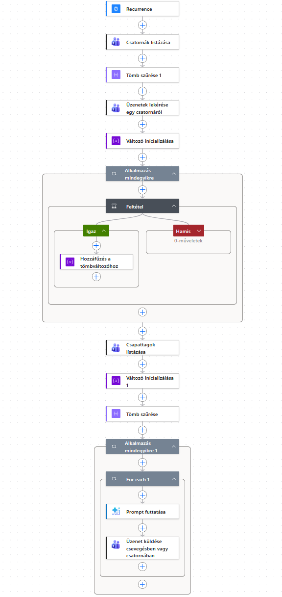

---
layout: default
codename: 1032_TeamsIntegration
title: Teams inaktív tagok értesítése privát üzenetben
tags: snippets mieset
authors: Dongó Tamás
---

# Teams inaktív tagok értesítése privát üzenetben

Ez az esettanulmány bemutatja, hogyan építhető fel egy Power Automate folyamat, amely heti szinten ellenőrzi egy Microsoft Teams csoport tagjainak aktivitását, és automatikusan, privát üzenetben figyelmezteti azokat, akik az elmúlt egy hétben nem posztoltak az adott csatornán.

A munka során egy LLM (Nagy Nyelvi Modell) segítségével finomítottam a folyamatot, leküzdve a Teams konnektor specifikus kihívásait.

A tervezésnél két szervezeti megkötést is figyelembe kellett venni: a folyamatnak tenant admin jóváhagyás nélkül kell működnie, és lehetőleg fizetős (prémium) connector nélkül. Ez befolyásolta mind az üzenetküldés módját, mind pedig azt, hogy a figyelmeztető szöveg generálása miként történjen.

## Tanulságok

- **Privát üzenetküldés Teamsben:** A Power Automate-ből küldött privát üzenetekhez a "Csevegés a folyamatrobottal" (Chat with flow bot) a legtisztább megoldás. Mivel az üzenetbe könnyen belefoglalható, hogy melyik Teams csoportra hivatkozunk, így egyszerűbb ezt a megoldást választani. Ha mégis felhasználóként szeretnénk üzenetet küldeni, először létre kell hozni egy 1/1-es "Csoportos csevegést" (Group chat) a címzett bevonásával, majd annak az azonosítójára (Conversation ID) küldeni az üzenetet. Ez is megoldható a Power Automate-ben, de a teszt elkészítéséhez minden esetben a lehető legegyszerűbb megoldást kerestem. Mindkét módszer natív, delegált Teams-akciót használ, tehát egyik sem igényel tenant admin jóváhagyást.
- **Teams azonosítók (ID-k) különbsége:** Az üzenetek lekérésénél (Get messages) kapott ID (`from/user/id`) a felhasználó globális Entra (Azure AD) azonosítója. A "Csapattagok listázása" (List team members) művelet viszont egy speciális Teams tagsági azonosítót ad vissza az `id` mezőben. Az összehasonlításhoz fontos, hogy a `userId` mezőt kell használni.
- **Automatikus "Apply to each" elkerülése:** Ha egy szűrt tömbből (Filter array) csak az egyetlen lehetséges találat értékére van szükségünk (pl. csatorna ID lekéréséhez név alapján), a dinamikus tartalom közvetlen használata felesleges ciklust generál. Ezt a `first(body('Filter_array_neve'))?['mezoNeve']` kifejezés használatával lehet kivédeni.
- **Beágyazott JSON adatok elérése Kifejezésekkel:** A kifejezésekben a `/` nem használható mélyebb adatszintek eléréséhez. Ehelyett minden szintet külön szögletes zárójelbe kell tenni: `['from']?['user']?['id']`.
- **"Üzenetek lekérése" korlátai:** A Teams művelet alapértelmezetten csak az *új* beszélgetéseket látja, a válaszokat nem. Emellett be kell kapcsolni a lapozást (pagination), hogy 50-nél több üzenetet is le tudjon kérni (amennyiben várhatóan több, mint 50 üzenet érkezik a csatornára hetente).
- **A `Változó inicializálása` (Initialize variable) nem ágyazható be `Apply to each` cikluson belülre.** Ez nem beállítás kérdése, hanem kemény platformkorlát (`InvalidVariableInitialization` hiba); a változót mindig a ciklus előtt, a legfelső szinten kell inicializálni.
- **A Dinamikus tartalom panelen való kattintás néha véletlenül beágyazott, rossz adatforrású ciklust hoz létre** — érdemes minden hivatkozás után megnézni a generált kifejezést, mert egy rosszul beágyazott `Apply to each` könnyen a célzott tag helyett egy másik elemre (pl. a legutóbbi üzenet küldőjére) mutathat.
- **API-kulcsot soha ne írj be közvetlenül egy HTTP-lépés fejlécébe vagy törzsébe nyílt szövegként** — a flow JSON-ja és a futási előzmények könnyen megosztásra kerülhetnek, ezzel kompromittálva a kulcsot. Használj „Biztonságos bemenetek" beállítást, és lehetőség szerint Key Vault vagy környezeti változó hivatkozást.
- **A Power Automate `HTTP` akciója prémium funkció** — tetszőleges külső LLM API hívásához nincs ingyenes natív alternatíva. Fontos külön kezelni az „admin consent" és a „fizetős licenc" kérdését: ezek különböző akadályok. A natív Teams-akciók egyiket sem igénylik, de egy külső API HTTP-hívása mindig prémium csomagot kíván. Azonban az AI Builder funkciók Office365 előfizetéssel igénybevehetők, így végül ezt használtam a folyamatban.

## A folyamat felépítése

A folyamat lépésről lépésre:

1. **Trigger:** Heti ütemezés (Recurrence), pl. minden szerdán este 20:00-kor.
2. **Csatorna és tagok adatainak lekérése:**
   - **Csatornák lekérése** (List channels) -> **Tömbszűrés** (Filter array) a csatorna nevére.
   - **Csapattagok listázása** (List team members).
3. **Aktivitás ellenőrzése:**
   - **Üzenetek lekérése egy csatornáról** (Get messages) a kiválasztott csatorna ID-ja alapján.
   - **Apply to each** az üzeneteken végigiterálva.
   - **Feltétel (If):** Létrehozás dátuma (`createdDateTime`) >= `addDays(utcNow(), -7)`.
   - **Ha igaz:** Hozzáfűzés a posztolók tömbváltozójához (`PosterIds`): `items('Alkalmazás_mindegyikre')?['from']?['user']?['id']`.
4. **Inaktív tagok kiválogatása:**
   - **Szűrés (Filter array):** A "Csapattagok listázása" kimenetéből kiszűri azokat, akiknek a `userId`-ja *nincs benne* a `PosterIds` tömbben.
5. **Üzenetküldés:**
   - LLM hívás a figyelmeztető szöveg generálására (átadva a csatorna nevét és a címzett nevét). 
	  Prompt: 
	  `Írj egy rövid, barátságos, nem számonkérő emlékeztető üzenetet [[név]] csapattagnak, mert az elmúlt 7 napban nem posztolt a [[csoport_neve]] nevű Teams csatornában. A hangnem legyen kolléga-szintű, ne feletteshez illő. Maximum 2-3 mondat. Ne használj sablonos "kérlek jelentkezz be" fordulatot, változatosan fogalmazz minden alkalommal.`
	- "Üzenet küldése csevegésben vagy csatornában" (Post message in a chat or channel) a Flow bot nevében az inaktív felhasználónak.
	
A Power Automate folyamat exportja a *Teams_integráció* mappában található.

## A munkafolyamat tanulságos részletei

A folyamat építése során több, a Teams és a Power Automate integrációjából fakadó rejtett hibával találkoztam. Ezeket a teszt futtatások elemzésével, és az LLM (Claude illetve Gemini) magyarázatainak segítségével oldottam meg.

### A láthatatlan tömb probléma

A csatorna ID-jának lekérdezésénél a Power Automate felesleges ciklust generált, ami elrontotta a későbbi adathivatkozásokat. Ezt az LLM a `first()` függvény használatával oldotta meg.

**Prompt (felhasználó):**
> Ez így nem jó, mert lehetséges, hogy a tömb szűrése egynél több eredményt ad vissza, nekem olyan kell ami egyértelműen kiválasztja azt az egy csatornát.

**LLM válasz:**
> Ha biztosra akarsz menni, hogy csak és kizárólag az első, egyértelmű találatot használja a rendszer, és el akarod kerülni a ciklust, akkor a Power Automate Kifejezések (Expressions) funkcióját kell használnod a `first()` (első) függvénnyel.
>
> `first(body('Filter_array'))?['id']`
>
> Miért tökéletes ez a megoldás?
> 1. Nincs ciklus: A rendszer egyáltalán nem hoz létre `Apply to each` hurkot...
> 2. Szigorú kiválasztás: A `first()` függvény kerekperec megmondja...

### Az alma és körte összehasonlítása (ID vs. userId)

Bár a logikai felépítés tökéletes volt, a szűrés eredménye mindig üres halmaz lett (mindenki inaktívnak tűnt). Az LLM rámutatott a Teams konnektor egyik legnagyobb furcsaságára.

**Prompt (felhasználó, miután megosztotta a Query blokk JSON kódját):**
> [JSON kód, ami az 'id' mezőt hasonlítja össze a PosterIds tömbbel]

**LLM válasz:**
> Amikor az "Üzenetek lekérése" lépésben kimented a posztolókat, a `from/user/id` a felhasználó valódi, globális azonosítója... Amikor a "Csapattagok listázása"... lépés lekéri az embereket, a kimenetében lévő `id` mező NEM ez a globális azonosító! Az itt kapott `id` egy speciális, csak a Teams által használt belső "tagsági kód"...
>
> A megoldás: A "Csapattagok listázása" művelet kimenetében a felhasználó valódi Entra ID-ját a `userId` nevű mező tárolja. Csak ezt az egyetlen szót kell átírnod a szűrődben!

### API-kulcs védelme és a HTTP akció licencelése

Egy HTTP-hívás tervezetében az API-kulcs nyílt szövegként szerepelt a fejlécben:

    "x-goog-api-key: [KULCS]"

Ezt azonnal vissza kellett vonni és újragenerálni, mivel a flow JSON-ja (és a futási előzmények) könnyen megosztásra kerülhetnek. Emellett kiderült, hogy a `HTTP` akció Power Automate-ban mindig prémium besorolású — ez egy licencelési (fizetési) korlát, nem admin jóváhagyási kérdés, ezért a két akadályt külön kellett kezelni.

### Ha nincs Office365 előfizetés: sablon-pool valódi LLM-hívás helyett

A HTTP funkció prémium szolgáltatás, és amennyiben nincs Office365 előfizetése a felhasználónak az AI Builder sem lesz elérhető. Ebben az esetben van lehetőség egy előre megírt, 8-10 elemű sablon-tömböt használni a változatos szöveggenerálásra. A listából választunk véletlenszerűen elemenként (`rand(0, length(variables('MessageTemplates')))`), és a névbehelyettítést egy `replace()` kifejezés végzi egy `Compose` lépésben, mielőtt a szöveg a `Post message in a chat or channel` akció „Message" mezőjébe kerül. Ez teljesen natív, nem igényel se admin consentet, se fizetős connectort, cserébe nem egyedi, minden alkalommal frissen generált szöveg.
