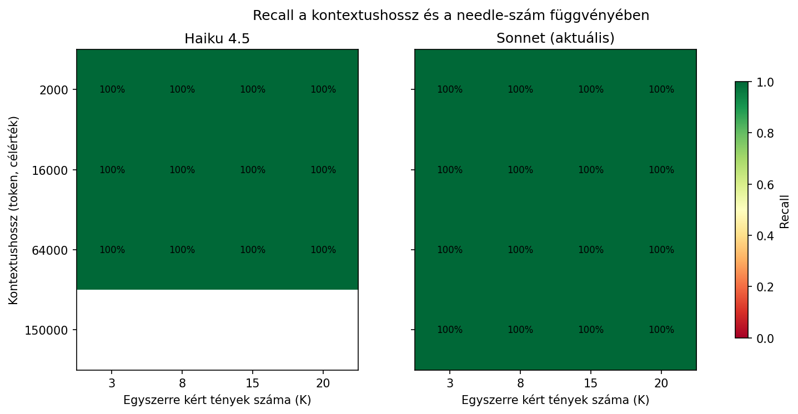
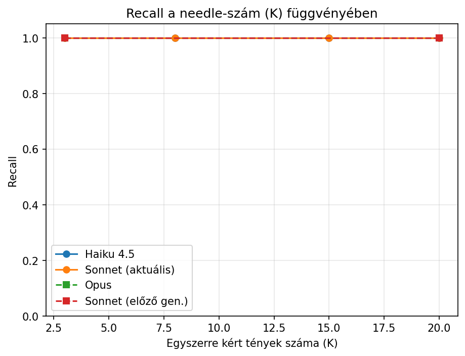
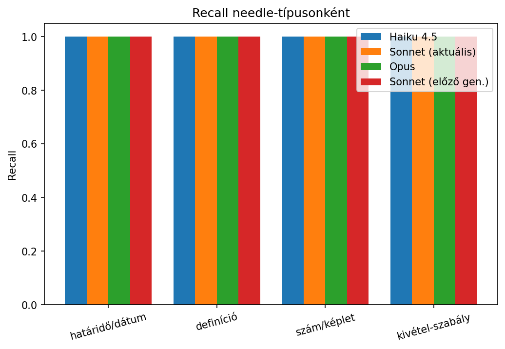
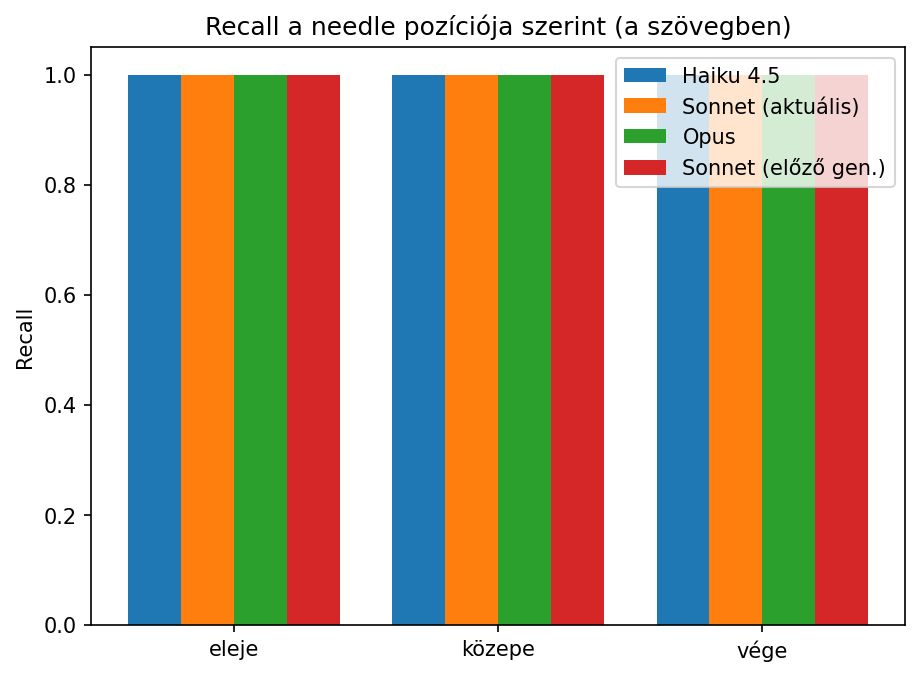

# Multi-Needle Haystack: hány tényt tud egyszerre megjegyezni az AI egy hosszú jegyzetből?

## A szcenárió

Egy hallgató egy hosszú, valódi tananyagból (jegyzet, tankönyv-fejezet) szeretne egyszerre több különböző adatot kinyeretni az AI-val, pl. egy határidőt, egy definíciót, egy kivétel-szabályt egyetlen kérdésben, ahelyett hogy egyenként kérdezne rá. Ez a kísérlet azt méri: mennyire romlik a felidézési pontosság, ha (a) egyszerre több tényt kérek, és (b) nő a tananyag hossza, valamint (c) hogy egy átlagos felhasználónak megéri-e kifejezetten drágább modellt választania, vagy egy olcsóbb/egyszerűbb modell is elég ehhez a feladathoz. Ez a "Multi-Needle in a Haystack" teszt egy kicsiben megcsinált változata.

A sima, egy-tű "Needle in a Haystack" tesztet (Greg Kamradt, 2023) a mai csúcsmodellek gyakorlatilag megoldották: az Anthropic saját Claude 3 mérése 99%+ eredményt adott. Ezért csak a multi-needle verziónál (több egyidejű tény, címke nélkül elrejtve) volt esély rá, hogy tényleg lássak különbséget a modellek teljesítményében.

## A haystack-forrás: magyar Wikipédia

A "tananyagot" 8 magyar Wikipédia-cikkből építettem fel (Szoftvertesztelés, Tervezési minta, Verziókezelés, Objektumorientált programozás, Adatbázis-kezelő rendszer, Szoftverfejlesztési folyamat, Agilis szoftverfejlesztés, Szoftverarchitektúra; összesen 142 319 karakter), a nyilvános Wikipédia API-n keresztül letöltve ([`fetch_haystack_source.py`](harness/fetch_haystack_source.py)).

*Forrás: [hu.wikipedia.org](https://hu.wikipedia.org), CC BY-SA 4.0. A pontos cikklista és licenc-metaadat: [`manifest.json`](data/haystack_source/manifest.json).*

A [`generate_haystack.py`](harness/generate_haystack.py) a cikklistát és a cél token-hosszakat paraméterként kapja, így más magyar szakterületen (jog, orvostudomány, közgazdaságtan) is azonnal újrafuttatható ugyanez a teszt, más cikklistával, a saját tananyagon.

## Módszertan

**Needle-ek**: 20 kézzel megírt, kitalált tény (4 típusban: határidő/dátum, definíció, szám/képlet, kivétel-szabály; l. [`needles.json`](harness/needles.json)). Mivel Claude valószínűleg ismeri a népszerű Wikipédia-cikkeket a tréningadatból, a needle-eknek egyértelműen csak ebben a promptban létező, kitalált tényeknek kell lenniük (fiktív határidők, fiktív számok), amik nem keverednek össze azzal, amit a modell amúgy is tud.

A needle-ök nem viselnek egységes címkét: az első verzióban minden needle "Oktatói megjegyzés:" felirattal kezdődött, ami gyakorlatilag kereshető kulcsszóvá tette őket (ld. lentebb, "Első verzió" szakasz). A végleges verzióban minden needle egy 1 mondatos semleges bevezetéssel ellátott, 2 mondatos bekezdés, ami tartalmilag üt el a környező szoftverfejlesztési szövegtől (kurzuslogisztika téma), de formailag nem jelölt.

**Kísérleti rács**:
- Kontextushossz: 4 méret (~2k, ~16k, ~64k, ~150k token, becsülve karakterszám/4 alapon)
- Egyszerre kért tények száma (K): 4 érték (3, 8, 15, 20)
- Modellek, két szinten (a költség kordában tartásáért): Haiku 4.5 és Sonnet (`claude-sonnet-4-6`) a teljes 4×4×2 ismétléses rácson; Opus (`claude-opus-4-8`) és egy előző generációs Sonnet (`claude-sonnet-4-5`) csak a 4 szélső cellán (2 legkisebb/legnagyobb kontextushossz × 2 legkisebb/legnagyobb K)
- Összesen 72 hívás

**Végrehajtás**: a RalphLoop harness mintájára ([`run_test.sh`](harness/run_test.sh)) egy bash script hívja meg ismételten a `claude -p --model <id> --output-format json`-t, fix, magyar promptsablonnal, ami arra kéri a modellt, hogy kizárólag JSON tömbben válaszoljon (`[{"id":1,"answer":"..."}, ...]`).

**Kiértékelés** ([`score.py`](harness/score.py)): a nyers JSON válaszokat összevetettem a ground truth-tal, kis-nagybetű/ékezet-toleráns egyezéssel.

## Eredmény: 100% recall minden lefutott cellán





A 713 kiértékelhető needle mindegyikét helyesen adta vissza minden tesztelt modell, minden kontextushosszon és minden K-n: **713/713 = 100%**.

| Modell | Recall | Hívások | Összköltség | Átlag idő/hívás |
|---|---|---|---|---|
| Haiku 4.5 | 100% | 32 | $3.13 | 13.2 mp |
| Sonnet (aktuális, `claude-sonnet-4-6`) | 100% | 32 | $18.47 | 24.3 mp |
| Opus (`claude-opus-4-8`) | 100% | 4 | $6.09 | 26.7 mp |
| Sonnet (előző gen., `claude-sonnet-4-5`) | 100% | 4 | $0.28 | 16.7 mp |
| **Összesen** | **100%** | **72** (62 sikeres) | **$27.97** | |




Sem a needle-típus, sem a szövegbeli pozíció (eleje/közepe/vége) szerint nincs érdemi különbség: nincs primacy/recency torzítás, nincs "nehezebb" needle-típus.

A nehezített (címke nélküli, akár 150k+ tokenes, akár 20 egyidejű tényt kérő) teszt sem talált gyengeséget a jelenlegi Sonnet/Opus modellekben: a hosszú kontextusból való többszörös tényvisszakeresés ezeken gyakorlatilag megoldott probléma.

## Az egyetlen valós hibamód: kontextusablak-kapacitás, nem felidézés

10 a 72 hívásból nem recall-hibával, hanem kontextusablak-túlcsordulással hiúsult meg: ez kapacitáskorlát, nem pontatlanság.

```
Prompt is too long · the request is ~237 927 tokens (limit 200 000)
but this conversation is only ~152 450 tokens — the rest is system
prompt, tool definitions, and attachment content.
```

Ez történt minden Haiku 4.5-ös hívásnál a ~150k-tokenes szinten (mind a 4 K-érték × 2 ismétlés = 8 cella), és a régebbi generációs Sonnet (`4-5`) mindkét ~150k-tokenes mintacelláján (2 cella). A jelenlegi Sonnet (`4-6`) és az Opus (`4-8`) ugyanezt a bemenetet simán feldolgozta, vagyis csak a legújabb generáció rendelkezik elég nagy effektív kontextusablakkal ehhez a mérethez.

A becsült "150k token" cél a valóságban ~152–153k tényleges tartalom-tokent jelentett, amihez a `claude -p` headless hívás ~85 000 token rendszerprompt/eszközdefiníció-overheadet adott hozzá (237 927 − 152 450 ≈ 85 477). Ez a Claude Code CLI saját, minden egyes hívásnál újra megfizetett fix költsége, nem a haystack mérete. Ez összecseng a RalphLoop esettanulmány megfigyelésével (a tokenek 99.96%-a cache-olvasás volt): a `claude -p` headless mintázat kényelmes, de érdemi, nem elhanyagolható overheaddel jár minden egyes híváskor, ami egy közvetlen API-hívásnál nem lenne jelen.

**Gyakorlati tanulság:** ha egy hallgató vagy oktató egy nagyon hosszú anyagot akar egyben feldolgoztatni, a modellválasztás nem csak a pontosságot befolyásolja (itt mindegyik modell hibátlan volt), hanem azt is, hogy a hívás egyáltalán lefut-e. Egy olcsóbb/régebbi modell választása ilyenkor nem rosszabb választ, hanem semmilyen választ sem ad.

## Módszertani buktató: a saját pontozó scriptem is tévedett

Az első kiértékelési kör 98.3%-os recall-t mutatott (12 "hibás" választ 713-ból), de manuális ellenőrzéssel kiderült, hogy mind a 12 valójában helyes válasz volt, csak a pontozó script túl szigorúan illesztett:

- **"Hány igazolatlan hiányzás után?"**: az elvárt válasz "két" volt, a modellek helyesen "2"-t (számjeggyel) írtak. Substring-matchben "két" nincs benne "2"-ben, pedig ugyanazt jelenti.
- **"Kinek csökken a pontszáma?"**: az elvárt válasz "csak az érintett hallgató" volt szó szerint, a modellek helyes, csak átfogalmazott választ adtak (pl. "Csak az érintett (hibázó) hallgató pontszáma csökken...").

Miután rugalmasabbá tettem az illesztést (számjegy/kiírt szám elfogadása, kulcsszó-alapú egyezés a fix válasz helyett, l. [`score.py`](harness/score.py) `is_match()` függvénye), és újrapontoztam a meglévő adatot új API-hívás nélkül, a végeredmény 100%-ra javult.

Fontos megfigyelni, hogy az automatizált kiértékelés maga is hibázhat, és ez nem csak AI-alapú értékelésre igaz, hanem egy egyszerű string-matching scriptre is. Kézi mintavételes ellenőrzés nélkül könnyű lett volna hamis romlást jelenteni.

## Üzemeltetési epizód: a session-limit megosztott fiókkeretről

A mérés közben a Claude Code session-limitbe futottam (`"You've hit your session limit · resets 8:30pm"`), ez nem fizetős kredit-kimerülés, hanem egy gördülő, fiókszinten megosztott használati keret. Mivel a mérés közben más eszközről/helyről is történt bejelentkezés ugyanarra a fiókra, a párhuzamos használat gyorsabban kimerítette a közös keretet, mint a harness önmagában tette volna.

A harness-t úgy módosítottam, hogy különbséget tegyen a **végleges** hiba (kontextusablak-túlcsordulás, nem érdemes újrapróbálni) és az **átmeneti** hiba (session-limit, a reset után újrapróbálandó) között, és csak az utóbbit próbálja újra ismétléskor. Enélkül a harness vagy feleslegesen újrapróbálta volna a véglegesen reménytelen cellákat, vagy, rosszabb esetben, a session-limit miatt megszakadt hívásokat is "0% recall"-ként (téves válaszként) könyvelte volna el, ami hamis romlást mutatott volna.

## Összefoglaló tanulságok

1. **A multi-needle recall a mai Sonnet/Opus modelleken gyakorlatilag hibátlan.** Még címke nélkül elrejtett, ~150k+ tokenes kontextusban, 20 egyidejű tény mellett is. A "hosszú anyagból több tényt egyszerre kinyerni" kockázata ma elsősorban nem pontossági kérdés.
2. **A valós kockázat a kapacitás, nem a pontosság.** A régebbi/kisebb modellek (Haiku, előző generációs Sonnet) egyszerűen nem férnek bele a legnagyobb tesztelt mérethez. Ez keményen, előre jelezhetően megbukik, nem "majdnem jó" választ ad.
3. **A `claude -p` headless hívás komoly, fix token-overheaddel jár** (itt ~85k token/hívás). Ezt figyelembe kell venni, ha valaki a gyakorlati kontextusablak-limithez közeli bemenetet tervez CLI-n keresztül feldolgoztatni.
4. **Az automatizált kiértékelés maga is hibaforrás.** Mielőtt "AI hibázott"-at jelentek, érdemes kézzel átnézni néhány konkrét "hibás" esetet, mert könnyen a pontozó script a hibás, nem a modell.
5. **A session-limit fiókszinten, megosztottan működik.** Párhuzamos használat (másik eszközről bejelentkezve) gyorsabban kimeríti, mint gondolnánk, és ezt egy automatizált harnessnek kezelnie kell (átmeneti vs. végleges hiba megkülönböztetése).

## Első verzió: miért kellett címke nélkülire cserélni a needle-eket

Az első needle-tervben minden elrejtett tény "Oktatói megjegyzés:" felirattal kezdődött. Ez könnyen kereshető, egységes kulcsszóvá tette a needle-öket: a modellnek nem kellett ténylegesen keresnie a tűt a szénakazalban, elég volt rátalálnia erre a mintázatra, ami minden más szempontból nem hasonlított a Wikipédia-szövegre. Az eredeti (Kamradt-féle) needle-in-haystack tesztben sem viselt címkét a "tű", csak tartalmilag ütött el a környezetétől. Miután a címkét eltávolítottam és a needle-öket 2 mondatos, természetesen beágyazott bekezdésekké alakítottam (l. fent, "Módszertan"), a teszt módszertanilag helyesebb, nehezebb lett. Mint látható, ez sem talált valódi gyengeséget a jelenlegi modellekben.

## Nyers adatok

- Haystack-forrás és licenc-metaadat: [`manifest.json`](data/haystack_source/manifest.json), nyers Wikipédia-szövegek: [`data/haystack_source/`](data/haystack_source/)
- Needle-pool: [`needles.json`](harness/needles.json)
- Harness: [`fetch_haystack_source.py`](harness/fetch_haystack_source.py), [`generate_haystack.py`](harness/generate_haystack.py), [`run_test.sh`](harness/run_test.sh), [`score.py`](harness/score.py), [`models.json`](harness/models.json)
- Kiértékelt eredmények: [`results.csv`](data/results.csv) (needle-szintű), [`cells.csv`](data/cells.csv) (hívás-szintű, cost/idő)
- Elemző script: [`analyze.py`](analyze.py)
