# Emberi kiértékelő lap

Minden diagramhoz 3 kérdés tartozik (az átlag-kérdést kihagytuk, mert azt ránézésre nem lehet megmondani). Csak nézd meg a képet, és írd be a válaszod a `Válasz:` mögé. Ne nézz bele a `data/charts/ground_truth.json`-ba, mert az elrontja a vak tesztet.

## bar_level1_rep1 (szint: 1, típus: bar)

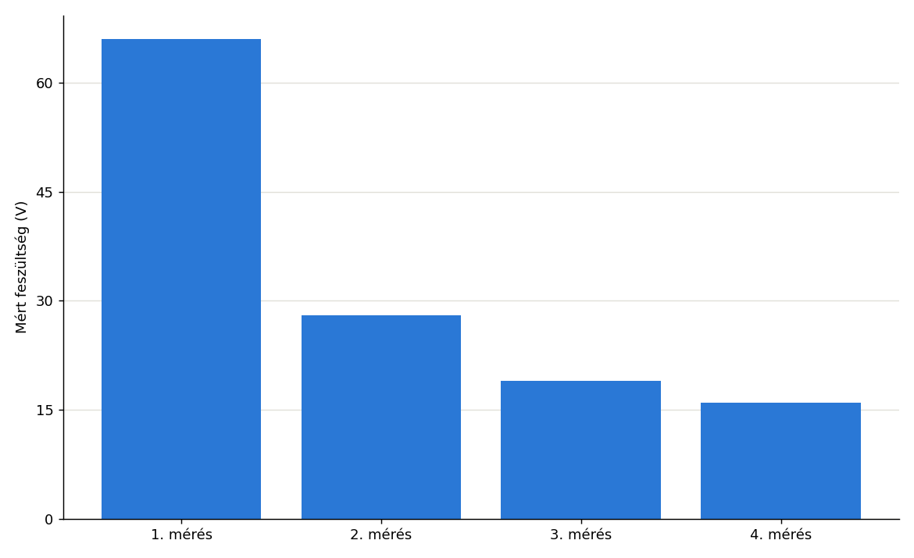

1. Mennyi a mért érték itt: 3. mérés?
   Válasz: 19

2. Mennyivel tér el egymástól a következő két érték: 3. mérés és 4. mérés?
   Válasz: 3

3. Melyik ponton (minta/mérés) a legnagyobb az érték a diagramon?
   Válasz: 1

---

## bar_level1_rep2 (szint: 1, típus: bar)

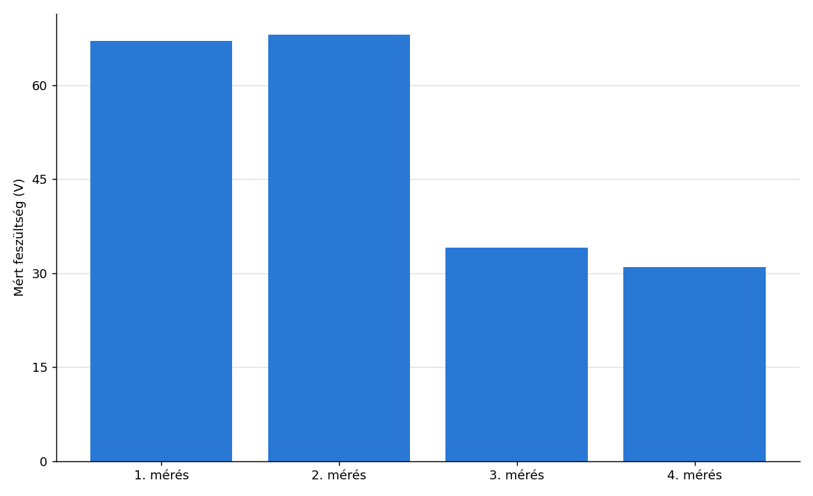

1. Mennyi a mért érték itt: 3. mérés?
   Válasz: 34

2. Mennyivel tér el egymástól a következő két érték: 3. mérés és 1. mérés?
   Válasz: 32

3. Melyik ponton (minta/mérés) a legnagyobb az érték a diagramon?
   Válasz: 2

---

## line_level1_rep1 (szint: 1, típus: line)

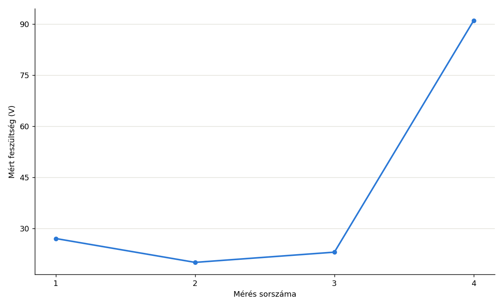

1. Mennyi a mért érték itt: 3. mérés?
   Válasz: 16

2. Mennyivel tér el egymástól a következő két érték: 3. mérés és 2. mérés?
   Válasz: 4

3. Melyik ponton (minta/mérés) a legnagyobb az érték a diagramon?
   Válasz: 4

---

## line_level1_rep2 (szint: 1, típus: line)

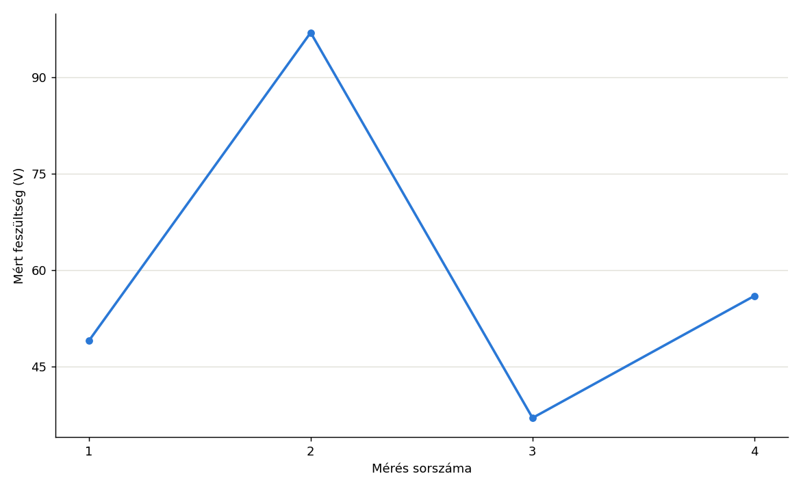

1. Mennyi a mért érték itt: 1. mérés?
   Válasz: 51

2. Mennyivel tér el egymástól a következő két érték: 1. mérés és 2. mérés?
   Válasz: 53

3. Melyik ponton (minta/mérés) a legnagyobb az érték a diagramon?
   Válasz: 2

---

## scatter_level1_rep1 (szint: 1, típus: scatter)

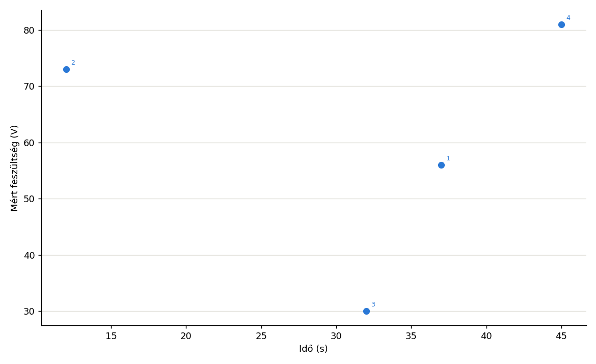

1. Mennyi a 1. pont y-értéke (a mért feszültség)?
   Válasz: 57

2. Mennyivel tér el egymástól a 1. pont és a 4. pont y-értéke?
   Válasz: 24

3. Hányadik pontnak (sorszám) a legnagyobb az y-értéke az adatpontok közül?
   Válasz: 4

---

## scatter_level1_rep2 (szint: 1, típus: scatter)

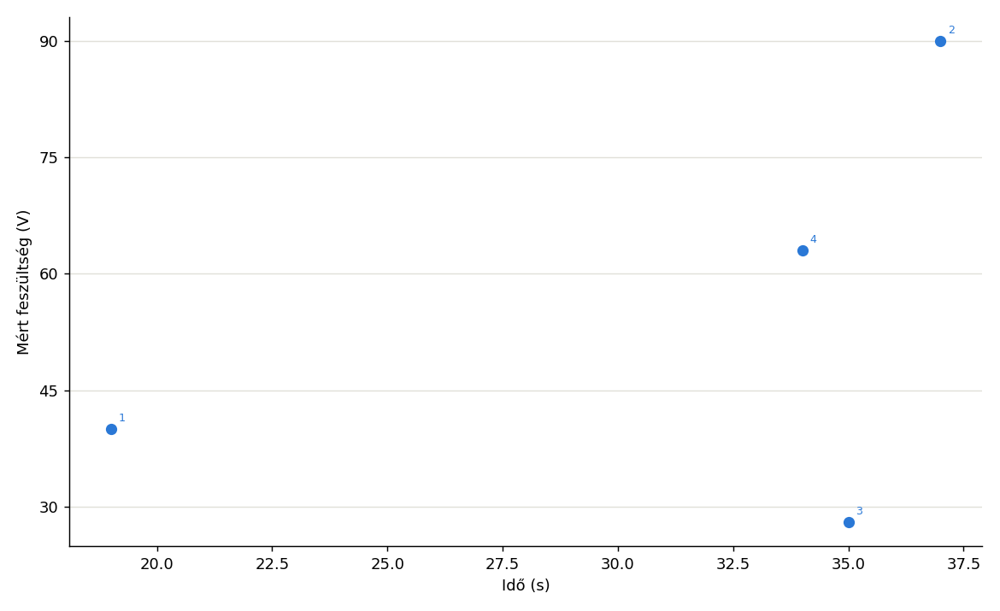

1. Mennyi a 2. pont y-értéke (a mért feszültség)?
   Válasz: 90

2. Mennyivel tér el egymástól a 2. pont és a 4. pont y-értéke?
   Válasz: 26

3. Hányadik pontnak (sorszám) a legnagyobb az y-értéke az adatpontok közül?
   Válasz: 2

---

## bar_level2_rep1 (szint: 2, típus: bar)

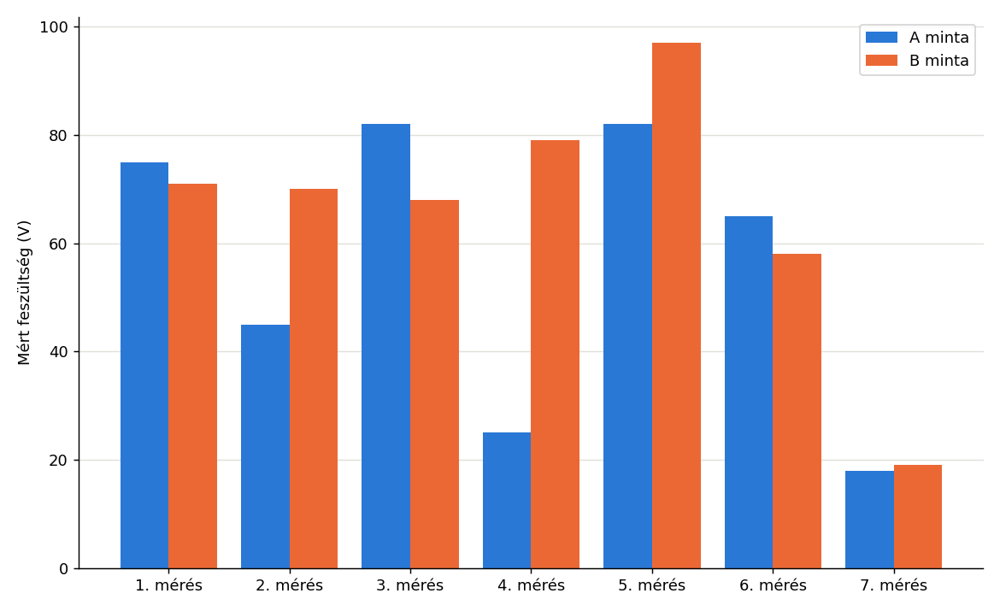

1. Mennyi a mért érték itt: B minta, 2. mérés?
   Válasz: 71

2. Mennyivel tér el egymástól a következő két érték: B minta, 2. mérés és B minta, 6. mérés?
   Válasz: 14

3. Melyik ponton (minta/mérés) a legnagyobb az érték a diagramon a(z) A minta sorozatban?
   Válasz: 3

---

## bar_level2_rep2 (szint: 2, típus: bar)

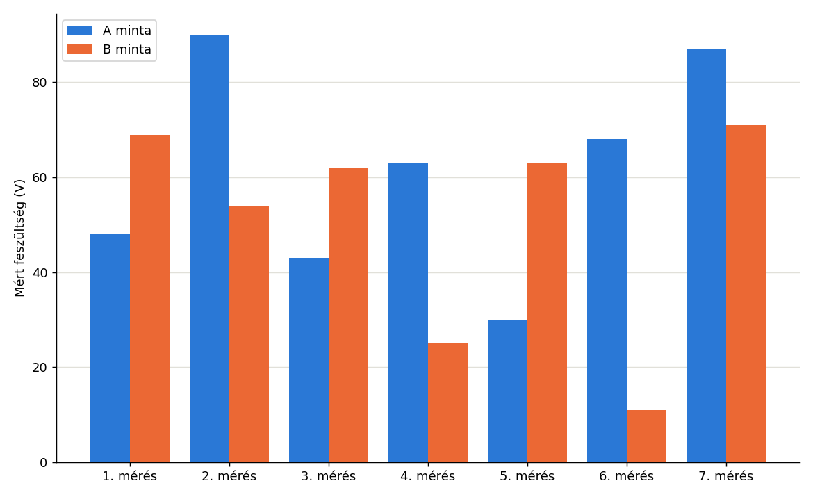

1. Mennyi a mért érték itt: A minta, 2. mérés?
   Válasz: 88

2. Mennyivel tér el egymástól a következő két érték: A minta, 2. mérés és B minta, 2. mérés?
   Válasz: 33

3. Melyik ponton (minta/mérés) a legnagyobb az érték a diagramon a(z) A minta sorozatban?
   Válasz: 2

---

## line_level2_rep1 (szint: 2, típus: line)

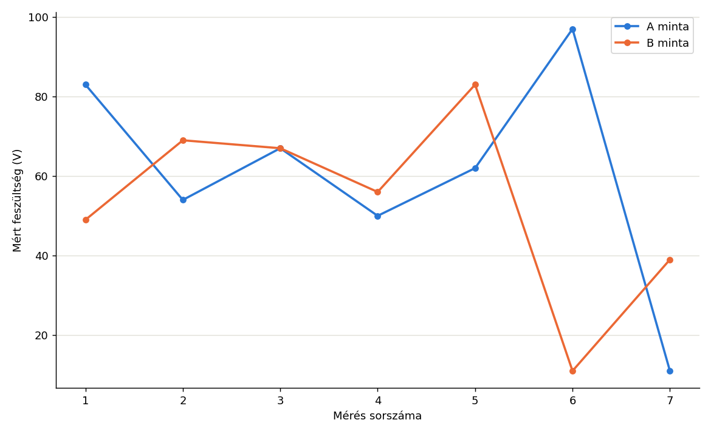

1. Mennyi a mért érték itt: A minta, 3. mérés?
   Válasz: 67

2. Mennyivel tér el egymástól a következő két érték: A minta, 3. mérés és A minta, 6. mérés?
   Válasz: 30

3. Melyik ponton (minta/mérés) a legnagyobb az érték a diagramon a(z) B minta sorozatban?
   Válasz: 5

---

## line_level2_rep2 (szint: 2, típus: line)

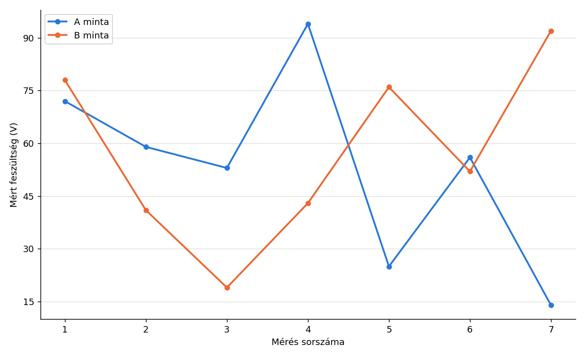

1. Mennyi a mért érték itt: A minta, 7. mérés?
   Válasz: 14

2. Mennyivel tér el egymástól a következő két érték: A minta, 7. mérés és B minta, 6. mérés?
   Válasz: 39

3. Melyik ponton (minta/mérés) a legnagyobb az érték a diagramon a(z) A minta sorozatban?
   Válasz: 4

---

## scatter_level2_rep1 (szint: 2, típus: scatter)

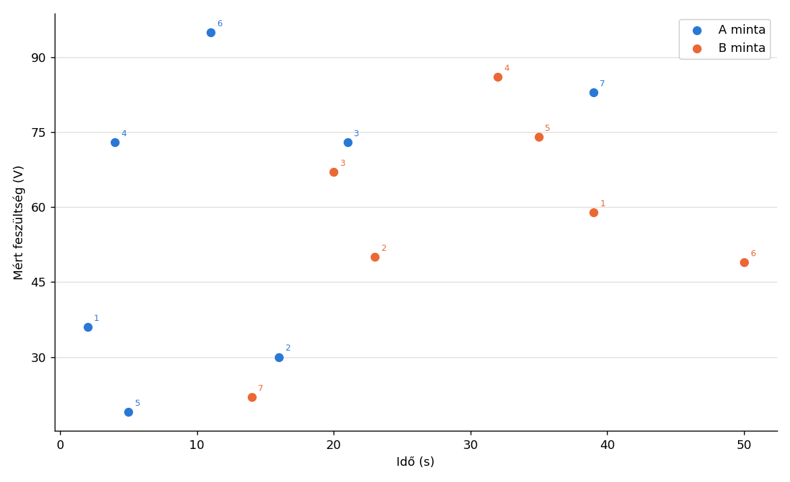

1. Mennyi a(z) B minta sorozat 2. pontjának y-értéke (a mért feszültség)?
   Válasz: 50

2. Mennyivel tér el egymástól a(z) B minta 2. pontjának és a(z) A minta 6. pontjának y-értéke?
   Válasz: 46

3. Hányadik pontnak (sorszám) a legnagyobb az y-értéke a(z) A minta sorozat pontjai közül?
   Válasz: 6

---

## scatter_level2_rep2 (szint: 2, típus: scatter)

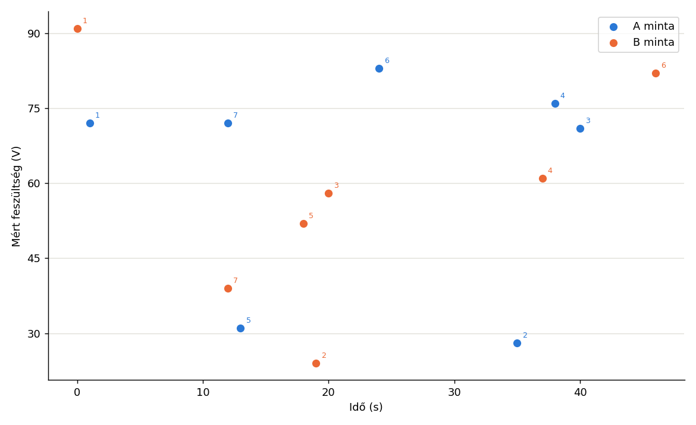

1. Mennyi a(z) A minta sorozat 5. pontjának y-értéke (a mért feszültség)?
   Válasz: 32

2. Mennyivel tér el egymástól a(z) A minta 5. pontjának és a(z) A minta 3. pontjának y-értéke?
   Válasz: 40

3. Hányadik pontnak (sorszám) a legnagyobb az y-értéke a(z) A minta sorozat pontjai közül?
   Válasz: 6

---

## bar_level3_rep1 (szint: 3, típus: bar)

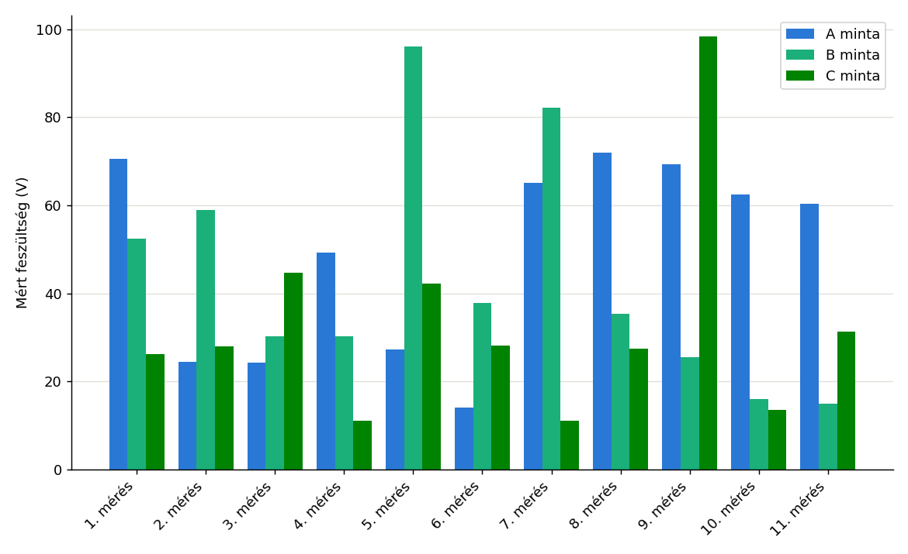

1. Mennyi a mért érték itt: A minta, 9. mérés?
   Válasz: 70

2. Mennyivel tér el egymástól a következő két érték: A minta, 9. mérés és B minta, 3. mérés?
   Válasz: 40

3. Melyik ponton (minta/mérés) a legnagyobb az érték a diagramon a(z) C minta sorozatban?
   Válasz: 9

---

## bar_level3_rep2 (szint: 3, típus: bar)

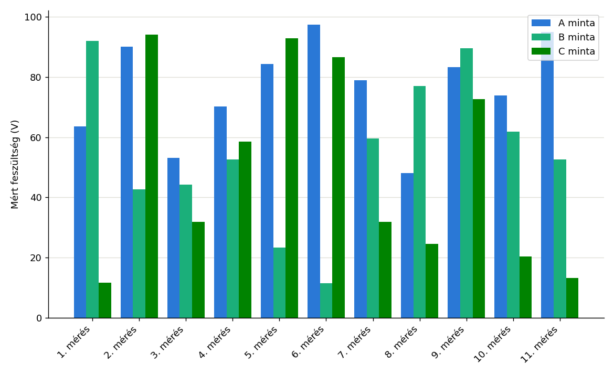

1. Mennyi a mért érték itt: A minta, 6. mérés?
   Válasz: 97

2. Mennyivel tér el egymástól a következő két érték: A minta, 6. mérés és B minta, 5. mérés?
   Válasz: 74

3. Melyik ponton (minta/mérés) a legnagyobb az érték a diagramon a(z) B minta sorozatban?
   Válasz: 1

---

## line_level3_rep1 (szint: 3, típus: line)

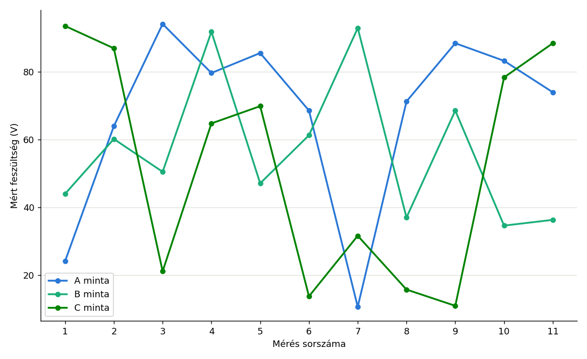

1. Mennyi a mért érték itt: C minta, 10. mérés?
   Válasz: 79

2. Mennyivel tér el egymástól a következő két érték: C minta, 10. mérés és B minta, 10. mérés?
   Válasz: 43

3. Melyik ponton (minta/mérés) a legnagyobb az érték a diagramon a(z) C minta sorozatban?
   Válasz: 1

---

## line_level3_rep2 (szint: 3, típus: line)

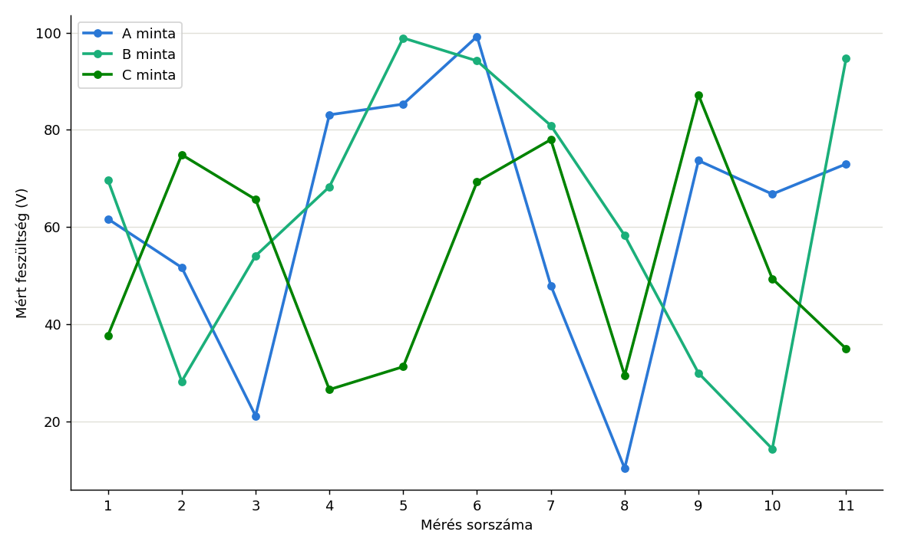

1. Mennyi a mért érték itt: B minta, 1. mérés?
   Válasz: 70

2. Mennyivel tér el egymástól a következő két érték: B minta, 1. mérés és A minta, 10. mérés?
   Válasz: 3

3. Melyik ponton (minta/mérés) a legnagyobb az érték a diagramon a(z) B minta sorozatban?
   Válasz: 5

---

## scatter_level3_rep1 (szint: 3, típus: scatter)

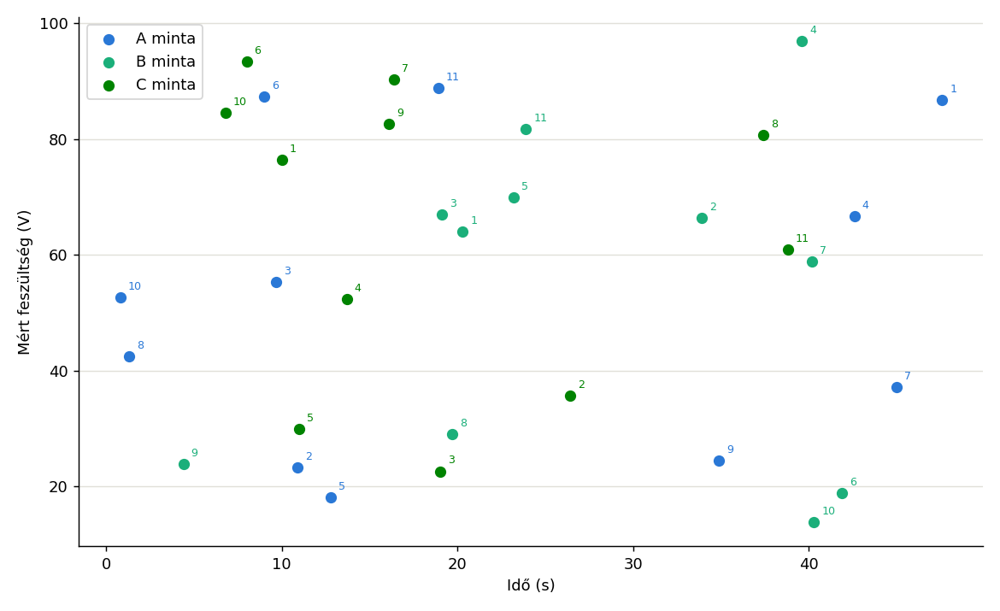

1. Mennyi a(z) C minta sorozat 8. pontjának y-értéke (a mért feszültség)?
   Válasz: 81

2. Mennyivel tér el egymástól a(z) C minta 8. pontjának és a(z) A minta 11. pontjának y-értéke?
   Válasz: 9

3. Hányadik pontnak (sorszám) a legnagyobb az y-értéke a(z) A minta sorozat pontjai közül?
   Válasz: 11

---

## scatter_level3_rep2 (szint: 3, típus: scatter)

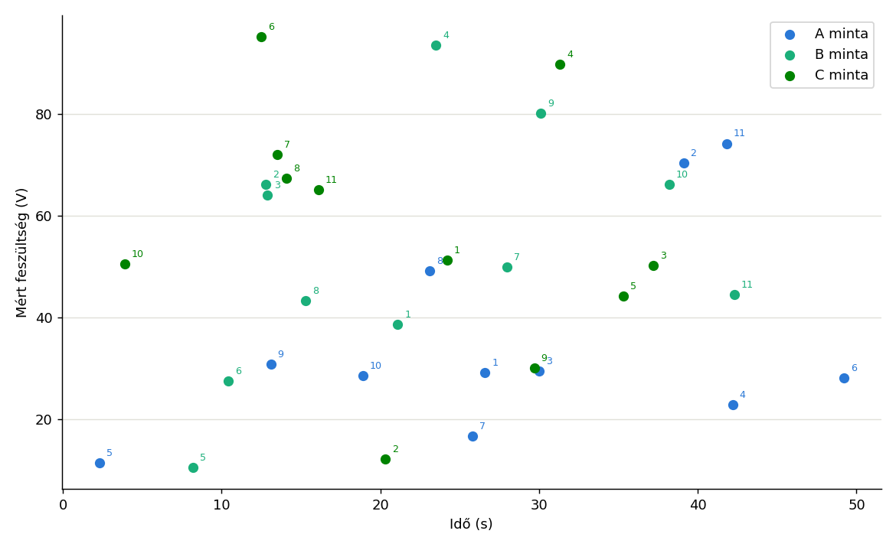

1. Mennyi a(z) A minta sorozat 3. pontjának y-értéke (a mért feszültség)?
   Válasz: 30

2. Mennyivel tér el egymástól a(z) A minta 3. pontjának és a(z) C minta 1. pontjának y-értéke?
   Válasz: 23

3. Hányadik pontnak (sorszám) a legnagyobb az y-értéke a(z) B minta sorozat pontjai közül?
   Válasz: 4

---

## bar_level4_rep1 (szint: 4, típus: bar)

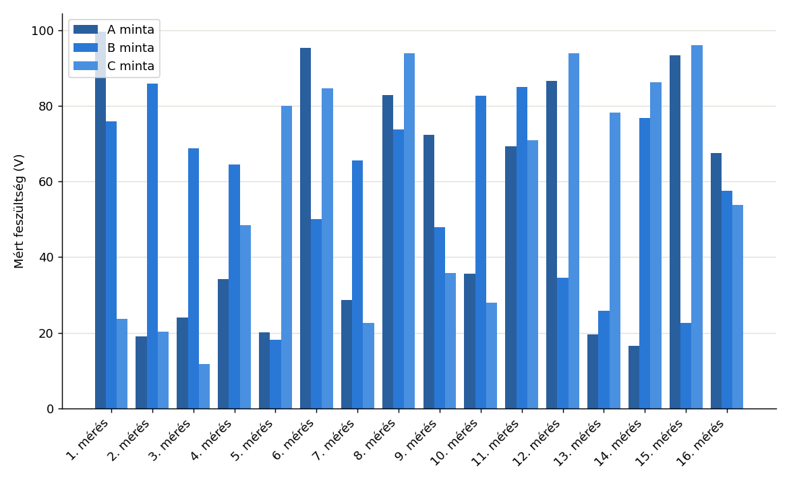

1. Mennyi a mért érték itt: B minta, 14. mérés?
   Válasz: 77

2. Mennyivel tér el egymástól a következő két érték: B minta, 14. mérés és C minta, 13. mérés?
   Válasz: 2

3. Melyik ponton (minta/mérés) a legnagyobb az érték a diagramon a(z) B minta sorozatban?
   Válasz: 2

---

## bar_level4_rep2 (szint: 4, típus: bar)

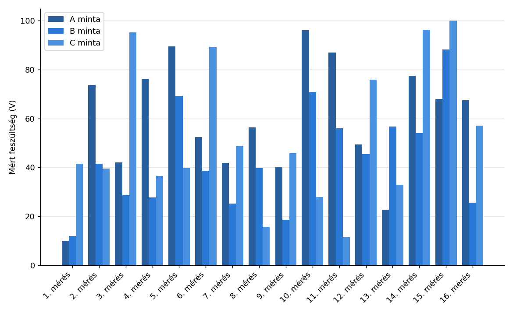

1. Mennyi a mért érték itt: B minta, 6. mérés?
   Válasz: 38

2. Mennyivel tér el egymástól a következő két érték: B minta, 6. mérés és B minta, 7. mérés?
   Válasz: 13

3. Melyik ponton (minta/mérés) a legnagyobb az érték a diagramon a(z) C minta sorozatban?
   Válasz: 15

---

## line_level4_rep1 (szint: 4, típus: line)

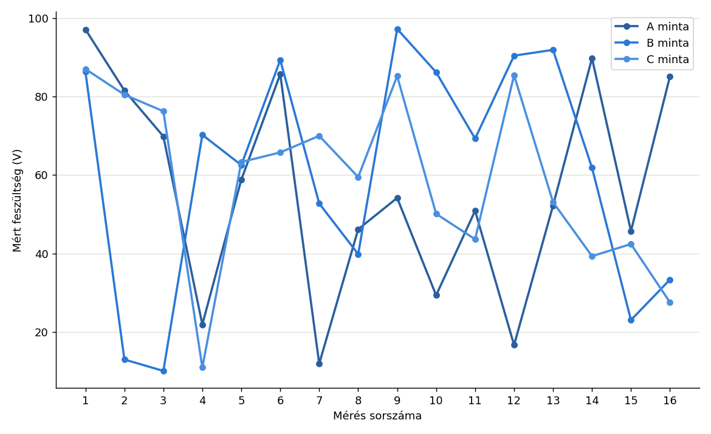

1. Mennyi a mért érték itt: C minta, 8. mérés?
   Válasz: 59

2. Mennyivel tér el egymástól a következő két érték: C minta, 8. mérés és C minta, 13. mérés?
   Válasz: 5

3. Melyik ponton (minta/mérés) a legnagyobb az érték a diagramon a(z) A minta sorozatban?
   Válasz: 1

---

## line_level4_rep2 (szint: 4, típus: line)

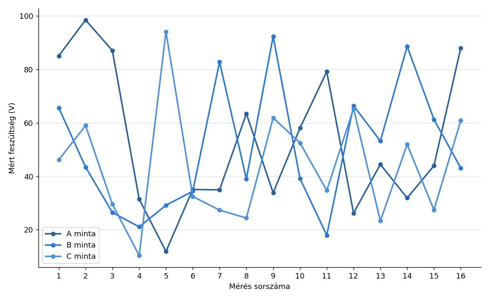

1. Mennyi a mért érték itt: B minta, 1. mérés?
   Válasz: 66

2. Mennyivel tér el egymástól a következő két érték: B minta, 1. mérés és C minta, 5. mérés?
   Válasz: 29

3. Melyik ponton (minta/mérés) a legnagyobb az érték a diagramon a(z) A minta sorozatban?
   Válasz: 2

---

## scatter_level4_rep1 (szint: 4, típus: scatter)

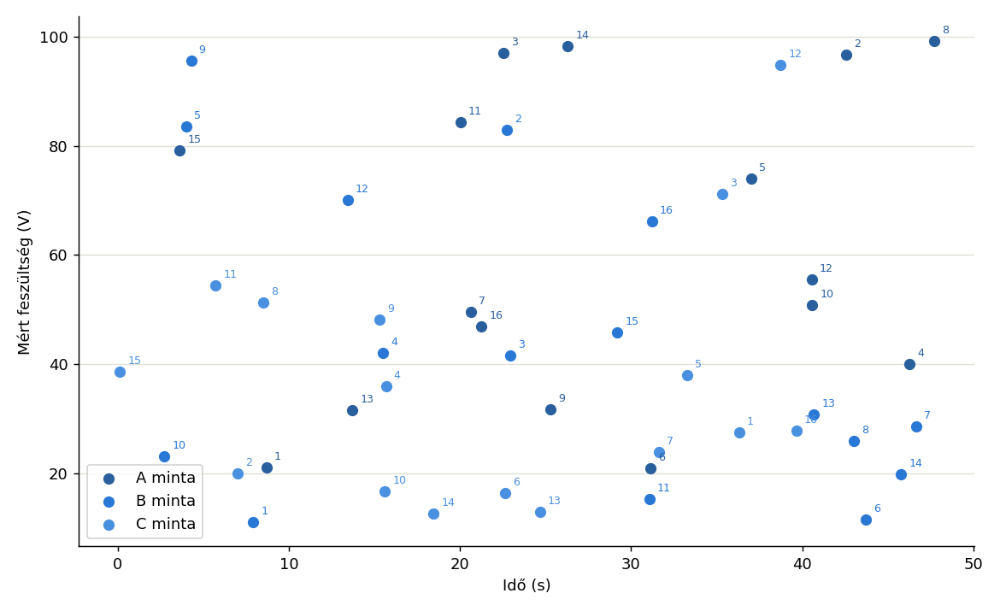

1. Mennyi a(z) C minta sorozat 14. pontjának y-értéke (a mért feszültség)?
   Válasz: 37

2. Mennyivel tér el egymástól a(z) C minta 14. pontjának és a(z) A minta 5. pontjának y-értéke?
   Válasz: 28

3. Hányadik pontnak (sorszám) a legnagyobb az y-értéke a(z) B minta sorozat pontjai közül?
   Válasz: 9

---

## scatter_level4_rep2 (szint: 4, típus: scatter)

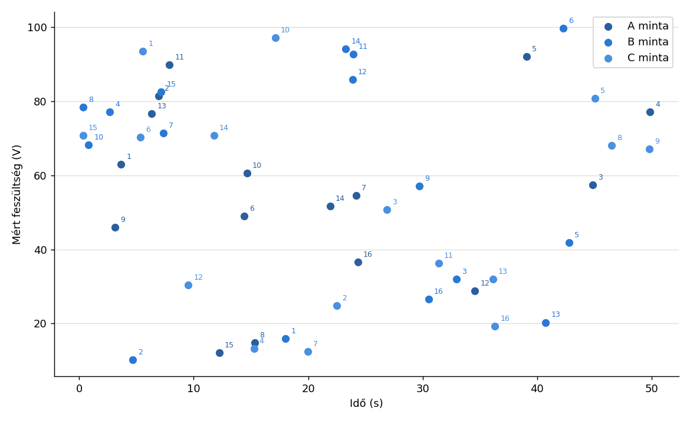

1. Mennyi a(z) B minta sorozat 4. pontjának y-értéke (a mért feszültség)?
   Válasz: 78

2. Mennyivel tér el egymástól a(z) B minta 4. pontjának és a(z) A minta 6. pontjának y-értéke?
   Válasz: 29

3. Hányadik pontnak (sorszám) a legnagyobb az y-értéke a(z) A minta sorozat pontjai közül?
   Válasz: 5

---

## bar_level5_rep1 (szint: 5, típus: bar)

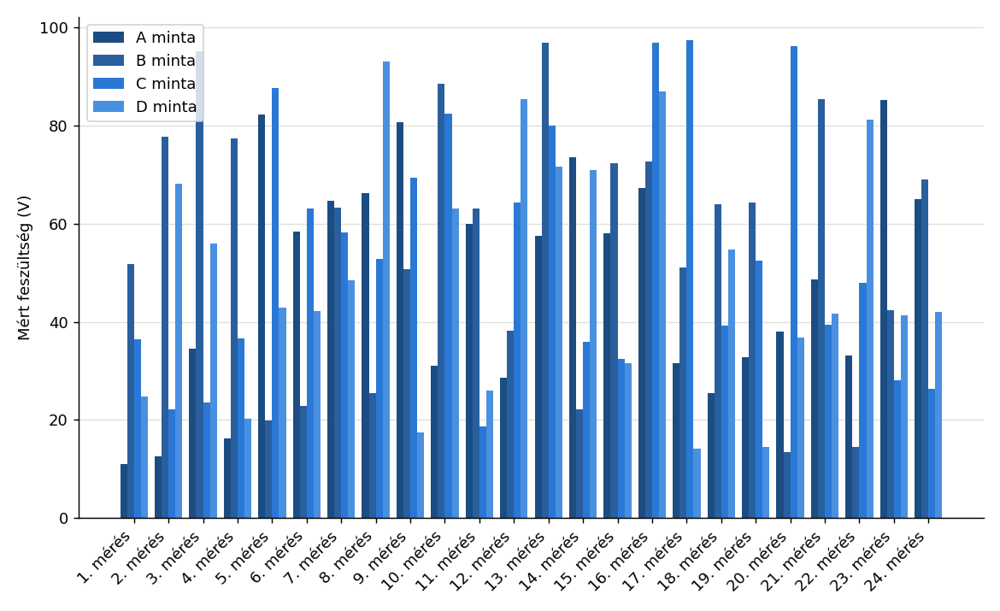

1. Mennyi a mért érték itt: A minta, 7. mérés?
   Válasz: 65

2. Mennyivel tér el egymástól a következő két érték: A minta, 7. mérés és B minta, 11. mérés?
   Válasz: 2

3. Melyik ponton (minta/mérés) a legnagyobb az érték a diagramon a(z) B minta sorozatban?
   Válasz: 13

---

## bar_level5_rep2 (szint: 5, típus: bar)

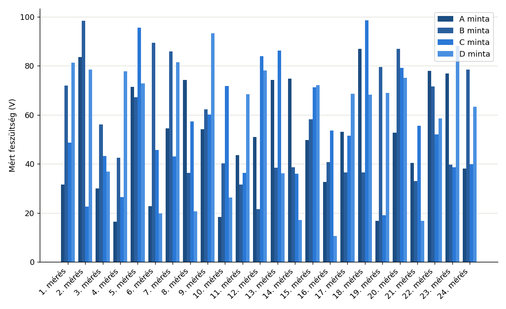

1. Mennyi a mért érték itt: D minta, 6. mérés?
   Válasz: 20

2. Mennyivel tér el egymástól a következő két érték: D minta, 6. mérés és D minta, 10. mérés?
   Válasz: 7

3. Melyik ponton (minta/mérés) a legnagyobb az érték a diagramon a(z) B minta sorozatban?
   Válasz: 2

---

## bar_level5_rep3 (szint: 5, típus: bar)

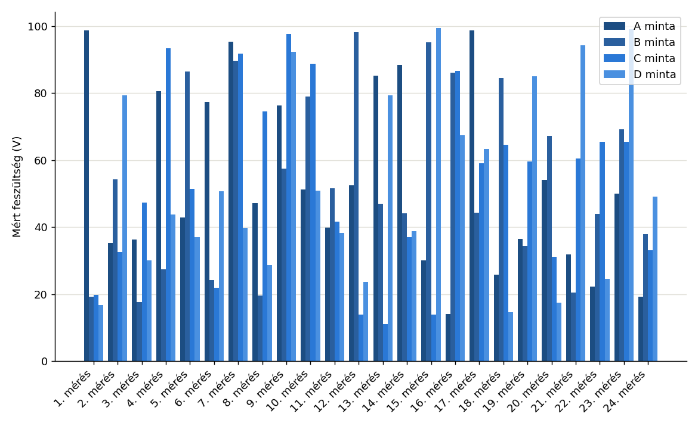

1. Mennyi a mért érték itt: D minta, 20. mérés?
   Válasz: 18

2. Mennyivel tér el egymástól a következő két érték: D minta, 20. mérés és D minta, 24. mérés?
   Válasz: 33

3. Melyik ponton (minta/mérés) a legnagyobb az érték a diagramon a(z) A minta sorozatban?
   Válasz: 17

---

## bar_level5_rep4 (szint: 5, típus: bar)

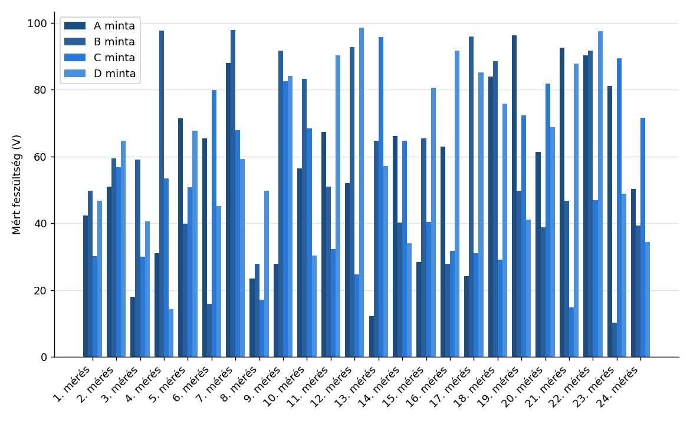

1. Mennyi a mért érték itt: D minta, 3. mérés?
   Válasz: 41

2. Mennyivel tér el egymástól a következő két érték: D minta, 3. mérés és B minta, 13. mérés?
   Válasz: 23

3. Melyik ponton (minta/mérés) a legnagyobb az érték a diagramon a(z) C minta sorozatban?
   Válasz: 23

---

## bar_level5_rep5 (szint: 5, típus: bar)

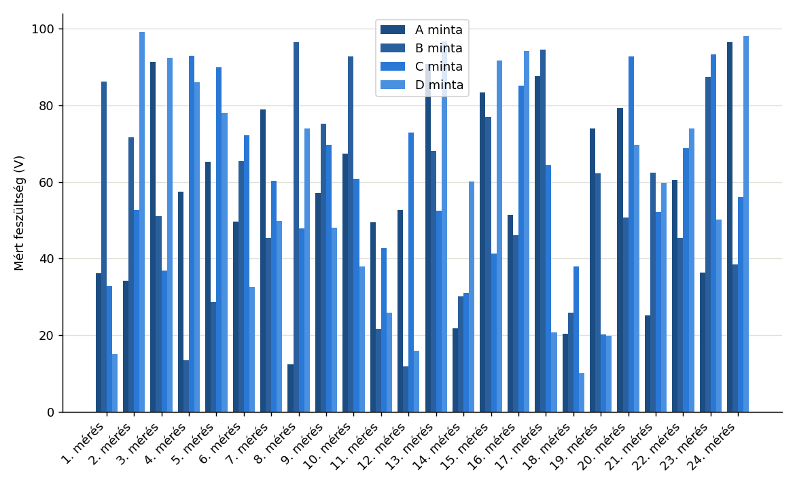

1. Mennyi a mért érték itt: B minta, 19. mérés?
   Válasz: 63

2. Mennyivel tér el egymástól a következő két érték: B minta, 19. mérés és A minta, 12. mérés?
   Válasz: 10

3. Melyik ponton (minta/mérés) a legnagyobb az érték a diagramon a(z) B minta sorozatban?
   Válasz: 8

---

## line_level5_rep1 (szint: 5, típus: line)

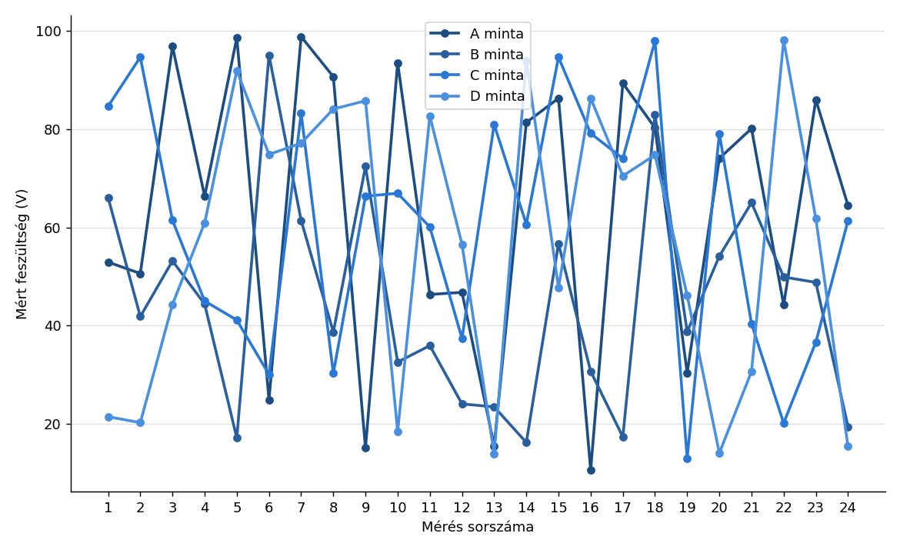

1. Mennyi a mért érték itt: B minta, 8. mérés?
   Válasz: 38

2. Mennyivel tér el egymástól a következő két érték: B minta, 8. mérés és B minta, 4. mérés?
   Válasz: 6

3. Melyik ponton (minta/mérés) a legnagyobb az érték a diagramon a(z) D minta sorozatban?
   Válasz: 23

---

## line_level5_rep2 (szint: 5, típus: line)

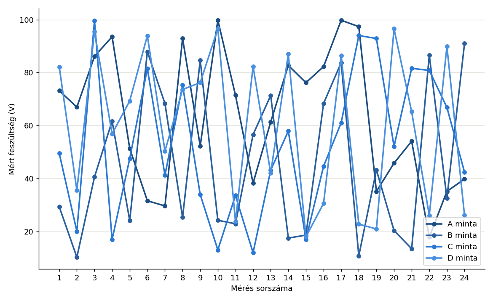

1. Mennyi a mért érték itt: C minta, 22. mérés?
   Válasz: 81

2. Mennyivel tér el egymástól a következő két érték: C minta, 22. mérés és A minta, 13. mérés?
   Válasz: 19

3. Melyik ponton (minta/mérés) a legnagyobb az érték a diagramon a(z) B minta sorozatban?
   Válasz: 24

---

## line_level5_rep3 (szint: 5, típus: line)

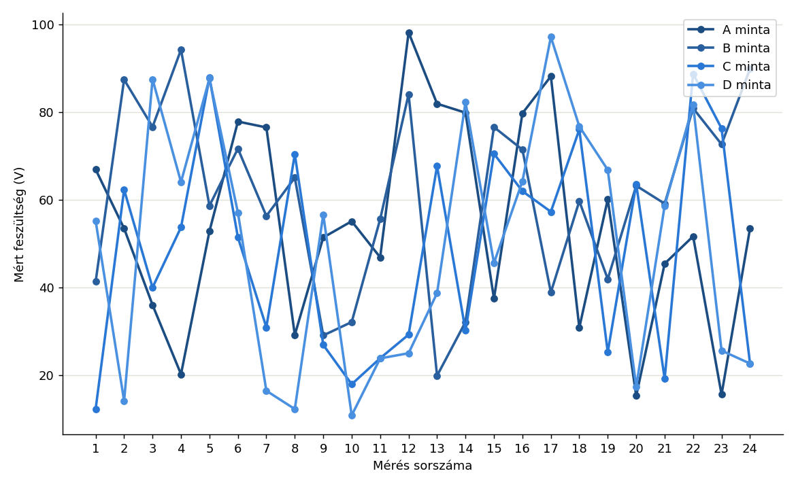

1. Mennyi a mért érték itt: A minta, 1. mérés?
   Válasz: 68

2. Mennyivel tér el egymástól a következő két érték: A minta, 1. mérés és C minta, 14. mérés?
   Válasz: 37

3. Melyik ponton (minta/mérés) a legnagyobb az érték a diagramon a(z) C minta sorozatban?
   Válasz: 22

---

## line_level5_rep4 (szint: 5, típus: line)

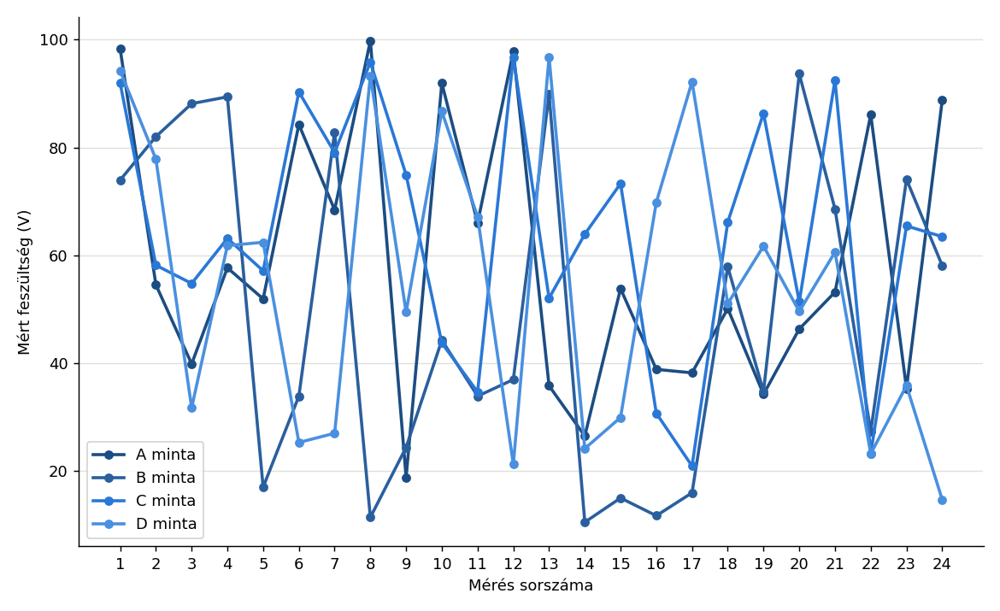

1. Mennyi a mért érték itt: D minta, 11. mérés?
   Válasz: 68

2. Mennyivel tér el egymástól a következő két érték: D minta, 11. mérés és B minta, 21. mérés?
   Válasz: 1

3. Melyik ponton (minta/mérés) a legnagyobb az érték a diagramon a(z) C minta sorozatban?
   Válasz: 12

---

## line_level5_rep5 (szint: 5, típus: line)

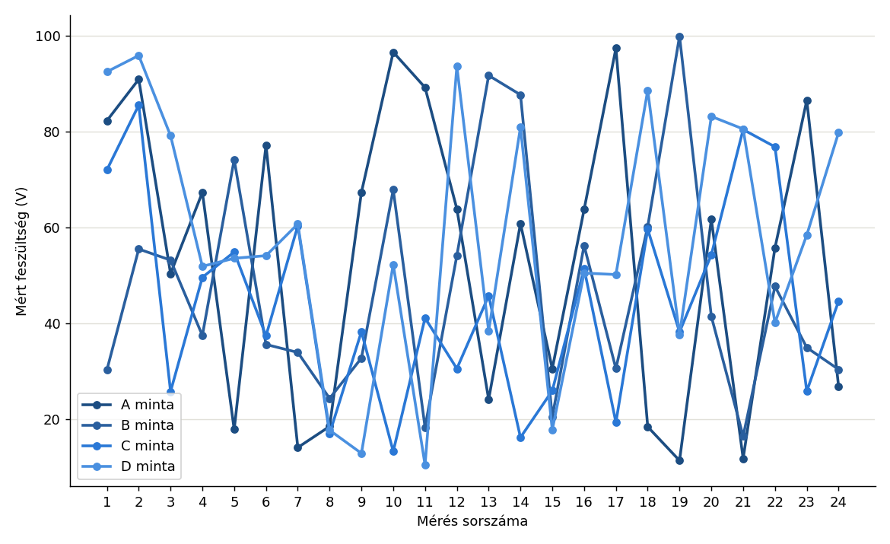

1. Mennyi a mért érték itt: C minta, 10. mérés?
   Válasz: 12

2. Mennyivel tér el egymástól a következő két érték: C minta, 10. mérés és D minta, 14. mérés?
   Válasz: 70

3. Melyik ponton (minta/mérés) a legnagyobb az érték a diagramon a(z) B minta sorozatban?
   Válasz: 19

---

## scatter_level5_rep1 (szint: 5, típus: scatter)

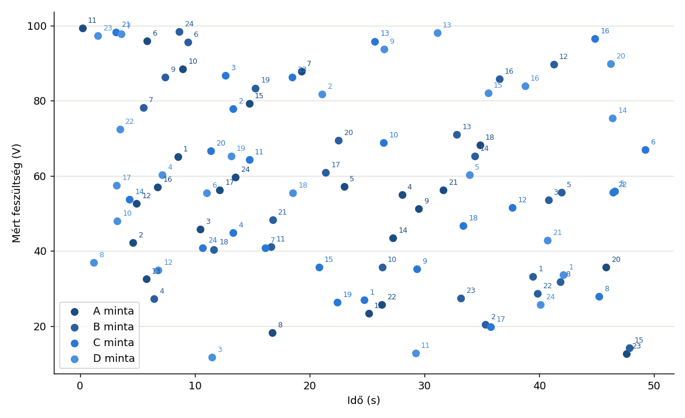

1. Mennyi a(z) C minta sorozat 19. pontjának y-értéke (a mért feszültség)?
   Válasz: 27

2. Mennyivel tér el egymástól a(z) C minta 19. pontjának és a(z) B minta 9. pontjának y-értéke?
   Válasz: 61

3. Hányadik pontnak (sorszám) a legnagyobb az y-értéke a(z) A minta sorozat pontjai közül?
   Válasz: 11

---

## scatter_level5_rep2 (szint: 5, típus: scatter)

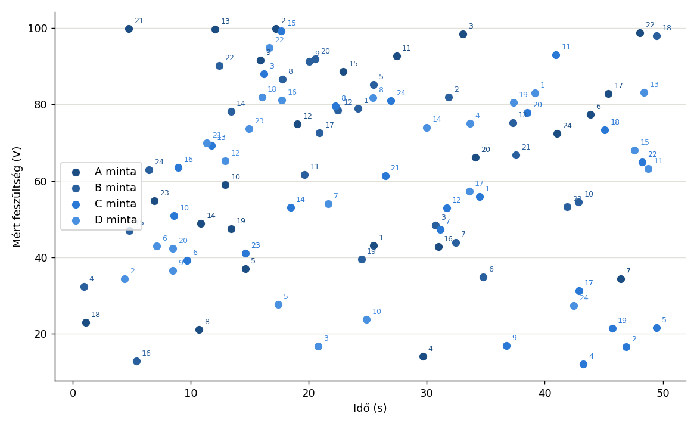

1. Mennyi a(z) A minta sorozat 2. pontjának y-értéke (a mért feszültség)?
   Válasz: 100

2. Mennyivel tér el egymástól a(z) A minta 2. pontjának és a(z) B minta 8. pontjának y-értéke?
   Válasz: 14

3. Hányadik pontnak (sorszám) a legnagyobb az y-értéke a(z) A minta sorozat pontjai közül?
   Válasz: 2

---

## scatter_level5_rep3 (szint: 5, típus: scatter)

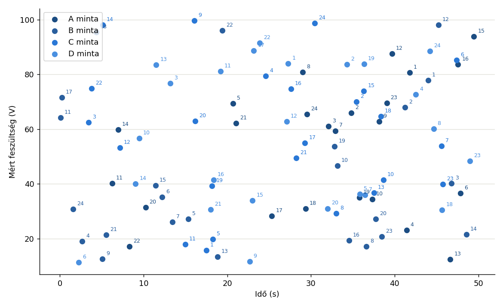

1. Mennyi a(z) C minta sorozat 11. pontjának y-értéke (a mért feszültség)?
   Válasz: 18

2. Mennyivel tér el egymástól a(z) C minta 11. pontjának és a(z) C minta 18. pontjának y-értéke?
   Válasz: 47

3. Hányadik pontnak (sorszám) a legnagyobb az y-értéke a(z) B minta sorozat pontjai közül?
   Válasz: 12

---

## scatter_level5_rep4 (szint: 5, típus: scatter)

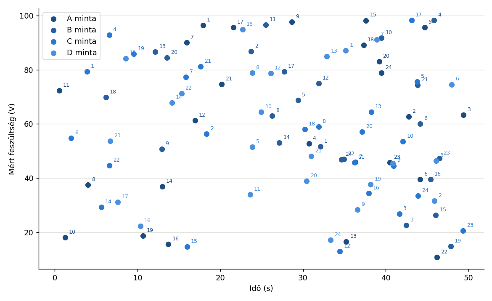

1. Mennyi a(z) B minta sorozat 11. pontjának y-értéke (a mért feszültség)?
   Válasz: 97

2. Mennyivel tér el egymástól a(z) B minta 11. pontjának és a(z) D minta 18. pontjának y-értéke?
   Válasz: 3

3. Hányadik pontnak (sorszám) a legnagyobb az y-értéke a(z) C minta sorozat pontjai közül?
   Válasz: 17

---

## scatter_level5_rep5 (szint: 5, típus: scatter)

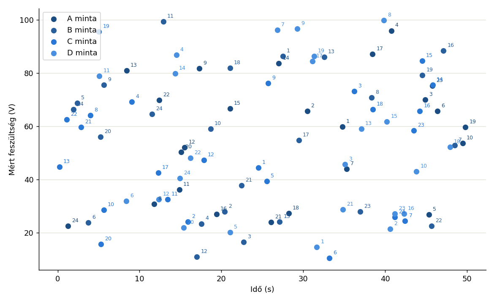

1. Mennyi a(z) C minta sorozat 24. pontjának y-értéke (a mért feszültség)?
   Válasz: 27

2. Mennyivel tér el egymástól a(z) C minta 24. pontjának és a(z) A minta 2. pontjának y-értéke?
   Válasz: 39

3. Hányadik pontnak (sorszám) a legnagyobb az y-értéke a(z) C minta sorozat pontjai közül?
   Válasz: 19

---
