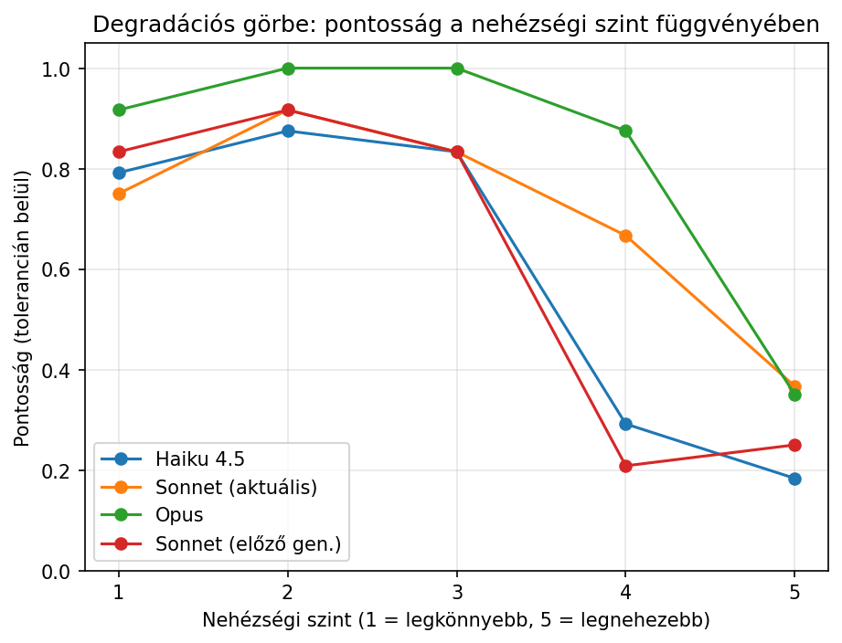
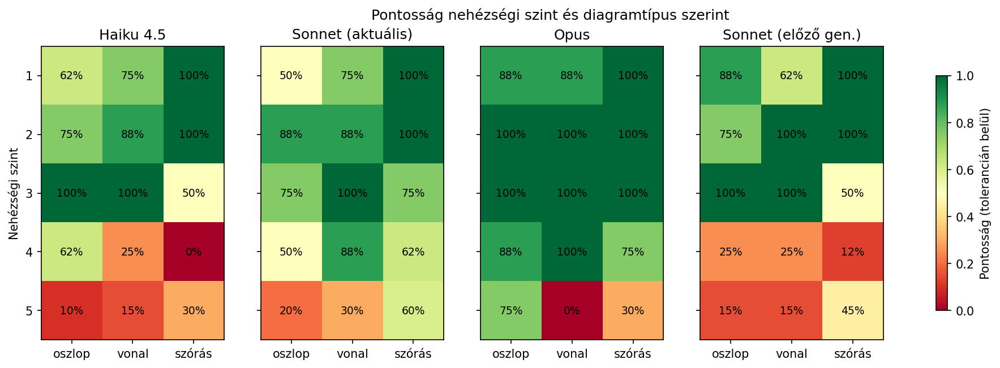
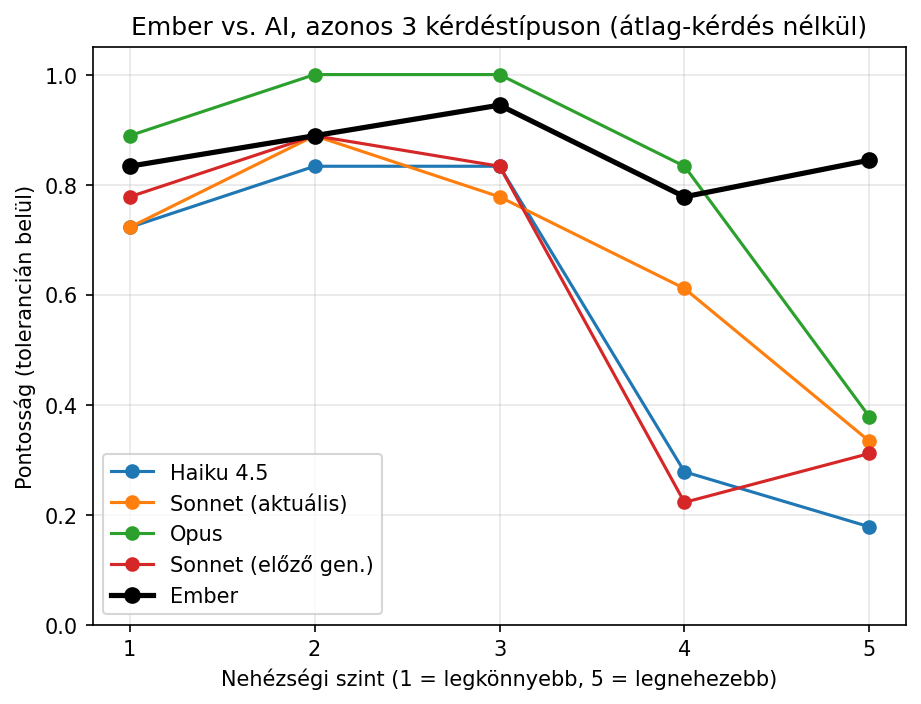
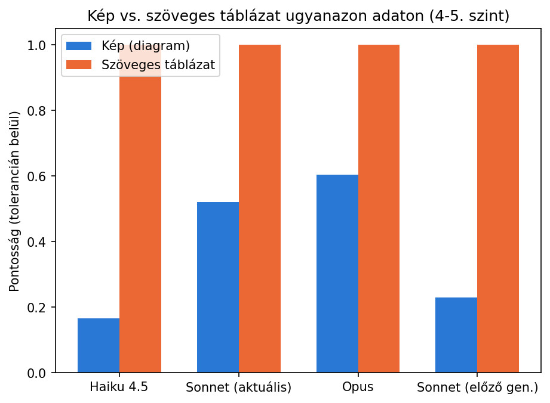
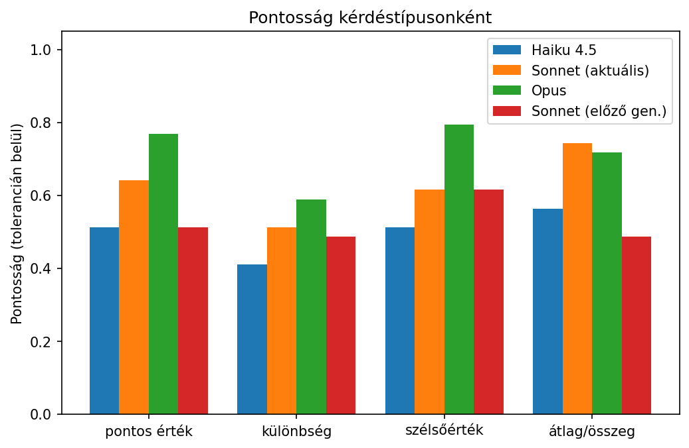
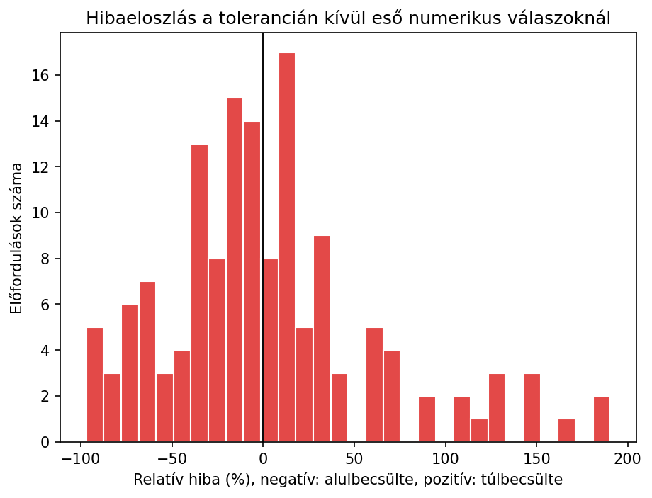

# Diagram-leolvasási pontosság: mikor téved az AI, ha egy grafikonról kell számot leolvasnia?

## A szcenárió

Egy mérnökhallgató egy mérési jegyzőkönyv diagramjából szeretne gyorsan konkrét számértéket kiolvasni AI segítségével, ahelyett hogy manuálisan leolvasná. Ez a kísérlet azt méri, mennyire megbízható ez a módszer, hogyan romlik a pontosság a diagram bonyolultságával, és hogy a hiba forrása a *látás* (a diagram helytelen leolvasása) vagy a *számolás* (a leolvasott adatokkal való műveletek elvégzése).

## Nehézségi létra

39 diagramot generáltam (matplotlibbel, saját, kitalált mérési adatokkal), 3 típusban (oszlop, vonal, szórás) és 5 fokozatos nehézségi szinten:

| Szint | Adatpontok | Pontosság | Sorozatok / színek |
|---|---|---|---|
| 1: nagyon könnyű | 4-5 | kerek egész szám | 1 sorozat |
| 2: könnyű | 6-8 | kerek egész szám | 2 sorozat, jól megkülönböztethető szín |
| 3: közepes | 10-12 | 1 tizedesjegy | 3 sorozat, mérsékelt szín-hasonlóság |
| 4: nehéz | 15-18 | 2 tizedesjegy | 3 sorozat, hasonló (kék) árnyalatok |
| 5: nagyon nehéz | 22-25 | 2 tizedesjegy | 4 sorozat, nagyon hasonló árnyalatok, zsúfolt |

Az 1-4. szint 2-2 ismétlésben készült, az 5. szint (a legérdekesebb, legnagyobb szórású tartomány) 5 ismétlésben, hogy a szélsőséges nehézségnél kapott eredmények ne néhány mintán múljanak.

A könnyű szinteken a `dataviz` skill elveit követve jó, validált színpalettát használtam; a nehéz szinteken szándékosan a valóságban is előforduló rossz gyakorlatot szimuláltam (sok, egymáshoz hasonló szín, sűrű elrendezés). A jó diagram-dizájn tehát nemcsak az embernek segít, az AI-nak is.

Minden diagramhoz 4 kérdés tartozik: pontos érték leolvasása egy megjelölt ponton, két pont közti különbség, szélsőérték azonosítása, és a látható értékek átlaga/összege. Mind a 4 kérdést egy `claude -p` hívásban, JSON tömb-válaszként tettem fel ([`generate_charts.py`](harness/generate_charts.py), [`run_test.sh`](harness/run_test.sh)), a diagramot `@data/charts/<chart_id>.png` képfájl-hivatkozással mellékelve.

**Szöveges kontroll**: a 4. és 5. szinten minden diagramhoz elkészítettem egy párját is, ahol ugyanazokat a kérdéseket ugyanarra az adatra tettem fel, de a diagram helyett egy egyszerű szöveges táblázatban adtam meg az adatokat. Ez elválasztja, hogy egy hibás válasz oka a *diagram-leolvasás* vagy az *adatokkal való számolás* volt-e: ha a modell szöveges adaton hibátlan, a képen viszont téved, a hiba egyértelműen a vizuális leolvasásban van.

**Modellek**: mind a 4 (Haiku 4.5, Sonnet aktuális `claude-sonnet-4-6`, Opus `claude-opus-4-8`, előző generációs Sonnet `claude-sonnet-4-5`) minden diagramon és mindkét (kép/szöveg) módban, összesen 204 hívás, **$14.93** teljes költséggel.

**Kiértékelés** ([`score.py`](harness/score.py)): mivel a ground truth pontosan ismert szám, a válaszból kinyert numerikus értéket egzakt egyezésre és ±5%-os (különbség-kérdésnél ±8%-os) tolerancia-egyezésre is ellenőriztem; a szélsőérték-kérdésnél kulcsszó-egyezést néztem.

## Eredmény: mérhető degradáció

| Modell | Tolerancián belül | Egzakt |
|---|---|---|
| Opus | 71.8% | 35.9% |
| Sonnet (aktuális) | 62.8% | 24.4% |
| Sonnet (előző gen.) | 52.6% | 28.2% |
| Haiku 4.5 | 50.0% | 22.4% |

| Szint | Tolerancián belüli pontosság (minden modell átlaga) |
|---|---|
| 1 | 82.3% |
| 2 | 92.7% |
| 3 | 87.5% |
| 4 | 51.0% |
| 5 | 28.7% |

Az 1-3. szinten minden modell 75-100% körül teljesít, aztán a 4. szintnél éles törés jön. Az 5. szinten (5 ismétlésen mérve) a sorrend szoros: Sonnet 37%, Opus 35%, előző generációs Sonnet 25%, Haiku 18%. A 4. szintig az Opus egyértelműen a legjobb (88% felett), de a legnehezebb szinten ez az előny gyakorlatilag eltűnik: a legmagasabb árkategória nem garantál arányosan jobb teljesítményt a legnehezebb esetekben.

## Emberi alapmérés: hogyan teljesít egy ember ugyanezen a teszten?

A [`build_human_worksheet.py`](harness/build_human_worksheet.py) a 39 diagramhoz egy vakteszt-lapot generál ([`human_worksheet.md`](data/human_worksheet.md)), a ground truth nélkül. Egy ember töltötte ki, csak a képeket nézve. Az átlag-kérdést kihagytuk a lapról, mert azt egy ember ránézésre nem tudja megválaszolni; a maradék 3 kérdéstípus (pontos érték, különbség, szélsőérték) 117 kérdést ad ki, ugyanazon 39 diagramon, amit a modellek is kaptak.

A kiértékelés ugyanazt a pontossági logikát követi, mint a modelleknél ([`score_human.py`](harness/score_human.py)): egzakt egyezés és tolerancián belüli egyezés. A szélsőérték-kérdésnél az ember csak a pont sorszámát írta le (pl. "3"), nem a teljes címkét (pl. "3. mérés"), ezért ott a pontszám sorszám alapján készült, nem szöveg-egyezéssel.

| Kiértékelő | Tolerancián belül | Egzakt |
|---|---|---|
| Ember | 85.5% | 39.3% |
| Opus | 71.8% | 45.3% |
| Sonnet (aktuális) | 59.0% | 29.1% |
| Sonnet (előző gen.) | 53.8% | 35.9% |
| Haiku 4.5 | 47.9% | 27.4% |

Tolerancián belül az ember minden modellnél pontosabb. Egzakt egyezésben viszont az Opus (45.3%) meghaladja az embert (39.3%): az ember gyakrabban ad tolerancián belüli, de nem pontos becslést, az Opus gyakrabban talál el pontos számot.

| Szint | Ember | AI-modellek átlaga |
|---|---|---|
| 1 | 83.3% | 77.8% |
| 2 | 88.9% | 90.3% |
| 3 | 94.4% | 86.1% |
| 4 | 77.8% | 48.6% |
| 5 | 84.4% | 30.0% |

Az 1-3. szinten az ember és az AI-modellek átlaga közel esik egymáshoz, a 2. szinten az AI-átlag magasabb. A 4. és 5. szinten az AI-átlag 48.6%-ra, majd 30.0%-ra csökken, az emberi pontosság 77.8%, illetve 84.4% marad.

| Kérdéstípus | Ember | AI-modellek átlaga |
|---|---|---|
| Pontos érték | 92.3% | 60.9% |
| Különbség | 71.8% | 50.0% |
| Szélsőérték | 92.3% | 63.5% |

A különbség-kérdés az embernél is a leggyengébb kategória (71.8%), ugyanaz a mintázat, mint az AI-modelleknél (50.0%, l. fent).

| Diagramtípus | Ember | AI-modellek átlaga |
|---|---|---|
| Oszlop | 84.6% | 56.4% |
| Vonal | 82.1% | 55.1% |
| Szórás | 89.7% | 62.8% |

Diagramtípus szerint az ember pontossága 82-90%, az AI-modellek átlaga 55-63% között mozog. A sorrend megegyezik: mindkét csoportnál a szórásdiagram a legpontosabb, a vonaldiagram a leggyengébb kategória.

A mérés egy emberi kiértékelőre épül, egy lefutásban: egy konkrét ember pontosságát mutatja, nem egy validált emberi átlagot.

## Kép vs. szöveges adat: hol van a szűk keresztmetszet?

A legérdekesebb eredmény a szöveges kontrollból jött. Ugyanazt a 4 kérdést, ugyanarra a 4-5. szintű, nehéz adatra feltéve, csak diagram helyett szöveges táblázat formájában:

| Modell | Kép | Szöveges táblázat |
|---|---|---|
| Haiku 4.5 | 16.7% | 100.0% |
| Sonnet (aktuális) | 52.1% | 100.0% |
| Opus | 60.4% | 100.0% |
| Sonnet (előző gen.) | 22.9% | 100.0% |

**Mind a 4 modell hibátlan (100%) a szöveges táblázaton, ugyanazon a nehéz adaton, ahol a diagramon 17-60% között teljesítettek.** Ez egyértelműen mutatja, hogy a hiba forrása kizárólag a diagram vizuális leolvasása, nem a számolás vagy az adatokkal való bánásmód: a modellek pontosan ugyanúgy ki tudják számolni a különbséget vagy az átlagot, ha az adatot nem kell egy zsúfolt, hasonló színű diagramról leolvasniuk.

Konkrét példa (`line_level5_rep1`, Haiku): a diagramon mind a 4 kérdésre rossz választ adott (pl. az átlagra 26-ot mondott 59.99 helyett), a pontosan ugyanazon adatot tartalmazó szöveges táblázaton mind a 4 kérdésre egzaktul eltalálta a választ.

## Kérdéstípus és diagramtípus szerinti bontás

A **különbség-kérdés a legnehezebb** (50% átlagosan): logikus, hiszen két külön leolvasási hiba adódik össze. A szélsőérték-kérdés a legkönnyebb (64%).

Diagramtípus szerint alig van eltérés (oszlop 59%, vonal 56%, szórás 63%). Ez a szórásdiagramnál nem volt mindig így, l. lentebb a módszertani buktatót.

A téves numerikus válaszok nagy része nem apró kerekítési hiba, hanem 10-50%-os nagyságrendű, mindkét irányba szóró tévedés. Vagyis ha egy modell téved a diagramon, gyakran nem "majdnem jó" választ ad, hanem érdemben rossz értéket, miközben ugyanazt az adatot szövegből hibátlanul kezeli.

## Konkrét példák

**Egy könnyű eset** (`scatter_level2_rep1`, 2. szint, 7 pont, 2 jól elkülönülő szín): mind a 4 modell minden kérdésre tolerancián belüli választ adott, jellemzően 1-2 egységnyi eltéréssel (pl. a helyes 50 helyett 48-51 közötti válaszok). Ezen a szinten a diagram-leolvasás gyakorlatilag megbízható. Az ember mindhárom (átlag nélküli) kérdésre is tolerancián belüli választ adott: 50 (helyes: 50), 46 (helyes: 45), 6 (helyes: 6).

**Egy nagyon nehéz eset** (`bar_level5_rep1`, 24 mérés, 4 sorozat, hasonló kék árnyalatok):

| Kérdés | Helyes válasz | Sonnet-4-5 | Haiku | Opus | Sonnet | Ember |
|---|---|---|---|---|---|---|
| Pontos érték | 64.62 | 58 ✗ | 60 ✗ | "kb. 64 V" ✓ | 65 ✓ | 65 ✓ |
| Különbség | 1.51 | 30 ✗ | 2 ✗ | "kb. 4 V" ✗ | 24 ✗ | 2 ✗ |
| Szélsőérték | 13. mérés | 13. mérés ✓ | 14. mérés ✗ | "B minta, 13. mérés" ✓ | "B minta, 18. mérés" ✗ | 13 ✓ |
| Átlag | 55.913 | 72.5 ✗ | 52 ✗ | "kb. 58 V" ✓ | 60 ✗ | nem kérdeztük |

A különbség-kérdésen **mind a 4 modell elbukott**: a helyes válasz (1.51, azaz gyakorlatilag azonos két érték) egyik modellnek sem sikerült, egymással sem egyező hibás válaszokkal (30, 2, 4, 24). 24, egymáshoz nagyon hasonló színű oszlop között két konkrét, közeli értékű oszlopot pontosan megtalálni és összehasonlítani nehézséget okoz a mai modelleknek is. Az ember is elhibázta ugyanezt a kérdést (2, a helyes 1.51 helyett): két közeli oszlop pontos összehasonlítása egy zsúfolt, hasonló színű diagramon nem csak az AI-modelleknek, az embernek is nehézséget okoz.

A jelenlegi Sonnet **egyszer sem** válaszolt "nincs adat"-tal 51 kérdésből (mindig adott valamilyen számot, akkor is, ha rosszat), míg Haiku 13-szor, az előző generációs Sonnet 9-szer, az Opus 15-ször ismerte el bizonytalanságát. Ez nem feltétlenül jó vagy rossz, de azt mutatja, hogy a modellek eltérően kezelik a bizonytalanságot: van, amelyik inkább hallgat, van, amelyik mindig ad egy becslést.

## Módszertani buktató 1: a szórásdiagram pontjai nem voltak számozva

Az első verzióban a szórásdiagramok kérdései olyasmit kérdeztek, hogy "melyik a 7. pont értéke", de maguk a pontok **nem viseltek semmilyen látható sorszámot** a diagramon, tehát a kérdés a képből kiindulva elvileg megválaszolhatatlan volt. Ez nem az AI hibája volt, hanem a saját tesztem hibája: a modellek gyakorlatilag találgattak, és ez a szórásdiagramoknál mesterségesen alacsony, torz pontossági eredményt adott.

A javítás: minden ponthoz kis sorszám-címkét adtam a diagramon (l. [`generate_charts.py`](harness/generate_charts.py) `make_scatter()` függvénye), majd a szórásdiagramos cellákat újrafuttattam. A javítás előtt a szórásdiagram pontossága 34% volt, a diagramtípusok közül a legrosszabb; a javítás utáni első (30 diagramos) mérésben 71%-ra ugrott, a legjobb. A különbség szinte teljes egészében a hiányzó címkézésnek volt betudható, nem a modellek tényleges olvasási képességének.

## Módszertani buktató 2: a Python `hash()` nem stabil futtatások között

A diagramgeneráló script eredetileg Python beépített `hash()` függvényét használta a véletlenszám-generátor seedeléséhez (`hash((chart_type, level, repeat))`). Python biztonsági okból **véletlenszerűsíti a string- és tuple-hash-eket minden folyamatindításkor**, tehát minden újrafuttatás más-más diagramot és más ground truth-ot generált ugyanazokkal a bemeneti paraméterekkel. Amikor a szórásdiagram-javítás miatt újra lefuttattam a generátort, ez véletlenül a bar/line diagramok adatait is lecserélte, miközben a hozzájuk tartozó, korábban begyűjtött API-válaszok a *régi* diagramokra vonatkoztak. A kiértékelés így értelmetlen, összehasonlíthatatlan adatokat kapott (átmenetileg 8%-os "pontosságot" mutatva bar/line-nál, ami nyilvánvalóan hibás volt).

A javítás: `random.Random(f"{chart_type}_{level}_{repeat}")`. A `random.Random()` konstruktor stringgel hívva determinisztikus, futtatások között stabil seedelést ad, szemben a beépített `hash()`-sel. Két külön processzben lefuttatva a generátort, a kimenet bájtra egyezett. Emiatt viszont a teljes hívássorozatot újra kellett futtatni egy végleges, stabil diagramkészlettel: a javítás után a bar és line diagramok pontossága a hibás 8%/7%-ról a valós, mérhető szintre állt helyre, vagyis a hibás mérés nem enyhén torzított, hanem a teljes eredményt értelmetlenné tette.

## Összefoglaló tanulságok

1. **A hiba forrása a látás, nem a számolás.** Ugyanazon a nehéz adaton a modellek diagramon 17-60%-ot, szöveges táblázatként 100%-ot teljesítettek. A diagram-leolvasás gyengesége tisztán vizuális, nem aritmetikai korlát.
2. **A diagram-leolvasás mérhető gyengeség** a mai Claude modelleknél is: egyértelmű romlás látszik a nehézség növelésével (82% → 29%).
3. **A törés nem fokozatos, hanem éles**: 1-3. szinten minden modell jól teljesít, a 4. szintnél hirtelen zuhanás következik be.
4. **A legnehezebb szinten összeszűkül a különbség a modellek között**: 4. szintig az Opus egyértelműen vezet, az 5. szinten viszont mind a 4 modell 18-37% közé szorul, a sorrend nem stabil.
5. **A "két közeli érték összehasonlítása" a legnehezebb feladat.** Nem az egyedi értékek leolvasása, hanem a finom különbségek észrevétele omlik össze először zsúfolt, hasonló színű diagramokon.
6. **A jó diagram-dizájn AI-olvashatósági kérdés is**, nem csak emberi: a validált, jól elkülönülő színpaletta és a rendezett elrendezés (l. `dataviz` skill) mérhetően segíti a pontos leolvasást.
7. **Az emberi alapmérés szerint az AI-modellek pontossága esik vissza a nehéz szinteken, az emberi pontosság nem.** Egy ember tolerancián belüli pontossága minden szinten 77-94% között marad (117 kérdés, 3 kérdéstípuson mérve), az AI-modellek átlaga viszont az 5. szinten 30%-ra csökken. Egzakt egyezésben ugyanakkor az Opus (45.3%) meghaladja az embert (39.3%).

## Nyers adatok

- Diagramok és ground truth: [`data/charts/`](data/charts/) (39 diagram-kép + 12 szöveges kontroll-prompt, [`ground_truth.json`](data/charts/ground_truth.json))
- Harness: [`generate_charts.py`](harness/generate_charts.py), [`run_test.sh`](harness/run_test.sh), [`score.py`](harness/score.py), [`models.json`](harness/models.json)
- Kiértékelt eredmények: [`results.csv`](data/results.csv)
- Emberi alapmérés: kitöltött lap [`human_worksheet.md`](data/human_worksheet.md) (generálás: [`build_human_worksheet.py`](harness/build_human_worksheet.py)), pontozás: [`score_human.py`](harness/score_human.py), eredmény: [`human_results.csv`](data/human_results.csv)
- Elemző script: [`analyze.py`](analyze.py)
