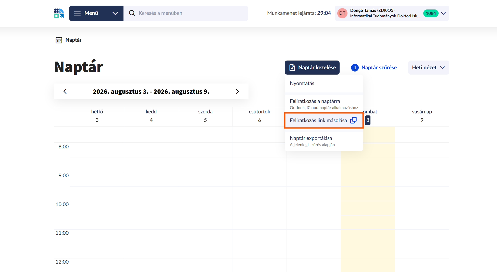
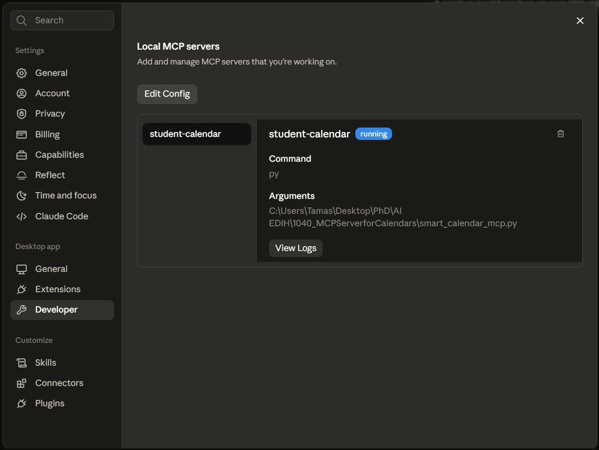
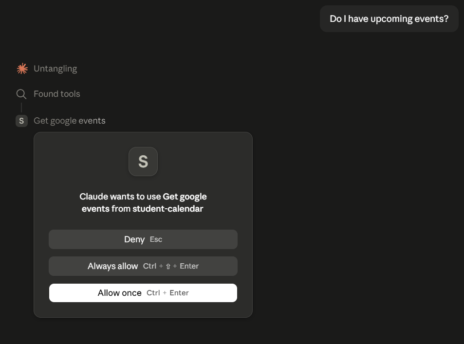

# MCP szerver Google Calendar és Neptun naptár integrációhoz

Ez az esettanulmány bemutatja, hogyan fejleszthető és konfigurálható egy helyi Model Context Protocol (MCP) szerver Pythonban, amely zökkenőmentesen köti össze egy hallgató egyetemi (BME Neptun) órarendjét, valamint privát Google Naptárát egy asztali Nagy Nyelvi Modell (LLM) klienssel. 

A projekt fő célja egy automatizált tanulmányi tervező asszisztens létrehozása volt. Az LLM-nek képesnek kellett lennie kiolvasni a fix egyetemi elfoglaltságokat (órák, vizsgák) a Neptun által biztosított `.ics` (iCalendar) feedből, elemezni a hallgató Google Naptárának üres időszakait, és intelligensen betervezni, majd létrehozni a vizsgafelkészülési blokkokat. 

## Tanulságok

A fejlesztési és hibakeresési folyamat során számos értékes tapasztalat gyűlt össze, mind az API integráció, mind a helyi AI kliensek üzemeltetése terén:

- **Google Cloud Console - Desktop App OAuth specifikumok:** Helyi Python szkripttel történő Google Naptár hozzáféréshez a Google Cloud Console-ban kifejezetten "Desktop app" típusú OAuth 2.0 klienst kell létrehozni. Mivel az alkalmazás "Testing" státuszban marad, **fontos a saját teszt e-mail cím hozzáadása a "Test users" listához**. Ennek hiányában a Google a bejelentkezés végén `403: access_denied` hibát dob.
- **Az időzónák kezelésének szerepe:** A naptárkezelő AI asszisztensek leggyakoribb és legrejtettebb hibaforrása az időzónák elcsúszása (UTC vs. lokális idő). Két ponton is érdemes védekezni a hibák ellen: 
  1. A kód szintjén: A Google API kérés JSON törzsébe érdemes hardcode-olni a `timeZone: 'Europe/Budapest'` értéket.
  2. A prompt szintjén: Az LLM-nek olyan *system prompt* utasítást kell adni, hogy soha ne generáljon nyers UTC sztringeket, hanem az ISO dátumokat a helyi időzóna eltolódásával (pl. `+01:00` CET esetén, `+02:00` CEST esetén) adja át a funkciónak.
- **Open WebUI vs. Helyi Asztali Kliensek (Claude Desktop):** Bár az Open WebUI egy népszerű webes felület, Windows alatti natív (nem Docker) futtatása komoly hálózati akadályokba ütközhet. Az `aiohttp` könyvtár hajlamos ignorálni a Windows DNS beállításait, és az ezt megkerülni próbáló LiteLLM proxy gyakran okoz FastAPI függőségi konfliktusokat különböző Python alverzióknál. Az MCP szerverek tesztelésére és futtatására sokkal stabilabb, out-of-the-box alternatíva egy dedikált asztali kliens, mint például a Claude Desktop (amelyet a példa további részében is használtam), vagy a ChatGPT asztali verziója, de akár a Cursor illetve az Antigravity IDE-k is jól használhatók.
- **Claude Desktop MCP integráció Windowson:** A Claude Desktop helyi MCP eszköztára egy egyszerű `claude_desktop_config.json` fájlon keresztül bővíthető. Windowson ügyelni kell arra, hogy a JSON struktúrában minden elérési útnál dupla visszaperjelet (`\\`) kell használni. Emellett a `command` paraméterhez gyakran nem elég a `py` rövidítés; meg kell adni a `python.exe` pontos, abszolút útvonalát (pl. `C:\\Users\\...\\Python313\\python.exe`), hogy a háttérfolyamat biztosan el tudja indítani a szervert.
- **A Neptun `.ics` export adathiánya:** Meglepő módon a Neptunból kinyert naptárfájl kizárólag a hallgató által személyesen felvett órákat, kurzusokat és vizsgaidőpontokat tartalmazza. Az általános egyetemi naptár eseményei (például a tantárgyfelvételi időszak, a vizsgaidőszak kezdete vagy a beiratkozási hetek) teljesen hiányoznak belőle. Emiatt az AI asszisztens hiába látja a napi órarendet, nem tud válaszolni a félév adminisztratív mérföldköveire vonatkozó kérdésekre, hacsak nem biztosítunk neki egy külön adatforrást a hivatalos tanév rendjéről.

## A folyamat felépítése és architektúrája

A projekt megvalósítása három, jól elkülöníthető lépésből állt, amely során egy önálló, lokális API szervert húztunk fel, és kötöttünk be egy okos kliens alá.

### 1. Fázis: Google Cloud Platform (GCP) OAuth beállítása
Mivel a naptár írás-olvasás érzékeny adat, a folyamat egy biztonságos hitelesítési keretrendszer felállításával indult a Google Cloud konzolon:
- Új projekt létrehozása és a **Google Calendar API** engedélyezése.
- **OAuth consent screen** beállítása "External" felhasználótípussal, és az applikáció teszt módba állítása. Ezen a ponton adtam hozzá az e-mail címemet a "Test users" listához.
- **Credentials** generálása "Desktop app" típussal. Az így kapott `credentials.json` fájlt letöltöttem a projekt helyi mappájába, amely mintegy "kulcskártyaként" szolgál a Python szkript számára.

### 2. Fázis: Az MCP Szerver fejlesztése (Python + FastMCP)
A `smart_calendar_mcp.py` szkript alkotja a rendszer "agyát". A `fastmcp` csomag segítségével pillanatok alatt kialakítottam egy szabványos MCP szervert, amely három dedikált eszközt (tool-t) publikál az LLM számára:
- `@mcp.tool() get_neptun_schedule`: Ez a függvény az `icalendar` csomagot használja. Lekéri a Neptunból a megadott nyílt `.ics` URL-t, letölti a fájlt, majd végigiterál rajta, és kiszűri a következő X nap (alapértelmezetten 7) eseményeit. A kimenet egy jól olvasható, kronologikus szöveges lista a kurzusokról. *(Fontos korlát: a fent említett adathiány miatt a modell csak a privát beosztást látja, az egyetemi naptárat nem).*
  
- `@mcp.tool() get_google_events`: A Google Calendar API `events().list` metódusát hívja meg. Ugyanúgy kronologikus sorrendben lekéri a felhasználó elsődleges (`primary`) naptárából az elkövetkező napok eseményeit.
- `@mcp.tool() create_personal_event`: Ez a függvény végzi a transzakciós műveletet. Fogadja az LLM által generált eseménynevet, a kezdő és végdátumokat (ISO 8601 formátumban), valamint a leírást. Létrehozza az objektumot a Google API felé, szigorúan `Europe/Budapest` időzónára kényszerítve az időpontokat, majd visszatér a sikeresen létrehozott esemény HTML linkjével.

*Megjegyzés: A szkript első lokális futtatásakor elindul egy böngészős OAuth flow, ahol a felhasználó engedélyt ad a hozzáférésre. A kapott engedélyt a kód elmenti egy `token.json` fájlba, így a későbbiekben (amikor már az LLM hívja a háttérben) nem lesz szükség bejelentkezésre.*

### 3. Fázis: Kliens integráció
A cél az volt, hogy a hallgató egyszerű természetes nyelven (chat felületen) keresztül tudja utasítani a rendszert. 
- Kezdetben az Open WebUI kliensével próbálkoztam, de végül a stabil megoldást a **Claude Desktop** alkalmazás biztosította. Ez az asztali program beépített MCP támogatással rendelkezik. A `claude_desktop_config.json` módosításával betöltöttem a Python szervert, így a Claude modell megkapta a naptárak olvasásának és a Google naptár írásának képességét, mindenféle bonyolult hálózati proxy beállítása nélkül.  
  

## A munkafolyamat tanulságos részletei és hibakeresés

A projekt során számos technikai akadályba ütköztem. Az alábbiakban bemutatom a legérdekesebb problémákat és azok megoldásait, amelyeket nagyrészt az LLM segítségével oldottam meg.

### Az Open WebUI DNS és Proxy hálózatépítési kálváriája

A legnagyobb küzdelmet a kliens kiválasztása jelentette. Megpróbáltam a Gemini API-t használni egy helyi Open WebUI telepítésben (OpenAI kompatibilis végponton keresztül). Azonban sorozatos hálózati hibákat kaptunk: `[Could not contact DNS servers]`.

Kiderült, hogy Windows rendszereken az Open WebUI által használt Python hálózati modul (`aiohttp`) időnként képtelen feloldani a külső domaineket, különösen ha VPN (pl. egyetemi hálózat) vagy agresszív vírusirtó van a gépen. 

Kísérletet tettem a probléma megkerülésére a **LiteLLM** helyi proxy futtatásával, hogy mentesítsem az Open WebUI-t a közvetlen internetes kérések alól. Azonban itt egy újabb akadályba ütköztem: `ImportError: cannot import name 'get_flat_dependant'`. Ez egy klasszikus FastAPI és Pydantic verziókonfliktus volt a háttérben.

**AI javaslat az irányváltásra:**
> "We have spent a lot of time fighting with local Python packages, SSL errors, and Open WebUI bugs. Let's abandon the Open WebUI route. It is overcomplicating what should be a simple connection. Let's use Claude Desktop. It is an official, native desktop application that has flawless, built-in support for local MCP servers."

### A Claude Desktop MCP integráció finomhangolása

A Claude Desktop valóban sokkal stabilabbnak bizonyult, de Windowson itt is figyelnünk kellett a részletekre. Amikor a `claude_desktop_config.json` fájlban beállítottuk a szervert, a kliens felületén nem jelent meg az elérhető eszközöket jelző ikon.

Az AI rámutatott, hogy a háttérben futó Claude processz nem mindig ismeri fel a `py` vagy `python` parancsokat Windowson, ha azok nincsenek tökéletesen regisztrálva a környezeti változókban.

**Megoldás:**
A JSON konfiguráció `"command"` kulcsánál a `py` rövidítés helyett megadtuk a Python értelmező pontos, abszolút útvonalát:
`"command": "C:\\Users\\Tamas\\AppData\\Local\\Programs\\Python\\Python313\\python.exe"`
*Különös figyelmet érdemel a dupla visszaperjelek (`\\`) használata, ami JSON fájlok esetében kötelező szintaktikai elem Windowson.*

### Engedélyek

A Claude Desktop minden alkalommal, amikor egy újabb tool-t használunk, engedélyt kér a kérés végrehajátására. Érdemes az "Always allow" lehetőséget választani, így a későbbiekben nem fog megjelenni az üzenet.

