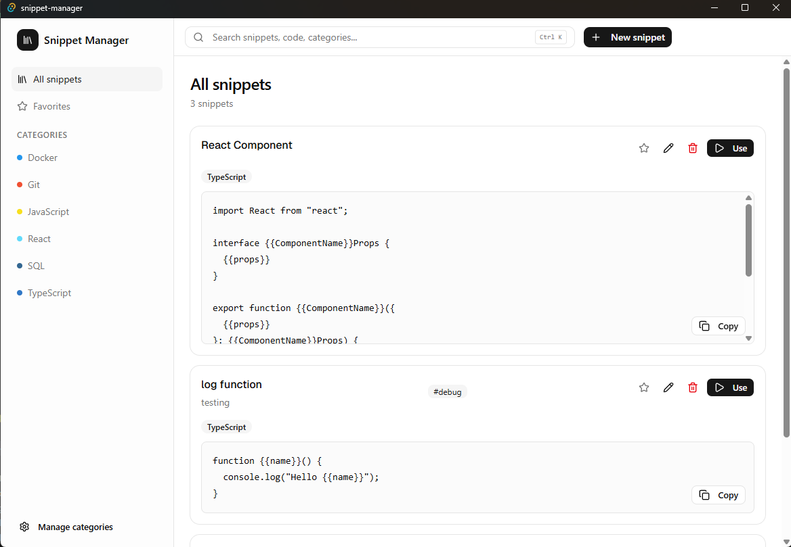
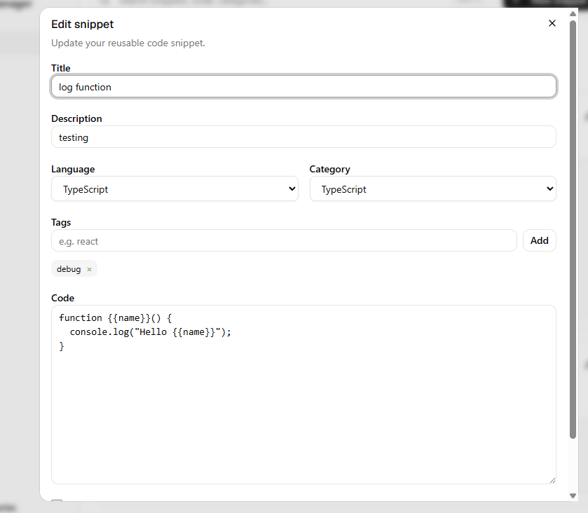
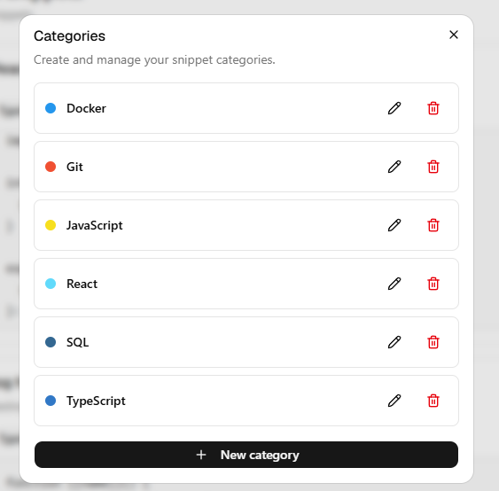
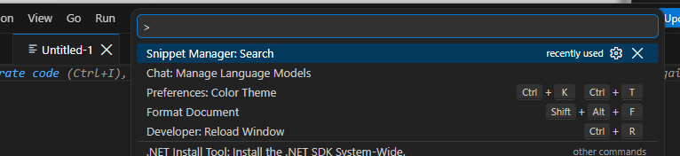
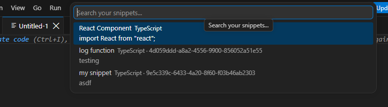
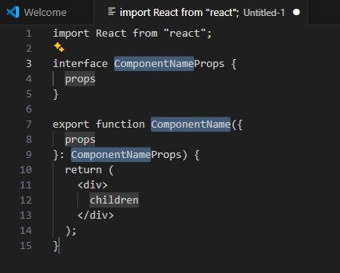

# MI esettanulmány – Vágólap-kezelő applikáció kkészítése esettanulmány

A kész projekt elérhető [itt](https://github.com/peterz0ne/snippet-manager).

## Tartalomjegyzék

* [Célkitűzések](#célkitűzések)
* [Kiindulás és Architektúra](#kiindulás-és-architektúra)
* [Környezet kialakítása](#környezet-kialakítása)
* [Core Funkcionalitás](#core-funkcionalitás)
* [UI](#ui)
* [Funkciók](#funkciók)
* [Tanulságok össszefoglalva](#tanulságok-össszefoglalva)

## Célkitűzések

A mindennapok során gyakran előjön, hogy szeretnék valamit gyorsan lejegyezni, és eddig erre az operációs rendszer által kínált alkalmazások, bár gyakran elégnek tűnnek, könnyen visszakereshetetlenné válnak és összekeverednek egymással.

Az alkalmazás a gyorsan lementendő szöveges tartalmak minél egyszerűbb kezelésére a következő funkciókkal igyekszik a használóját segíteni:
- új snippet gyors rögzítése, elsősorban gyorsbillentyűk segítségével
- a snippetek rendszerezése
- hatékony keresési lehetőség biztosítása
- VS Code-integráció

Az alkalmazást, a fejlesztés során ágensek használata helyett promptok segítségével készítettem el. Ennek fő oka az volt, hogy ne legyen teljesen idegen az elkészült kódbázis, az egyes lépéseket követni tudjam az aktuális fejlesztési lépések során, illetve hogy a fejlesztés folyamán feltehessem a kérdéseimet, ahol esetleg nem értettem a javaslatot. Erre a ChatGPT ingyenesen elérhető modelljét használtam fel.

Igyekeztem egy kontextusban kezelni a teljes applikációt.
Ennek oka az egységes kontextusra való törekvés, hogy megspóroljam a kontextusváltáskori hatalmas promptokat, illetve a váltásból történő inkompatibilitást.

## Kiindulás és Architektúra

Igyekeztem egy minél egyszerűbb és általánosabb kezdőprompttal indítani, hogy apró részfeladatok megoldása helyett az LLM egy nagyobb terjedelmű tervet tudjon kidolgozni és abból származtatni az alfeladatokat.

A következő prompttal indítottam a kontextust:
```txt
Szeretnék készíteni egy Snippet manager applikációt, ahol 
- az általam gyakran használt snippet-eket tudom kategorizálni
- tárolni
- paraméterezni
- keresni gyorsbillentyűkkel
sőt akár integrálni is VSCode-al.
Milyen megvalósítási architektúrát, eszközöket javasolsz?
```

A válaszban egy aránylag egyértelmű és tálátható architektúrális tervet vázolt fel a modell

```txt
...
                    ┌──────────────────────────┐
                    │       UI / Desktop       │
                    │   React + TypeScript     │
                    │                          │
                    │ Search / Editor / Tags   │
                    │ Variables / Categories   │
                    └────────────┬─────────────┘
                                 │
                         Application Layer
                                 │
                    ┌────────────▼─────────────┐
                    │       Core Domain        │
                    │                          │
                    │ Snippet                  │
                    │ Category / Tag            │
                    │ Variable / Parameter      │
                    │ Templates                 │
                    │ Search                   │
                    └────────────┬─────────────┘
                                 │
              ┌──────────────────┼──────────────────┐
              │                  │                  │
       ┌──────▼──────┐   ┌──────▼──────┐   ┌──────▼──────┐
       │ Persistence │   │ Integrations│   │   Import /  │
       │             │   │             │   │   Export    │
       │ SQLite      │   │ VS Code     │   │ JSON/YAML   │
       │ Repository  │   │ Git         │   │ Markdown    │
       └─────────────┘   │ Clipboard   │   └─────────────┘
                         └─────────────┘
...
```
A magasszintű leírásra a következő válaszokat kaptam.

Megtervezte a `Snippet` osztályt és hozott példát annak sémájára:

```txt
...
Snippet {
  id: string
  title: string
  description?: string

  content: string

  language?: string
...

Például egy snippet:

const {{name}} = await fetch("{{url}}", {
  method: "{{method}}"
});

```

Megtervezte magas szinten a template nyelvet
```txt 
...
function {{functionName}}({{parameters}}) {
    {{body}}
}
...
```

Az adattárolásnak SQLite-ot ajánlott, a futtatáshoz Tauri-t, a megjelenítéshez pedig Reactot.
Továbbá a keresés mikéntjére is hozott ötleteket.
A végén pedig egy összefoglaló roadmap-et kaptam, hogy mit milyen sorrendben lenne érdemes lefejleszteni::
```txt
                 ┌──────────────┐
                 │    React     │
                 │   Desktop    │
                 └──────┬───────┘
                        │
                 ┌──────▼───────┐
                 │ Application  │
                 │    Core      │
                 └──────┬───────┘
                        │
        ┌───────────────┼────────────────┐
        │               │                │
   ┌────▼────┐    ┌─────▼─────┐    ┌────▼────┐
   │ SQLite  │    │ Template  │    │ Search  │
   │         │    │ Engine    │    │  FTS5   │
   └─────────┘    └───────────┘    └─────────┘
                        ▲
                        │
              ┌─────────┴──────────┐
              │                    │
       ┌──────▼──────┐      ┌──────▼──────┐
       │ VS Code     │      │     CLI     │
       │ Extension   │      │             │
       └─────────────┘      └─────────────┘
```

Összességében tehát egy *brainstorm* eredményét állította elő nekem, ahol az egyes modulok, azok eszközei, illetve az egyes funkciókra példák szerepeltek. A tervekkel elégedett voltam, így el is kezdtem generáltatni vele a kódot.

## Környezet kialakítása

Az első lépésben a fejlesztői környezet kialakításában segített. Ehhez lépésről lépésre végigvezetett, hogy melyik eszközöket honnan és hogyan tudom feltelepíteni, hogy ez működhessen, illetve PowerShell-kódokkal elkészítette a mappastruktúrát is.
Meglehetősen kevés hibával sikerült is megadnia.

A válaszok ebben az esetben főként npm install és mkdir parancsokból álltak:
```txt
npx shadcn@latest add button
npx shadcn@latest add input
npx shadcn@latest add textarea
...
```

## Core Funkcionalitás

A következőkben nekilátott az alapfunkcionalitás implementálásának, amelyre a következőkben a funkciók épülnek majd.
Itt egymás alatt `.tsx` fájlokat készített el, ahol csak annyit fűzött főként hozzá, hogy mit, illetve hova hozzam azt létre.
```txt
...
6. Header

src/components/layout/Header.tsx

import { Search, Plus } from "lucide-react";
import { Button } from "@/components/ui/button";
import { Input } from "@/components/ui/input";


interface HeaderProps {
  onCreateSnippet?: () => void;
}


export function Header({ onCreateSnippet }: HeaderProps) {
  return (
    <div clas
    ...
```

Pár helytelen importtól eltekintve a kód lefordult és helyesen működött.
Magyarázatot sajnos nem generált a kódhoz, ami nehezítette annak megértését. Elsőre egyszerűnek tűnt csupán bemásolni a megfelelő kódrészleteket a megfelelő helyekre, azonban korán nyilvánvalóvá vált, hogy ezt folytatva a kódbázist nem ismerem meg.


## UI

Ezt követte a felhasználói felület kialakítása, amely a beégetett felületi elemeket kötötte össze a korábban implementálásra került alappal.
A fejlesztés ezen fázisa is kimerült az LLM által generált kódok egy az egyben történő fájlokba illesztésével.

Ezzel egy időben visszamenőleg módosításokat javasolt az alapfunkciókon, például:
```txt
...
6. Egy kis repository-finomítás

A getAllSnippets() most minden módosítás után újra lekéri az adatokat. MVP-ben ez teljesen rendben van.

Viszont az update-nél érdemes ellenőrizni, hogy tényleg módosult-e rekord.
...
```

Miután elkészült a kezdetleges felhasználói felület, az egyes funkciók implementálása következett.

Ezt követő kérdéseim a kódbázisra irányultak, hogy magyarázza el, hogy melyik változtatás melyik komponenst hogyan érintette, és mi a szerepe. Erre egyértelmű és érthető válaszokat kaptam.

## Funkciók

Az egyes funkciók implementálása során már teljes fájlok helyett csupán fájlrészleteket biztosított, és indikálta, hogy melyiket hova kell beilleszteni.
```txt
A Snippet-et módosítsuk:

export interface Snippet {
  id: string;
  title: string;
...
```

Néhány kisebb importhibától eltekintve ezek is rendszerint működtek. Meglepő volt látni, hogy bár ezen a ponton még mindig ugyanabban a kontextusban jártam, a modell által adott válaszok kompatibilisek voltak a kódbázissal, és tisztában volt azzal, hogy mit, hol, hogyan kell változtatni, továbbá hogy ennek folyamán nem hallucinált nem létező kódrészleteket.

Fejlesztői szempontból azonban csak ebben a stádiumban vált nyilvánvalóvá számomra, hogy bár korábban törekedtem a kódbázis megértésére, valójában alig voltam vele tisztában. Gyakran abban is elbizonytalanodtam, hogy mit hova kell beilleszteni. Eleinte igyekeztem visszakérdezni, hogy aktuálisan milyen problémát orvosolt vagy funkciót implementált, de a rengeteg változtatást a későbbiekben gyakorlatilag lehetetlenné vált fejben követni.
```txt
...
ez utóbbival milyen fejlesztés lett kész?


Az utolsó módosítással nem került új funkció az appba, hanem a meglévő SnippetForm-ot tisztítottuk és stabilizáltuk.

Konkrétan:
✅ Eltávolítottuk a duplikált, nem használt form state-et.
...
```

A funkcionalitások implementálása közben gyakran nem tudtam, hogy valójában mit, hogyan valósít meg az LLM.
Ha felmerült egy hiba, egyből a modellhez fordultam, mivel magamtól nem tudtam, hogy mi okozhatja a problémát, mi miért felel, mi hogyan épül fel.
Ilyen esetekben pusztán a hibaüzenetből vagy a felmerülő tünetekből a modell gyakran egyből (rosszabb esetekben 1-2 ciklusban) rájött az okra, és hatékonyan tudta javítani a hibát.

A hibák orvoslása során több esetben is valójában a hiányos vagy a rossz helyre történő bemásolások okozták a problémát, azaz a kódbázis ismeretének hiánya a részemről.

A funkciók implementálása során, csupán követve az elején kitűzött célokat, gyakran találtam magam szemben olyanok fejlesztésével, amelyeket kezdetben nem is kértem.
Az alkalmazást az LLM egyszerűen új funkciókkal akarta kiegészíteni (pl.: kedvenc snippet-ek, komplex tagging rendszer a kategorizálás mellett), amelyek szintén nehezítették a kódbázis megértését.

Az implementálásra került, a projekt elején is kért funkciók:
- gyorsgombok
- komplex keresés
- rendszerezés
- template-ek használata

Implementált extra funkciók
- tag-ek használata
- kedvencek menüpont
- egyszerű copy


Az egyes funkciók fejlesztését követően gyakran ugrott vissza és változtatott már meglévő kódrészleteket. Ezt kifejezetten pontosan csinálta, és közel tökéletesen tisztában volt vele, hogy hogyan néz ki a kódbázisom ezen a ponton is, annak ellenére, hogy nem volt közvetlen rálátása.
Az alkalmazásból csupán a VS Code-integráció hiányzott, ugyanakkor ezen a ponton sajnos a kódbázissal egyáltalán nem voltam már tisztában. Ezt elősegítette továbbá az is, hogy az egyes hibák javítása/funkciók implementálása csak függvények és változók bevezetését jelentette. Ebből kifolyólag a funkcionalitás és megjelenés leírásáért felelős fájlok mérete hatalmasra nőtt (250-500 sor).

A kész desktop app:




## VSCode integráció

Korábban még nem volt tapasztalatom extension fejlesztésével, így teljesen ismeretlenként kezdtem neki.

Az LLM a következő megoldást javasolta:
```txt
...
1. Hogyan kommunikáljon a VS Code extension?
Mivel a Tauri app és a VS Code extension két külön folyamat, legegyszerűbb egy lokális HTTP API.

VS Code Extension
       │
       │ HTTP localhost
       ▼
Tauri App
       │
       ▼
SQLite

Például:

GET http://127.0.0.1:47821/api/snippets?q=react

válasz:
[
  {
    "id": "...",
    "title": "React Component",
    "language": "typescript",
    "content": "..."
  }
]
...
```

Így egy HTTP-backendet implementált először. Mivel a backend Rust, a korábbi implementáció pedig TypeScript, így egyes részeket, például repository osztályokat, újra kellett definiálni Rustban.

```txt
A snippet_repository.rs-be adjuk hozzá:

pub fn get_snippet_by_id(
    connection: &Connection,
    id: &str,
) -> Result<Option<SnippetDto>, String> {
    let mut statement = connection
        .prepare(
            "
            SELECT
                id,
```

Ez meglehetősen gyors volt, viszont sajnos a Rust-alapú kódbázishoz egyáltalán nem értettem.

Végül el kellett készíteni a VS Code extensiont, amely szintén meglehetősen egyszerű volt. Itt egyedül a template-ek esetén volt némi probléma, de a tünetek alapján gyorsan ki tudta javítani.

Előfordult, hogy kisebb módosításokat kellett végezni a már korábbi TypeScript-kódbázisban, azonban érdekes módon, annak ellenére, hogy még mindig ugyanazon kontextusban dolgoztam, a modell emlékezete romlott a korábbi kódbázissal kapcsolatban, pl.: az SQLite-táblát más sémával akarta elérni, mint korábban használta.
Itt, miután bepromptoltam a korábbi fájlokat, a modell képes volt helyesen kiegészíteni azokat.

A kész extension a következő képpen működik:
1. `Ctrl + P` > `Snippet Manager`

   
2. Rákerseni majd kiválasztani a megfelelő snippetet

   
3. Kitölteni a template elemeket, amelyek között `tab`-al lehet lépkedni
   


## Tanulságok össszefoglalva

* **Nehezíti a kódbázis megértését.**

  Ha a kódolást az AI-ra szeretnénk kiszervezni, akkor jobban járunk kódoló ágensek használatával, amelyek hatékonyabbak és pontosabbak, ebben az esetben azonban tisztában kell lennünk azzal, hogy egy közel teljesen ismeretlen kódbázissal fogunk szemben állni.

  Ugyanakkor, ha csupán debugolás céljából vagy kisebb javításokra, minimális fejlesztésekre szeretnénk felhasználni, nagyon résen kell lennünk és végig kell elemeznünk a kapott megoldást, különben könnyen elveszítjük a kontrollt a saját kódbázisunk felett.
* **Nem véd a refaktorálás ellen.**
  
  Kezdetben elegánsnak tűnő, egyszerű kódokat generált, azonban ahogyan jöttek be az új funkciók és javultak meg az egyes hibák, a kód is egyre inkább átláthatatlanná vált. Sok ilyen lépést követve az AI által generált kód is spagettikóddá válik. Erre megoldás tud lenni a refaktorálás. Ezt a lépést szintén végezheti az AI, viszont a hatékony eredmény érdekében egy olyan modellel vagy ágenssel érdemes dolgozni, amelynek rálátása van a teljes kódázisra és pontos módosításokat tud javasolni.
* **A mai modellek kontextusablaka hatalmas, azonos doménen belül.**

  A teljes alkalmazást csupán egy chatablak igénybevételével fejlesztettem le, közel 60 prompt segítségével, amely tartalmazza a debugolást is. Ez azonban csupán azért volt lehetséges, mivel ugyanazon a doménen belül maradtam. A kész alkalmazást követően, az extension fejlesztésekor, a domén változása esetén már megkérdőjelezhető pontossággal emlékezett vissza a korábbi részekre.
* **Képes elveszni a részletekben és nem kért funkcionalitást javasolni.**
  
  A funkciók fejlesztése során olyan egyebekkel próbálta kiegészíteni a kódot, amelyek nem voltak a kezdeti scope-ban. Számomra a kész termék jelentette az értéket, számára viszont a funkciók felhalmozása és a kontextus duzzasztása. (Gyakran észrevehető, hogy a modell nem egzakt megoldásokkal vagy nem kért extrákkal válaszol, amelynek oka egyesek szerint a felhasznált token-ek és ezzek a számla duzzasztására irányul a tervezők részéről.) Ennek következtében gyakran vissza kell téríteni a modellt a kiinduló célokra.