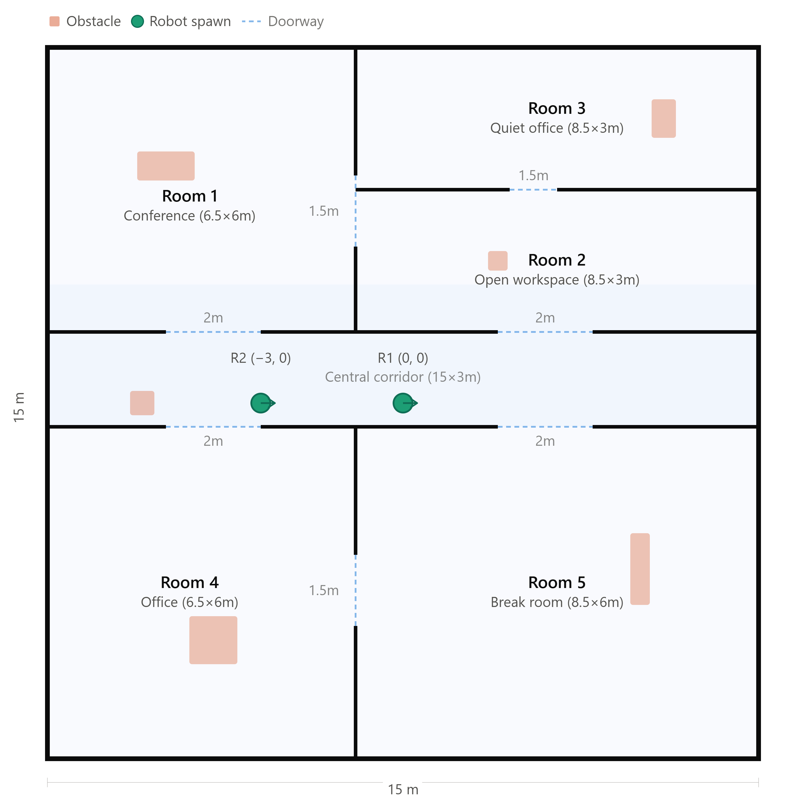
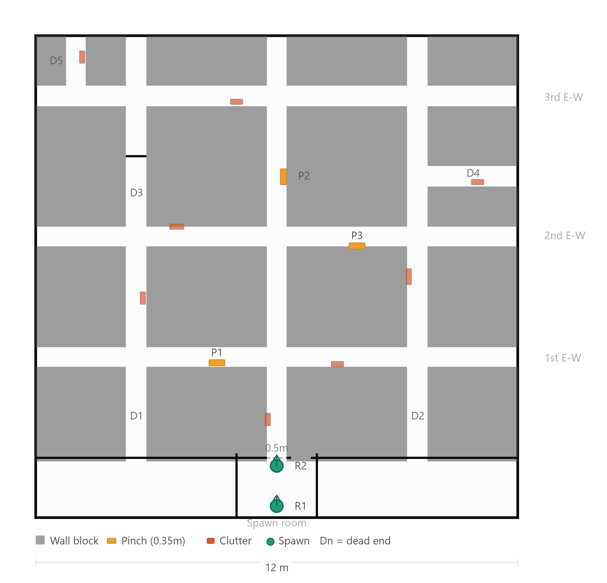
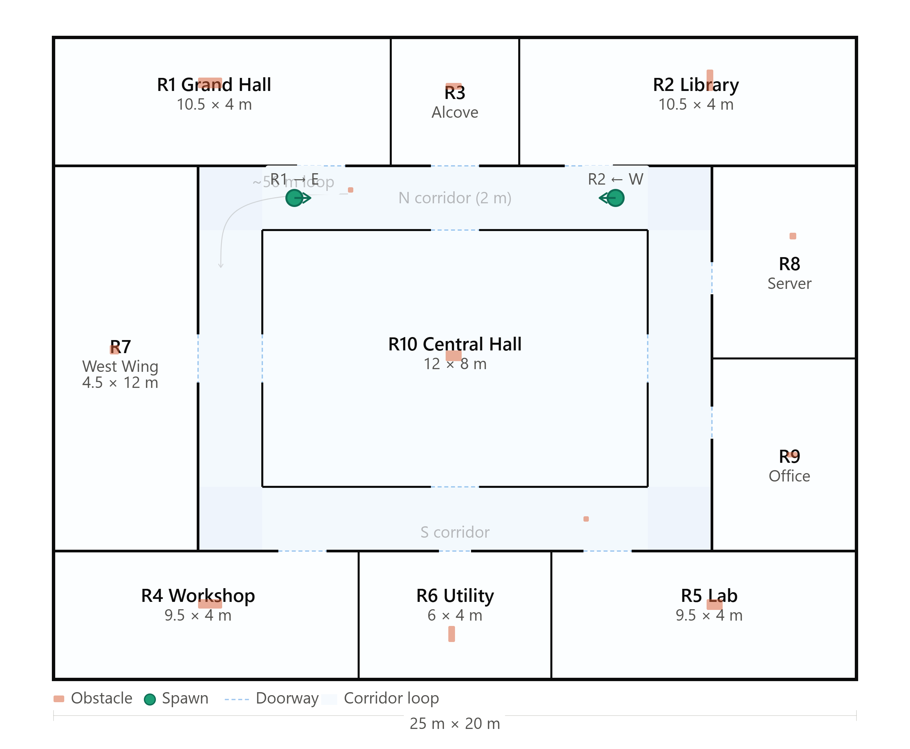
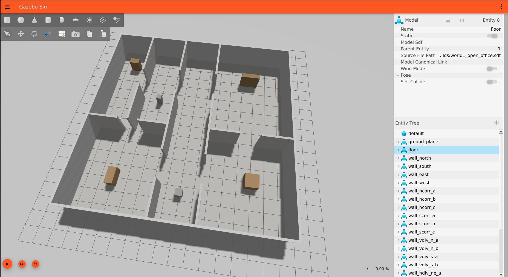
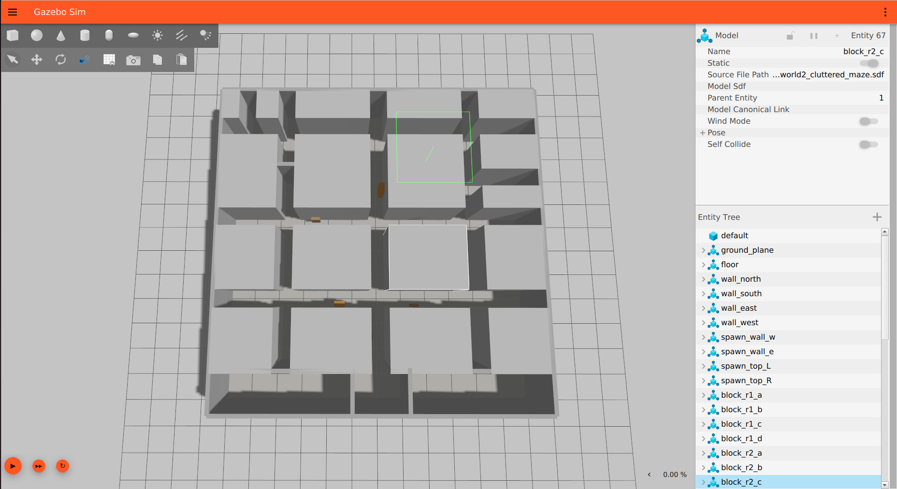
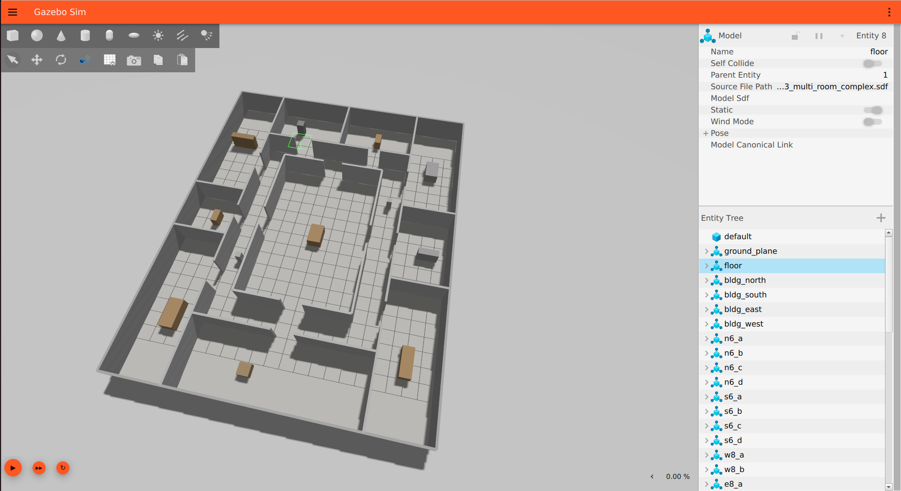
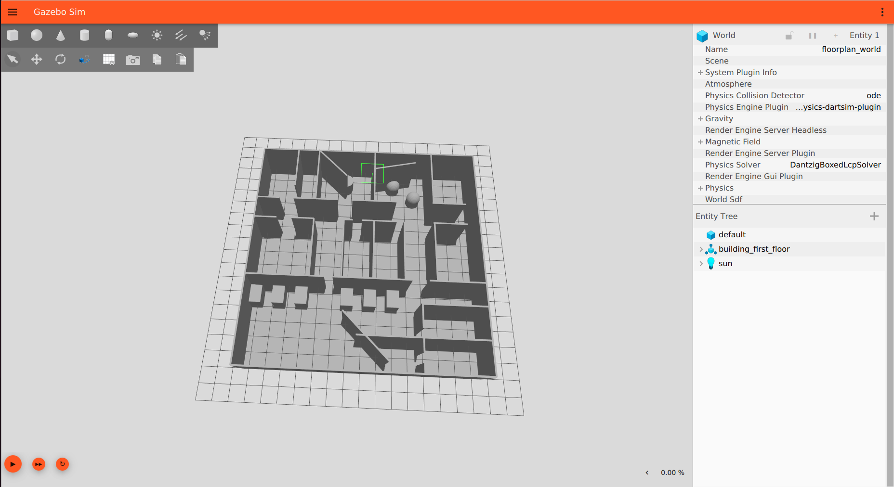

# AI-assisted Generation of Robot Simulation Environments
---
## Problem Statement
Considering the rise of reinforcement learning, imitation learning and perception model training in robotics, the demand for large volumes of diverse, realistic simulation environments have drastically increased to complete the sim-to-real pipeline in AI-powered robots. Most robot learning today happens in generated or procedurally-varied worlds, prior to real-life testing, to avoid overfitting to hand-built environments. Traditionally, creating simulation worlds requires special knowledge of specific markup formats, software programs and/or physics engine quirks. This iterative process can be tedious for engineers when dealing with lighting, collision properties of materials, inertias, and other physics parameters, rather than focusing on the actual task the simulation is meant to serve; however, AI code-generation tools can lower the barrier by generating world files, importing assets (e.g., exported models from Blender) and suggesting fixes for common physics misconfigurations. In this case study, we highlight the following question: How can AI coding assistants meaningfully reduce the time/expertise barrier to build usable, physically-valid robot simulation worlds?

## Task Description
The task requires the use of a simulation tool, a compatible file format, and an AI model(s). 
| Tool | Description |
|--------|-------------|
| Gazebo | Simulation Program |
| SDF | Simulation Description Format |
| Sonnet 5 | Planner model |
| Opus 4.6 | Executor model |

Sonnet 5 (with Medium Effort and Thinking enabled), as mentioned, is the planner model that will generate markdown files that describe the details of the current subtask. The executor model, Opus 4.6 (with High Effort and Thinking Enabled) receives the generated markdown file, executes the instructions, and waits for the confirmation to move on to the next task. The world files that are generated are in SDF format and are tested after the subtask is complete in the simulation tool called *Gazebo*.
For comparison, four worlds were created in total, three of which were AI generated:
| World | Description | Source | Complexity |
|--------|-------------|--------|------------|
| 1 | Open Office | AI | Basic |
| 2 | Cluttered Maze | AI | Intermediate |
| 3 | Multi-room Complex | AI | Complex |
| 4 | Generic Building Floor | Me | Complex |

> The software used for creating the 4th world is Blender

---
## Lessons Learned
- **Planner-Executor architecture keeps projects structured** – modularity by role when completing tasks with AI keeps the process clear, structured and identical in terms of workflow.  
- **Planner-Executor architecture is token-efficient** – rather than loading a model with all the planning and executing, we assign a less-powerful (i.e., less token usage) model the planning, and a relatively more powerful one the implementation to ensure sufficient accuracy and minimal mistakes.    
- **Using Projects is best for long tasks** – using projects facilitates with attaching files that are accessible across all chats within the project. It allows using different models based on the subtasks.
- **Keep the context window clean** – cluttering a single chat session with different tasks expands the context window of the model which is carried throughout the rest of the session, leading to less accuracy, much higher token usage and a higher probability of hallucinations. And if a task is completed, but not necessary for context, the "/clear" command can be used to clear the current conversation context.
- **Use markdown files with Claude models** – Anthropic states that models, at the start of every session, read a Markdown file automatically to maintain your project's memory. This proves that the Markdown format for files is the most compatible file type to be using with Claude models.  
- **Opus 4.6 with High effort burns tokens** – tasks that include file generation or file modification are classified as more usage-consuming. According to Anthropic: "... Note that creating files will use more of your limit compared to normal chats with Claude."
- **Toggle extended thinking off** – turn off this feature when you don't need Claude's enhanced reasoning for a particular task. This comes officially from the web page from Claude Support on "How do usage and length limits work?" and was the reason why the models were taking up a big portion of the current session usage limit. 

---
## Using the Result
Each of the AI-generated world files have floor plans that can be accessible in the [Worlds](worlds) directory.
1. World 1 – Open Office:

2. World 2 – Cluttered Maze:

3. World 3 – Multi-room Complex:


---
## Workflow Details
We created a project made of two chat sessions: one using the planner AI model (Sonnet 5) and another using the executor AI model (Opus 4.6). 
### Establishing Context and Constraints
The first phase of the planning session was providing the model with context about the task (e.g., simulation tool, what's the primary test focus for the worlds, how many robots will be used, what sensors do the robots have, etc...). To ensure a smooth and clean session, an initial prompt must be written:

#### ***User***
```text
The end goal is to create multiple worlds (2-3) for robots to be tested in. Your role is to act like an expert prompt engineer, and communicate with a model that will execute the implementation. Be clear, brief and structured. Ask clarifying questions.
```
Using this prompt, the model was able to ask all the questions needed to establish the full context. It is important to also note, that even after the model generated the markdown file describing the plan, I was able to modify it using Sonnet to add and remove unnecessary instructions. 

### Outlining, Planning and Implementing
During the second phase of the planning session, the markdown file was generated by Sonnet. I attached this file to the project for the executing session (uses Opus 4.6) to read using the following initial prompt:
#### ***User***
```text
Read and follow the multi_robot_exploration_worlds_brief.md file attached to this project.
```
The model proceeded by generating the worlds sequentially, one at a time and waited for confirmation before moving on to the next world. Since the Opus model was used, the world generation was sufficient and accurate relative to the context that was given; however, this model used a significant amount of tokens, even if it was for generating one world. On the Pro plan of Claude, it was taking up to 40% of the current session usage limit initially and sometimes took even more as it progressed through the subtask.

#### World 1: Open Office
For the first world to be generated, the purpose was to simulate an open office, and it is the simplest of all the worlds that have been generated. This simplicity alongside using the markdown file as an input ensured that there was no trouble throughout execution. In simulation, the world looks as follows:
 

#### World 2: Cluttered Maze
This environment is a classic test world when dealing with exploration applications, and Sonnet 5 was able to choose this type of environment to be generated. In the first iteration of the run, the wall-to-wall distance was too small – barely fitting one robot; however, this feedback was communicated back to the planner session (Sonnet 5), in which it was able to find a mistake that had to do with calculating the size of the robot. The final version of the world looks like this:
 

> Note that while testing the robot exploration using this system, the robots still had trouble navigating through the tight corridors of the maze. This problem doesn't occur in reality, as hallways always have a sufficient wall-to-wall distance.

#### World 3: Multi-room Complex vs. World 4: Generic Building Floor
This world is the most complex of the generated worlds and will be compared to the world generated in blender. In terms of AI-assisted world generation, the Opus model was able to precisely generate what Sonnet 5 had planned in the markdown file.  
| Comparison Factor | Best approach |
|-------------------|----------------------|
| Complexity | World generated in Blender. This goes back to the fact that I am able to freely and quickly modify the world according to my own specifications. I added obstacles that I knew would stress test exploration-programmed robots and tailored the world to simulate a quasi-realistic floor of a building. |
| Time | AI-generated world. Simply, it took almost 2 hours to learn the basics of blender and create a complex world model that fits the exploration application, whereas the Opus 4.6 was able to generate the world in a matter of minutes. |
| Iterability | World generated in Blender. Since the world was built manually, individual models and map elements can be selected and modified directly, making targeted iteration straightforward. |
  
**AI-generated world:**
 
  
**User-generated world:**
 

### Self-evaluation
A self-evaluation was performed by the execution session (Opus 4.6). The rubric of this evaluation was generated by the planner session (Sonnet 5), and the markdown file was handed manually to the execution session.
Since the evaluation survey was generated by the planner, this means that the executor model is technically benchmarking how well it had followed the instructions that were passed to it to generate the worlds precisely. The filled evaluation survey document can be found in [Self-evaluation Filled Rubric](./self_evaluation_rubric_filled.md). 
The main criteria for each world were the following: Spec Compliance, Dimensional Traceability, Independent Verification of Inputs, Geometric Validity, Clearance Margin Adequacy, Documentation Quality and Process Compliance.
#### **Brief Category Descriptions**:
- ***Spec Compliance*** — Does the delivered world match every explicit requirement in the brief (dimensions, room/corridor count, topology, deliverable list, file names, directory structure)?
- ***Dimensional Traceability*** — Can every stated width, height, or clearance be traced back to a source figure with the arithmetic shown, rather than just asserted?
- ***Independent Verification of Inputs*** — Before using a given figure (like robot bounding diameter), was it sanity-checked against the primary source (actual collision geometry) rather than trusted blindly from a brief or summary?
- ***Geometric Validity*** — Would the world actually load and behave as described in Gazebo — no unintended overlaps, walls fully enclosing the space, obstacle heights checked against LiDAR scan height?
- ***Clearance Margin Adequacy*** — Beyond bare geometric fit, does the design leave realistic margin for control error, localization drift, and costmap inflation, appropriate to that world's intended difficulty?
- ***Documentation Quality*** — Does the README state size, features, purpose, and start poses as required, with any deviations from the brief explicitly flagged rather than silently made?
- ***Process Compliance*** — Did the build stop after each world without pre-scaffolding the next, and were unresolved issues from prior worlds flagged rather than silently carried forward?
  
The scoring of each world was performed and gathered into a table, then a total average was calculated:
| World | Spec Compliance | Dimensional Traceability | Independent Verification | Geometric Validity | Clearance Margin | Documentation Quality | Process Compliance | **Average** |
|---|---|---|---|---|---|---|---|---|
| World 1 — Open Office | 4 | 3 | 2 | 4 | 5 | 4 | 5 | **3.86** |
| World 2 — Cluttered Maze | 4 | 4 | 3 | 3 | 4 | 5 | 5 | **4.00** |
| World 3 — Multi-Room Complex | 5 | 5 | 4 | 4 | 5 | 5 | 5 | **4.71** |
| **Task Average** | **4.33** | **4.00** | **3.00** | **3.67** | **4.67** | **4.67** | **5.00** | **4.19** |

---

## Summary & Conclusion
This case study explored how AI coding assistants can reduce the time and expertise barrier to building physically valid robot simulation worlds. Rather than prompting a single model to do everything, I used a **planner-executor workflow**: Sonnet 5 acted as the planner, turning my requirements into a structured Markdown brief, and Opus 4.6 acted as the executor, generating Gazebo SDF worlds one at a time from that brief. Three worlds of increasing complexity were produced this way, and a fourth was built manually in Blender for comparison.
AI assistants meaningfully reduce the *time* barrier and partly reduce the *expertise* barrier. The executor generated a complex multi-room world in minutes, compared to about two hours for me to learn Blender and build a comparable one. I never had to hand-write SDF, and the planner asked the clarifying questions I needed to define the task. However, the expertise barrier is only *lowered*, not removed. The AI still needed a human to catch physical-validity problems, and the manual Blender workflow remained better for complexity and fine-grained iteration.

#### How the AI Performed
- **Structure produced quality** – The Markdown brief gave the executor clear, sequential instructions, and it followed them closely. Self-evaluation scores were high (4.19/5 on average) and rose with world complexity (3.86 → 4.00 → 4.71), suggesting that a well-specified brief matters more than the difficulty of the task itself.
- **The weak spot was verification, not generation** – The lowest-scoring categories were Independent Verification (3.00) and Geometric Validity (3.67). The World 2 corridor problem illustrates this: a wrong robot-size calculation was carried into the design without being checked against the actual collision geometry. The model tended to trust the figures it was given rather than validate them.
- **The feedback loop between the two models worked** – When World 2 came out too tight, reporting the issue back to the planner let it locate the calculation error and correct the brief. This suggests the planner-executor split is useful for debugging as well as for building.
> Based on this experience, I would use AI to get a working base world quickly, and then switch to Blender when I need to fine-tune it or add specific details.

#### Future Work
- Use an independent evaluator (a different model or a human reviewer) instead of self-evaluation.
- Add automated validation scripts that check wall enclosure, clearance against robot diameter, and collision geometry.
- Evaluate how well AI-generated worlds transfer to real-world testing.

**Author:** Charaf Mohamad


