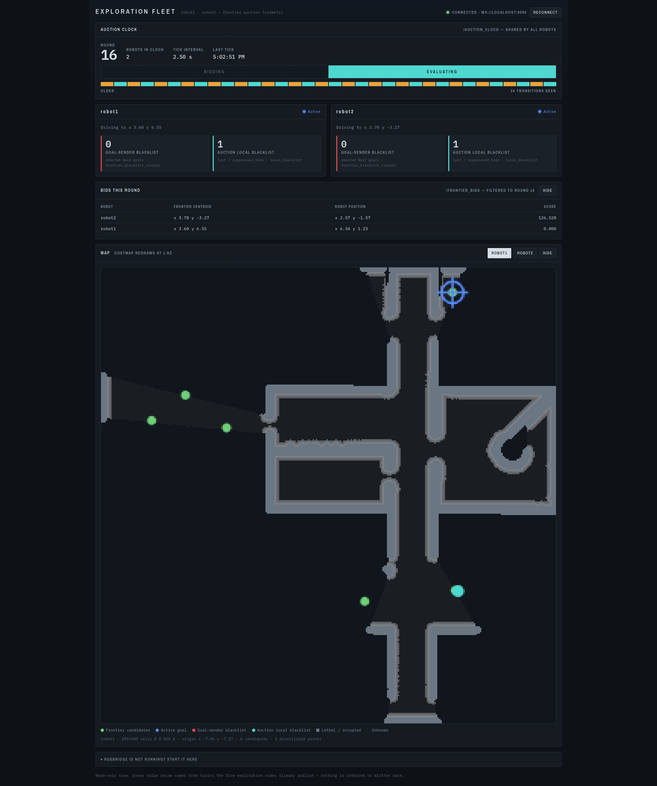
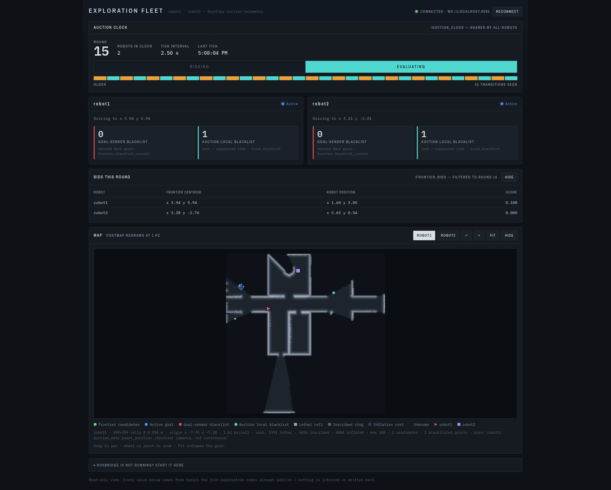
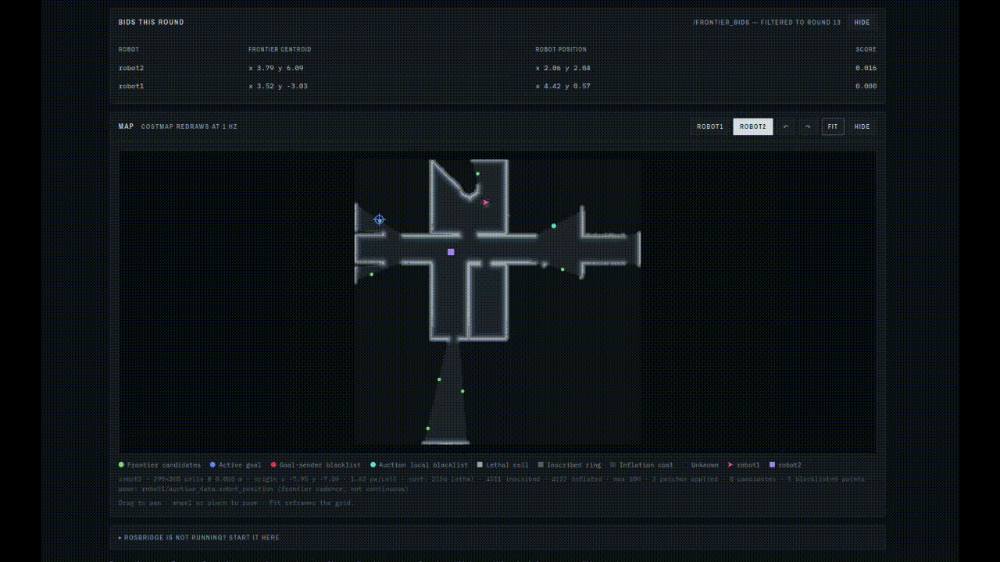
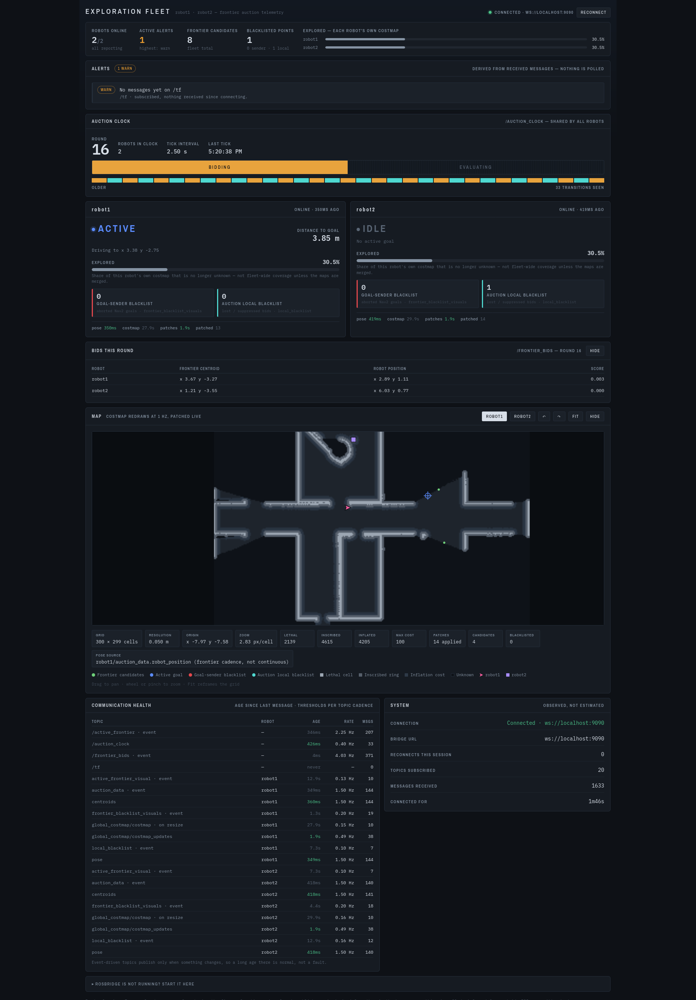
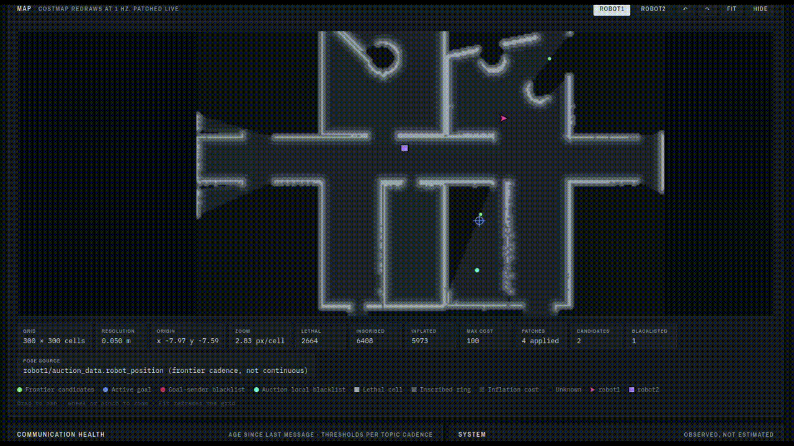

# AI-assisted Development of a Multi-Robot Exploration Dashboard
---
## Problem Statement
Building a robotic system that works correctly is only half the job – engineers also need to see what the system is doing while it runs. This is where monitoring dashboards come in: interfaces that gather live data from the robots and present it in a way that can be readable and understandable (e.g., which robot is active, whether a robot is stuck, whether the communication is still healthy). However, building such a dashboard requires skills that robotics engineers don't always have, including web development, UI/UX design and real-time data handling, in addition to understanding exactly what data the robotic system publishes. As a result, dashboards are often postponed or reduced to a basic prototype. With AI coding assistants becoming increasingly capable of generating complete, working interfaces, this raises the opportunity to hand the entire process – designing, building, reviewing and refining the dashboard – to AI models, while the engineer only tests the result and provides feedback. In this case study, we highlight the following question: How far can a planner-executor pair of AI models go in designing, building and iteratively refining a real-time monitoring dashboard for an existing robotic system, without any changes to the system itself?

## Task Description
The task was to create a web-based dashboard that monitors one of my existing projects – a multi-robot exploration system built on ROS 2 (Robot Operating System 2 – a widely used open-source framework for building robotics software). The exploration system itself is not the focus here; it only serves as the live data source that the AI-generated dashboard has to visualize. A planner-executor architecture was used, where both roles were taken by Claude models within a single project:

| Model | Role | Settings |
|--------|-------------|--------|
| Sonnet 5 | **Planner and Reviewer** – asks clarifying questions, writes the specification markdown files with success criteria, and reviews every generated version against those criteria | Medium Effort, Thinking enabled |
| Opus 5 | **Executor** – reads the specification markdown files, implements the dashboard, and verifies its own work | Medium Effort, Thinking enabled |

What distinguishes this setup from a typical planner-executor architecture is that the planner also **evaluated** every version that the executor generated – the model that defined what "done" looks like was the same model checking whether it had been achieved. In total, the AI models produced four versions of the dashboard:

| Version | What the AI was asked to do | Complexity |
|--------|-------------|------------|
| v1 | Design and build a first working dashboard from scratch | Low |
| v2 | Fix visual problems I observed while testing the map view | Moderate |
| v3 | Fix a data-freshness problem that made the map show outdated information | Moderate-High |
| v4 | Turn the prototype into a polished, production-grade monitoring interface | High |

> One constraint was given to the AI from the very beginning and carried through all four versions: the robot software must not be changed in any way. Every value on the dashboard had to come from, or be derived from, data that the system already publishes.

---
## Lessons Learned
- **Letting the planner review the results closes the loop** – since the model that wrote the success criteria was the same one checking them, each review was fast and structured. Without this review step, the only feedback on the result would be the executor's own summary of what it built.
- **Success criteria make AI output measurable** – every review became a checklist against the criteria, followed by non-blocking observations that later became fixes in the next specification.
- **The planner doesn't blindly trust the user** – when I reported a problem with how the robots were displayed, Sonnet 5 re-read the code first and pointed out that the feature I was describing didn't exist at all, so it was a new feature rather than a bug. Before the first specification, it also flagged two of my requests as impossible without changing the robot software, saving a full iteration.
- **Ask the planner to explain before it writes** – asking for a brief explanation before the markdown file is generated allows the user to correct misunderstandings early. Correcting it at this stage costs one message; correcting it after implementation costs a whole iteration.
- **Opus 5 verifies its own work** – in a single-model approach, the model that writes the code usually judges it by reading it rather than testing it. Here, Opus 5 wrote test scripts for almost every change, intentionally injected a bug into its own code to prove its test could detect it, and caught two of its own bugs before delivering the last version. It was also honest about what it could not test.
- **AI still needs a human for runtime insight** – the most important fix (v3) came from my knowledge of how my system behaves at runtime. Both models confirmed and implemented it correctly, but neither noticed the problem on its own, even though both had access to the source code.
- **Medium effort is sufficient for this type of task** – through experience, I have noticed that file-generation tasks with High effort models consume a large portion of the session usage limit. Here, both models ran on Medium effort and used much less tokens, while still producing accurate and well-tested results.

---
## Using the Result
All four AI-generated versions of the dashboard can be accessed in the [Dashboard Versions](dashboard_versions) directory, and the specification markdown files generated by Sonnet 5 can be accessed in the [Specifications](specifications) directory. Since the source code of the robotic system is not included, the dashboards cannot be connected to live data, but their layout and design can still be explored:
1. Download one of the dashboard files (e.g., "exploration_dashboard_v4.html") and open it directly in any web browser. No installation is needed.
2. The dashboard will load in its "waiting for data" state, showing the full layout, the empty state of each panel and the connection instructions.
3. To compare how the design evolved, open the four versions side by side.

---
## Workflow Details
A project was created with two chat sessions: one using the planner model (Sonnet 5) and another using the executor model (Opus 5). The source files of my robotic system were attached to the project so that both models could read them. My role was limited to relaying files between the two sessions and testing each version with the running system.

### Establishing Context and Constraints
The planner session started with the following prompt:
#### ***User***
```text
I would like to create an exploration dashboard for my program. Ask all clarifying questions. Feel free to suggest ideas. Be clear, brief and structured. I have attached all the source files that have to do with my multi-robot exploration system. After we conclude the session, you need to create a clear and structured markdown file that includes all instructions, success criteria and notes that are needed to create the dashboard. This markdown file will be fed into another session.
```
The model summarized its understanding of my system, suggested ideas, and asked three rounds of multiple-choice clarifying questions about the platform, the scope and the data source. When I left the platform choice to the model, it recommended a web dashboard, explained why along with its only downside, and waited for my confirmation. Notably, it compared my requests with what my code actually publishes and flagged two gaps, then asked whether I wanted to add new code to my system or work within what already exists. I chose not to change anything, which became the constraint for the rest of the project. The session ended with the [exploration_dashboard_spec.md](specifications/1_exploration_dashboard_spec.md) file, which included the architecture decisions, the data sources, a layout suggestion, explicit non-goals and success criteria.

### Outlining, Planning and Implementing
From this point, each version followed an identical loop:
1. Sonnet 5 generates the specification markdown file (with success criteria).
2. The markdown file is attached to the project and Opus 5 implements it.
3. I test the generated dashboard with the running system.
4. Sonnet 5 reviews the generated dashboard against the success criteria.
5. My observations and the planner's feedback become the next specification.

The executor session was always started with a short prompt:
#### ***User***
```text
Read and follow the exploration_dashboard_spec.md file
```

#### Version 1: Building From Scratch
Opus 5 generated a single, self-contained HTML file and explained its design decisions. Most notably, it chose the colors of the dashboard to match the colors my system already uses in its existing visualization tool, so that the same color means the same thing everywhere. I then tested its ability to adapt the file by asking it directly, without a specification:
#### ***User***
```text
Is this compatible for only 1 robot? if not, please create a compatible version for 1 robot. [...]
```
#### ***Opus 5***
```text
Not quite — the robot list is hardcoded [...] Rather than fork a second file that drifts from the first, I made the robot list a parameter.
```
Instead of creating a second file to maintain separately, the model made the number of robots configurable, and added a warning for a configuration mistake that becomes likely when switching between one and two robots, which I did not ask for.



Sonnet 5 then reviewed the file against each of the 7 success criteria in a table, all of which were met, and cross-checked every data source against my source files, listing four minor, non-blocking issues.

#### Version 2: Fixing What I Observed
After testing the first version, I reported three problems in the map view to the planner:
#### ***User***
```text
Observed artifacts:
* The window in the "map" section resizes automatically as the occupancy grid grows, but I am not able to rotate, or zoom in/out [...]
* The occupancy grid walls are too thick and the overall representation is too pixelated. [...]
* It seems that the robots are represented as dots in the window and their positions do not update continuously as needed. [...]

Please create another markdown file that contains fixes for these artifacts [...] Have success criteria so that you are able to evaluate the overall performance of the result.
```
Rather than writing fixes directly from my description, Sonnet 5 re-read the dashboard code and traced each problem back to its actual cause. It also flagged an inconsistency between two of my own source files and left it as an open question for the executor. The result was the [exploration_dashboard_map_fixes.md](specifications/2_exploration_dashboard_map_fixes.md) file.

Before implementing, Opus 5 explained how it would handle the open question instead of hardcoding a guess:
#### ***Opus 5***
```text
Instead of asking you to confirm base_link vs base_footprint, I'll subscribe /tf and accept whichever child frame appears per namespace [...] That resolves the inconsistency [...] empirically.
```
In other words, it let the dashboard detect the correct answer while running. After I confirmed, it rebuilt the map view with pan, zoom, rotation and a "Fit" button, cleaned up the rendering, and added distinguishable robot markers, while writing test scripts to verify the mathematics behind the map view rather than only checking it visually. When I later asked it directly to rotate the default orientation of the map by 90 degrees, it also noticed and fixed a side effect this would have caused on the "Fit" button, without being asked.



Sonnet 5 found that all 10 success criteria were met, with three minor observations.

#### Version 3: A Problem Only the User Could See
While testing the second version, I realized that the map on the dashboard could fall behind what the robots actually see: my system updates its map using small partial messages, while the dashboard was only listening to full map messages, which arrive less and less often as the exploration progresses. I asked the planner to confirm the correctness my understanding, and Sonnet 5 did so by walking through the exact functions in my source file. However, even though the model had read this same file at the very beginning of the session, it had not anticipated this problem in any of the previous specifications or reviews. Before allowing it to write the specification, I added a correction to its proposed fix and asked it to explain its solution first:
#### ***User***
```text
[...] a full grid resend must always overwrite what is on the map. an update message just patches the missing part.
Please explain first in a very brief way how you solved this issue. After I confirm, you will write up the markdown fix spec
```
After confirming its short explanation, the [exploration_dashboard_costmap_updates_fix.md](specifications/3_exploration_dashboard_costmap_updates_fix.md) file was generated. Also, the planner specifically warned the executor about one part of the fix that would fail silently if implemented incorrectly.

Opus 5 implemented the fix and tested that a partially updated map is identical, pixel by pixel, to a map drawn from scratch. Above all, it then intentionally broke its own code to confirm that the test actually detects this silent failure:
#### ***Opus 5***
```text
[...] I injected the flip bug on purpose to confirm the assertion actually fires — it catches 54 subpixels. So the check isn't vacuous.
```
Opus 5 also showed that it does not simply copy existing patterns in the code, but reasons about whether they apply. To avoid overloading the browser, the dashboard only accepts one full map message per second and skips the rest, which is safe since a skipped full map is replaced by the next one. The model decided **not** to apply the same limit to the partial updates, because a skipped update would leave that region of the map wrong until the next full map arrives – which may take a very long time.



Sonnet 5 verified the tricky part of the fix by hand and found that all 8 success criteria were met, with three minor observations.

#### Version 4: From Prototype to Production-grade
For the final version, I asked the planner to fix its own minor observations and push the design much further:
#### ***User***
```text
Write up a spec markdown that fixes the minor observations. Enhance the existing exploration dashboard into a polished, industry-ready multi-robot fleet monitoring interface. [...] It should look like a production-grade robotics operations dashboard, not a basic student prototype. 
```
In the generated [exploration_dashboard_v4_ux_overhaul.md](specifications/4_exploration_dashboard_v4_ux_overhaul.md) file, the planner did not forget the constraint set at the beginning of the project, and designed every new feature to be derived from data the dashboard was already receiving:

| New Feature | How the AI derived it without new data |
|-------------------|----------------------|
| Exploration progress | Calculated from the map data already being displayed |
| Distance to goal | Calculated from the robot and goal positions, both already tracked |
| Communication health | Measured from the time since the last message on each data stream |
| Alerts | Built from conditions the dashboard was already detecting |
| System metrics | Taken from the dashboard's own connection status and the message rates already tracked for communication health |

Opus 5 took close to 10 minutes to generate this version – by far the longest of all four. It tested the result by loading the actual dashboard in a simulated browser with fake data, and its tests caught two bugs in its own new code before finishing. It was also transparent that the simulated browser cannot calculate layouts, so it recommended checking the tablet and phone layouts in a real browser.





### Evaluation
After each version, Sonnet 5 reviewed the generated dashboard against the success criteria of its own specification. This means the evaluation is technically a benchmark of how well the executor followed the planner's instructions:

| Version | Success Criteria | Criteria Met | Blocking Issues | Minor Observations |
|---|---|---|---|---|
| v1 — Building From Scratch | 7 | 7 | 0 | 4 |
| v2 — Fixing What I Observed | 10 | 10 | 0 | 3 |
| v3 — Map Freshness Fix | 8 | 8 | 0 | 3 |
| v4 — Production-grade Overhaul | 15 | 15 | 0 | 2 |

The minor observations of each review became fixes in the following specification. It is also worth noting how the executor's self-verification grew with the complexity of each version, without me ever asking it to write tests:

| Version | Executor's Self-verification |
|---|---|
| v1 | Syntax check of the generated code |
| v2 | Test scripts for the map view mathematics and the new features |
| v3 | Pixel-by-pixel comparison test, plus an intentionally injected bug to prove the test works |
| v4 | 11 test scripts, including a simulated browser with fake data; 2 of its own bugs caught before handing over the file |

---
## Summary & Conclusion
This case study explored how far a planner-executor pair of AI models can go in building and refining a real-time monitoring dashboard for an existing robotic system. Sonnet 5 acted as the planner and reviewer, while Opus 5 acted as the executor, taking the dashboard from a first prototype to a production-grade monitoring interface over four versions. I never wrote a single line of the dashboard's code; my role was limited to testing, relaying files between the two sessions, and reporting what I observed.

All things considered, the AI models went very far. Every version met all of its success criteria with no blocking issues, and the constraint of not changing the robot software was respected throughout. Compared to a single-model approach, this setup had two independent layers of verification: the executor tested its own work without being asked, and the planner reviewed it afterwards against its own criteria. However, the most important problem of the project was only discovered because I knew how my system behaves at runtime – a reminder that the human is still needed to test the result in the real environment.
> Based on this experience, I would use this two-session approach for building any tool around an existing system: the planner understands the system and defines the constraints, the executor builds within them, and the human tests the result.

#### Potential Additions
- Use an independent evaluator (a different model) instead of the planner that wrote the success criteria.
- Test whether the planner can anticipate runtime problems like the one in v3 if it is explicitly asked to look for them.
- Check the layout of the AI-generated dashboard on real tablet and phone screens.

**Author:** Charaf Mohamad
