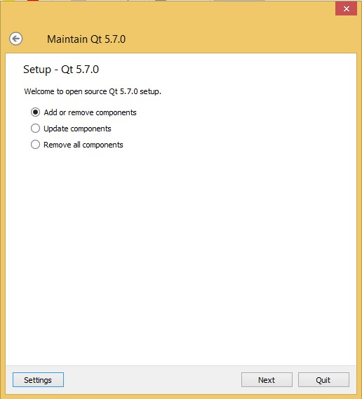
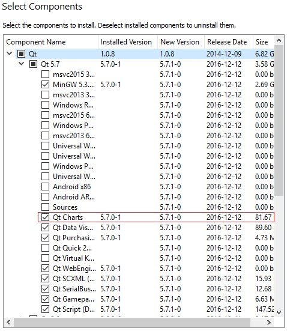

---
layout: default
codename: AlkFejlHf14
title: Balloon team tanulságai
tags: alkfejl afhf skipfromindex
authors: Háda Tamás, Szikszai Dávid
---

# Ballon team tanulságai

## 1) QtCharts, grafikonok megjelenítése
A szimulátorunk által szolgáltatott adatokat szerettük volna minél látványosabban megjeleníteni az alkalmazásunk grafikus felületén. Ehhez a Qt-s környezethez tartozó QtCharts modult alkalmaztuk.
A modul a Qt Graphics View Frameworköt használja, melynek köszönhetően egyszerűen készíthetünk vele látványos grafikonokat. Ennek előnye, hogy sok előre elkészített grafikon típust tartalmaz, melyeket csak megfelelő módon kell alkalmaznunk. Ismét teljesül, hogy nem feltétlenül kell feltalálni mindent magunknak, ha már léteznek rá jól működő megoldások is. További előnye, hogy tisztán QML oldalon megvalósítható a grafikon (kis javascripttel kiegészítve), c++ oldalon csupán egy függvényhívásra volt szükségünk.
```cpp   
 QMetaObject::invokeMethod(mainWindow, "addToChart",
                              Q_RETURN_ARG(QVariant, returnedValue),
                              Q_ARG(QVariant, QVariant(x_pos)),
                              Q_ARG(QVariant, QVariant(y_pos)),
                        Q_ARG(QVariant, QVariant(z_pos)));
```
A qml oldalon megvalósított addToChart javascript függvény végzi a pontoknak a grafikonhoz történő hozzáadását.
A modul használata, kezdeti nehézségek:
A modult hasonlóan a többi Qt-s modulhoz, először importálnunk kell.
import QtCharts 2.1
Importálás követően azonban azt vettük észre, hogy a QtCreator nem ismeri fel a modult, az elviekben hozzá tartozó típusokat aláhúzza, nem fordul az alkalmazás. Végül hosszadalmas keresgélés és próbálkozás után kiderült, hogy az alap Qt release nem tartalmazza ezt. (Hivatalos oldalon talált leírások és példakódok egyike sem utaltak erre az egyébként egyszerű magyarázatra :) ).
Ez egy folyamatosan fejlesztett modul, mely jelenleg is csak add-on-ként elérhető. (git repository: https://github.com/qt/qtcharts).
Szerencsére a Qt Maintanance Tool-ja segítségünkre volt a modul hozzáadásához.





A sikeres telepítés után a modul használatra kész volt. Innentől a hivatalos oldalon elérhető példa programok is segítségünkre voltak: http://doc.qt.io/qt-5/qtcharts-qmlmodule.html

## 2) Smart pointerek, unique pointer
Ahogy az kiderült a fejlesztés során is, sokszor szükség lehet pointerek használatára, ahogy azt korábba más programnyelveknél is tapasztaltuk. A smart pointerek azonban megérnek egy misét, hogy egyszer legalább valamilyen mélységig megértsük a tényleges működésüket, és ami ennél is fontosabb, hogy mikor is használjuk őket. Kezdetben úgy tűnhet, hogy amennyit pluszba adnak raw társaikhoz képest (memória menedzsment), annyit el is vesznek azzal, hogy esetleg nem is tudjuk, miképp inicializáljuk őket, vagy éppen melyik fajtát használjuk. Interneten lehet nagyon jó forrásokat találni ehhez, amik közül az egyik helyen említették talán a legjobb tanácsot: kezdetben minden pointert unique pointernek tételezzünk fel, mintha az adott objektumot más nem is látná. A fejlesztés során majd úgy is kiütközik, ha azt az objektumot máshonnan is el akarjuk érni. Szól a fordító, és átállunk shared pointerre.
A unique pointer a többitől is megkülönböztethető állat, mert mint a nevében is benne van, egy adott objektumra csak egy unique pointer mutathat. Innen kezdődnek a bajok, melyek azért, ha rájön az ember könnyen kezelhetőek utólag. A baj forrása, amikor átadunk egy ilyen pointert egy függvénynek és a függvényen belül akarunk vele dolgozni. Ekkor a megoldás az std::move() meghívása. Tehát nem egyszerűen beírjuk a mi kis unique pointerünket a függvény paraméter listájába, hanem meghívjuk rá ezt a függvényt a következő módon:

```cpp
    std::unique_ptr<Field> field = std::make_unique<Field>(9,8);
    field->SetCostNode(4,2,FIELD_WALL_SHORT);
    field->SetCostNode(4,3,FIELD_WALL_SHORT);
    field->SetCostNode(4,4,FIELD_WALL_SHORT);
    field->SetCostNode(4,5,FIELD_WALL_SHORT);
    field->SetCostNode(4,6,FIELD_WALL_SHORT);
    field->SetCostNode(4,7,FIELD_WALL_SHORT);
    field->SetCostNode(3,2,FIELD_WALL_SHORT);
    field->SetCostNode(3,3,FIELD_WALL_SHORT);
    field->GenerateFlowField(3,7);

    QApplication app(argc, argv);

    std::unique_ptr<Balloon> b = std::make_unique<Balloon>(22.0,30.0,0.0,server);
    b->AddField(std::move(field));
```

Ha a függvényen belül pedig mondjuk egy saját unique pointerrel akarunk már az objektumra mutatni, akkor ugyanezt a függvényt alkalmazhatjuk.

```cpp
void Balloon::AddField(std::unique_ptr<Field> field)
{
    // Átvesszük a paraméterként kapott teret további számításokhoz.
    ownField = std::move(field);
}
```

## 3) Konstruktor problémák
Sajnos legalább kétszer belefutottunk ebbe a hibába, ami elakasztotta a fejlesztést. A lényege, hogy amikor létrehozunk egy új .cpp és .h fájlt, vagyis valamilyen új osztálynak a deklarációját, akkor a QObject-ből való öröklés bepipálásával, egy megfelelő skeleton generálódik számunkra. Azonban ez nem is annyira megfelelő néha, esetünkben a generált konstruktor miatt. A generált konstruktorunk, egy QObject-re mutató pointert kap paraméterül, amely számára a parent-et állítja be, de nekünk erre egyszer sem volt szükség, hogy használjuk, viszont annál inkább okozott gondot a létezése.
A probléma röviden az volt, hogy esetünkben a TCP kapcsolat megírásakor, referenciaként tároltuk az osztályunkban például a SocketServert. Ez önmagában nem lett volna még gond, de elkezdett dobálni a Qt undeclared variable hibát. Végül a megoldás a problémára az volt, hogy eltűntettük az automatikusan generált konstruktort és csak a sajátunkat hagytuk meg.

```cpp
class Balloon : public QObject
{
    Q_OBJECT
private:
    SocketServer& balloon_server;
```
