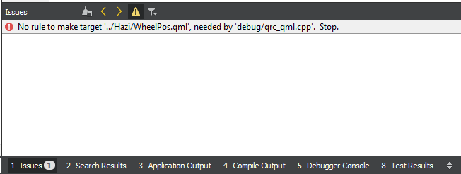

# Házi feladat tanulságok

## 1. Általános tanulságok a házi feladat elkészítésének menedzselésével kapcsolatban

Valószínűleg nem nagy meglepetés, de időben neki kell kezdeni foglalkozni a házi feladattal. Ennek már az is jelentős része lehet, hogy a csapat kitalálja, mit is szeretne megvalósítani.
Ha ez megvan, érdemes az előadóval egyeztetni, hogy még időben derüljön ki, ha valamit félreértettünk. Nálunk például problémát okozott, hogy nem volt teljesen világos a kiírásban, hogy mit kell érteni a vektoros adat alatt. Emiatt utólag kellett beilleszteni a QVector kezelését a kódba, ami korábban egyszerűbb lehetett volna.
Szintén megéri az elején rászánni némi időt és áttanulmányozni a SimpleTelemetryVisualizer forráskódját, hogyan is működik pontosan. Nagyon jó kiindulási alapot jelent és a későbbiekben is rengeteg időt megspórolhatunk az egyes funkciók fejlesztésénél, ha láttuk a benne lévő működőképes megoldásokat.
Amikor már elkezdtük a fejlesztést, nagyban meggyorsítja a folyamatokat, ha mindig mindenkinek van valamilyen saját feladata, amin tud gondolkodni, még akkor is, ha az látszólag valami egyszerűbb dolog. Egyrészt kiderülhet, hogy nem is olyan triviális, másrészt, addig is halad a projekt, nem vár egyik csapattag a másikra. Természetesen ehhez a csapat folyamatos kapcsolattartása is kell, nehogy ugyanazt csinálja két ember.
A Git repository karbantartását is jobban átbeszélhettük volna. Mivel volt aki inkább rebase, más merge párti volt, ezért nem lett igazán szép a Git fa, és az egyes fejlesztési területek sem különülnek el kellően. Ez ilyen kisebb projekteknél nem okoz nagy problémát, de nagyobbaknál már zavaró lehetne. Érdemes lehet ezzel kapcsolatban előre átbeszélni az egész csapatra érvényes alapelveket.
Végül azt is tapasztaltuk, hogy nem mindig szerencsés a működés szerint (pl. GUI és szimulátor) szerint felosztani a feladatokat, néha jobban megéri funkciók szerint (pl. rádió hozzáadása a projekthez). Ugyanis például amíg a nyomógomb nem kerül be a GUI-ba, addig a funkció tesztelése nem valósítható meg triviálisan. Ugyanakkor mondjuk előny lehet, hogy ez esetben a funkció fejlesztőjének nem kell foglalkoznia azzal, hogy hova kerül a gomb.

## 2. Clean project - qmake - rebuild

QML változtatások után néha az újrafordítás nem történik meg automatikusan. Ekkor megoldást jelenthet a Clean project -> Run qmake -> Rebuild műveletsor végrehajtása.
Konkrét példaként, amikor egy .qml fájlt töröltünk, mert már nem volt rá szükség, és a .qrc fájlból is eltávolítottuk, fordításkor "No rule to make target..." hibát kaptunk.

 

Hosszabb időt elvett megpróbálni rendesen törölni a fájlt, de ez nem vezetett eredményre. Végül a fentebb leírt műveletsor jelentett megoldást.

## 3. Git Extensions használata

Jó eséllyel sokan alapból használnák, ugyanakkor nehéz eléggé hangsúlyozni, hogy nekünk mennyit könnyített a helyzetünkön. Könnyen áttekinthető, logikus a felépítése, ügyesen jelzi a Git fa növekedésének előrehaladását és az előző commit óta történt változásokat.
A Git használatát nagyban megkönnyíti egy jó GUI használata. Mi kezdetben a TortoiseGit-et használtuk, ami ugyanerre a célra való, de annak a használata kevésbé volt magától értetődő, így áttértünk a Git Extensionsre.
Nyilván akinek már van egy kedvenc bejáratott Git GUI-ja, használja azt, de kezdőknek, vagy azoknak, akik még csak keveset használtak verziókövetést, jó választás a Git Extensions.

## 4. QStringList

A robot leírásának szöveges adataként mi egy aktuálisan játszott rádióadó nevét választottuk. Ehhez a szimulátornak rendelkezésre állt egy kínálat, ami tartalmazta az összes fogható rádió nevét, és a szimulátor parancs hatására ezek között tudott váltogatni. Ez a kínálat először egy hagyományos, QString elemeket tároló tömbként volt megvalósítva.
A probléma bizonyosan így is megoldható, azonban sokkal egyszerűbb a kínálatot QStringList-ként tárolni. Így nem kell eltárolni a tömb méretét, emiatt jóval rugalmasabb megoldás. Emellett számos hasznos tagfüggvénnyel rendelkezik a QStringList osztály, amelyekkel könnyebb a tömbmanipuláló műveleteket elvégezni. Ezek listája:
http://doc.qt.io/archives/qt-4.8/qstringlist-members.html

## 5. QML-ből is hívható függvény

Egy C++ függvényünknél nagyon jól jött, hogy QML-ből is meg tudtuk hívni. Ehhez nem kell mást tenni, mint odaírni a függvény elé, hogy Q_INVOKABLE. Így hívható lesz QML-ből is az alábbi szintaktikával: példánynév.függvénynév(<paraméterek>)

## 6. Alakzatok forgatása QML-ben

A házi feladatban több helyen is alkalmaztunk olyan grafikus megjelenítést, amely forgatási műveleteket használt. Mivel a forgatás megvalósítása nem triviális, ezért itt egy rövid kódrészletben megmutatjuk, hogyan forgattunk el négyszögeket:

	context.save();	//elmentjük a canvas állapotát

	//Elforgatjuk a canvas-t x,y körül angle szögben
	context.translate(x, y)	//canvas origó eltolás x,y-ba
	context.rotate(-angle * Math.PI/180)	//forgatás angle szögben (azért kell negatív mert az y tengely lefelé néz)
	context.translate(-x, -y)	//canvas origó visszatolása az eredeti pozícióba

	context.rect(x-rwidth/2, y-rheight/2, rwidth, rheight);	//Kirajzoljuk a négyszöget
	context.stroke();	//Megjelenítjük amit rajzoltunk
	context.restore();	//Visszaállítjuk a canvas elforgatást az eredeti állapotba
	
Ennek köszönhetően amikor az autónkat felülnézetből ki akartuk rajzolni egy adott helyre adott orientációval, akkor elég volt csupán téglalapokat rajzolni, majd azokat a megfelelő helyre eltolni és elforgatni.
