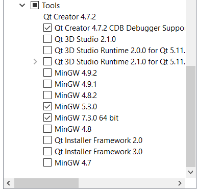

# E csapat összefoglalója

## 1) Qt telepítés
Qt telepítésénél nekünk nem sikerült elsőre a megfelelő komponenseket telepíteni. Végül ez a konfiguráció volt elég az egész féléves munkához:




## 2) QML tapasztalatok
A SimpleTelemetryVisualizer példaprojekt sok mindenben segítséget nyújthat, viszont grafikus megjeleítéshez az kézzel készíti a diagramokat.
Mindenképp érdemesebb a QT beépített diagram készítőit kipróbálni, ezek használata a hivatalos QT példakódok segítségével egyszerű, és az eredmény akár meglehetősen látványos is lehet.
A Qt-s chartoknak a kezelését érdemes JavaScript kóddal, qml oldalon végezni, és C++ oldalon csak átadni a szükséges adatokat a megjelenítéshez.
Erre egy példa a következő:

C++ oldal:
```cpp   
signals:
/**
 * @brief Notifies the UI of a change in the distance sensed by main car of the simulator.
 * @param distance The new distance, sensed by the car.
 */
void distanceChanged(qreal distance);
```
qml oldal:
```cpp   
signal distanceChanged(real distance)
onDistanceChanged:{
	if (distanceData.count == 20)
	{
		distanceData.removePoints(0,1);
		axisXd.max = axisXd.max+1
		axisXd.min = axisXd.min+1
	}
	var x = distanceData.count < 19 ? distanceData.count : axisXd.max
	distanceData.append(x,distance)
}
//...
ValueAxis {
    id: axisXd
    min: 0
    max: 19
}
ValueAxis {
    id: axisYd
    min: 0
    max: 50
}
LineSeries {
 id: distanceData
 name: "distance"
 axisX: axisXd
 axisY: axisYd
}
```

## 3) Tesztesetek
A unit teszteknél nekünk nem volt kötelező qtest-et használni, ez gondolom a jövőben is így marad. Ha a robototok egy szimulátor (nem hardver) 
érdemes elgondolkodni azon, hogy ahhoz írtok teszt eseteket, és inkább visual studio-s teszteket használtok.

## 4) Egyéb tanácsok
A házi feladatot nem érdemes a félév végére halogatni, a tanszéki honlapon található anyagok, és példaprojektek segítségével könnyedén el lehet kezdeni a házi feladatot, akár a Qt-s előadások előtt is.
Ezen kívül nem érdemes a minimum követelményekre hajtani. Egyrészt egy ilyen feladat végre gyakorlati tudást ad a hallgatóknak, a másik, hogy nem jár sok plusz munkával a megajánlott jegyhez szükséges feladatok elvégzése sem.
