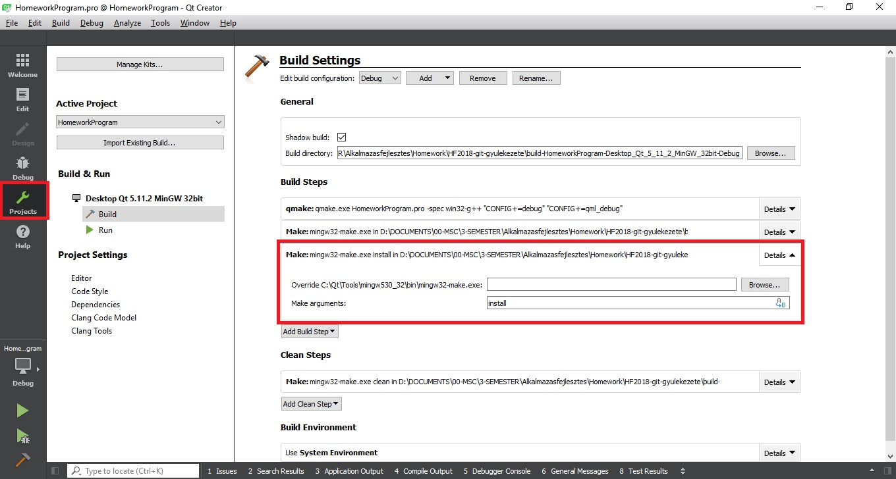
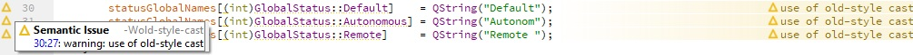

---
layout: default
codename: AlkFejlHF35
title: Git gyülekezete csapat tanulságok
tags: snippets
authors: Göntér Balázs, Kriszt Botond, Millner Balázs
---

# Git gyülekezete csapat tanulságai, Alkalmazásfejlesztés házifeladathoz

 ## 1. Általános

A házifeladat elkezdése előtt érdemes az összes példaprogramot és snippet-et végignézni (úgy, hogy közben a QT creator-ban futtatjuk a programokat) hogy az alapokat elsajátítsuk. Ezt érdemes minél előbb elkezdeni, mert sokkal gyorsabban lehet ezekután haladni majd a házival.
A korábbi házifeladatok tanulságait is érdemes még a komoly érdemi munka előtt áttanulmányozni, mert rengeteg hasznos megoldást rejtenek problémákra, ami sok időt tud megspórolni.

 ## 2. Fájlkezelés
 
Ha a csapat olyan projektet választ, amihet feltétlenül írni kell egy robotszimulátort is (nincs hardware), akkor felmerülhet az igény, hogy a szimuláció fizikájához az adatokat txt (vagy egyéb) fájl-on keresztül dolgozzuk fel.

A mi házi feladatunk egy labirintusban autonóm módon közlekedő robotot szimulál, amely minden egyes időlépésben halad és a labirintus újabb szegletét fedezi fel. Az adott időlépésekben átadni kívánt adatokat (pozíció, gyroscope adatok, fal érzékelő infra LED értékek) egy tetszőleges elválasztó karakterrel felvittük a txt fájlunkba és innen csak tick-enként be kell olvasni őket. Ehhez rengeteg mintaprogramot talál az ember pl.:  [stackoverflow-n](https://stackoverflow.com/questions/5444959/read-a-text-file-line-by-line-in-qt), vagy a hivatalos [QFile dokumentációban](http://doc.qt.io/qt-5/qfile.html).

A fenti példákban az egész fájl beolvasása és manipulációja egyszerre történik meg, azonban ha tick-enként akarjuk a szimulátor fizikáját frissíteni, akkor soronként kell feldolgoznunk a txt fájlt. Mivel ehhez az autonóm működés végéig nyitva kell hagynunk a fájlunkat, a Simulator osztályba a fájlnévhez, bemeneti String stream-hez és magához a fájlhoz 3 property-t kell defíniálni:

```cpp
QString  labirinthFile;
QTextStream  rawStream;
QFile  inputFile;
```

A Simulator konstruktorában ezeket inicializáljuk:

```cpp
labirinthFile  =  "Labirinth.txt";
inputFile.setFileName(labirinthFile);
rawStream.setDevice(&inputFile);
```
Majd ezután tick-enként meghívjuk az alábbi ***openFile()*** és ***readFile()*** metódusokat. Az openFile() csak akkor fogja megnyitni a txt fájlt ha az még nincs megnyitva. 
```cpp
void  Simulator::openFile()
{
  if(!inputFile.isOpen())
  {
	  if  (!inputFile.open(QIODevice::ReadOnly))
	  {
		  qDebug()  <<  "Could  not  open  the  file!  Please  check  its  existance!  ";
	  }
  }
}
```
A ***readFile()*** pedig beolvas egy sort, majd az elválasztókaraktereknél egy ***QStringList***-et ad vissza, amit tetszőlegesen felhasználhatunk a későbbi értékadásnál. Ha elérünk a fájl végére, akkor pedig be kell zárni a fájlt és a stream-et resetelni kell illetve újra be kell állítani a bemeneti fájlra vonatkozó referenciát, mivel így legközelebb megnyitva előről tudjuk kezdeni a beolvasást (szimulációt).
```cpp
QStringList  Simulator::readFile()

{
  QStringList  list;
  if  (!rawStream.atEnd())
  {
	  QString  line  =  rawStream.readLine();
	  list  =  line.split(";");
  }
  else
  {
	  inputFile.close();
	  rawStream.reset();  
	  rawStream.resetStatus();  
	  rawStream.setDevice(&inputFile);  
	  qDebug()  <<  "Labirinth.txt  was  closed";
  }
  return  list;
}
```
Ahhoz hogy a jelenlegi formájában működjön a programunk, a txt fájlt a munkakönyvtárba kell elhelyezni és a ***.pro*** -projekt fájt ki kell egészíteni az alábbival: 

    install_it.path  =  $$OUT_PWD
    install_it.files  =  Labirinth.txt
    INSTALLS  +=  install_it

Emellé még a projekt fordítási beállításainál, hozzá kell adnunk egy új build step-et aminek az argumentuma ***install*** kell hogy legyen:

Ezzel a beállítással azt értük el, hogy minden build-nél a ***make install*** is le fog futni, ami a txt fájlunkat "feltelepíti" a build könyvtárba és onnan már közvetlenül elérhető lesz a fenti kód számára a txt fájl beolvasáshoz.

 ## 3. Cast-olás / warning-ok

Bár a warning-ok a futást nem befolyásolják, egyrészről zavaróak lehetnek fejlesztéskor, másrészt szigorúbb körülmények között (például biztonság-kritikus rendszerekben) a "kész" projekteken le szoktak futtatni úgy nevezett statikus kód analizátort, ami általában (bizonyos) warning-ok előfordulását megtiltja. Mivel a projetkben sokszor előfordult a cast-oláshoz köthető warning, ennek megszüntetésére kerestünk megoldást.

Az ehhez kapcsolódó [C++ típus konverzióról szóló dokumentációt](http://www.cplusplus.com/doc/tutorial/typecasting/) végignézve, kiderül, hogy 4 féle típuskonverzió is létezik:
```cpp
dynamic_cast <new_type> (expression)  
reinterpret_cast <new_type> (expression)  
static_cast <new_type> (expression)  
const_cast <new_type> (expression)
```
Mi csak a static cast-ot használtuk, mivel a egyszerűbb adattípusok közötti konverzióhoz ezt ajánlják, így a megoldás:


 ## 4. QML tapasztalatok

Ahogy korábban mások is írták, érdemes már az elején széttagolni a projektünket, több különálló .qml fájlra, mert 1-2 új struktúra beillesztése drasztikusan növeli a méretet és csökkenti az áttekinthetőséget.

Mi kicsit fel akartuk dobni a betű stílust, ezért ennek külön defíniáltunk egy .qml fájlt, ami csak a stílusbeállítást tartalmazza, majd a többi fájlban a nevével hivatkozva tudjuk meghívni. Így elkerültük azt a problémát, hogy minden egyes Text típusnál 8-10 sornyi, ugyanolyan definíciót beillesszünk. 
```cpp
import  QtQuick 2.0
Text  {
	renderType:  Text.NativeRendering
	verticalAlignment:  Text.AlignVCenter
	horizontalAlignment:  Text.AlignHCenter
	font.family:  "BankGothic  Md  BT"
	font.pointSize:  11
	font.bold:  true
	font.italic:  false
	color:  "black"
}
```
 Pl.: a fenti kódrészlet ***GothicText.qml*** néven mentve, ***main.qml*** -ből hívva:
 ```cpp
label:  GothicText  {  text:  control.text;  font.italic:  true  }
```
Érdemes Tab-okat használni, mert így több helyet ki tudunk használni, ehhez több megoldás is létezik, nekünk a ***TabBar*** és ***TabButton*** kombó jött be.

Érdemes minél előbb elkezdeni a QML részt, mert sokkal időigényesebb tud lenni mint a backend megírása...
