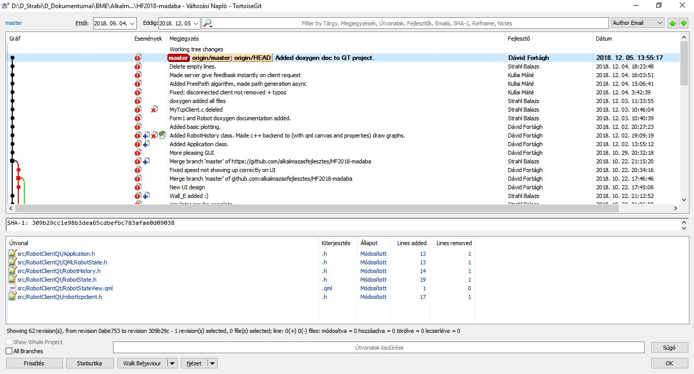
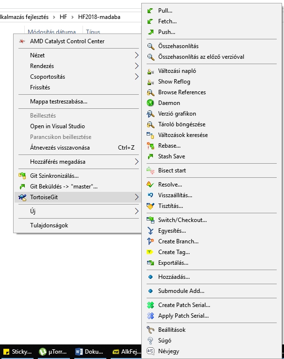

---
layout: default
codename: AlkFejlHf37
title: MáDaBa csapat tanulságai
tags: alkfejl afhf skipfromindex
authors: Fortágh Dávid, Kullai Máté, Stráhl Balázs
---

# Házi feladat tanácsok, tanulságok

## 1. Csapattársak kiválasztása
Célszerű minél előbb csapatot keresni magadnak, így nagyobb az esély, hogy ismerősökkel dolgozhatsz együtt.
Bár nálunk a csapat tagjai ezen tárgy keretei belül találkoztak egymással először, és így is viszonylag zökkenőmentesen ment a közös munka, de azért lényegesesen le tudja egyszerűsíteni szerintem, ha ismerősökkel dolgozhatsz közösen.
 
## 2. Pontos, előre definiált feladat
A mi csapatunk esetében nem volt kezdetben pontosan definiálva, hogy mit is akarunk megvalósítani. 
Kezdetben egy PLC-s eszközhöz akartuk elkészíteni a Qt-s diagnosztikai szoftvert. Ezért egyik csapattagunk neki is állt a projektnek, (mivel amúgy is le kellett fejlesztenie egy munka miatt).
Ekkor kezdtünk rájönni, hogy talán ezzel a projekttel mégsem tudjuk a tárgy összes követelményét kielégíteni, így inkább váltottunk a robot szimulátort ötletére.
Így, ha csapattársunknak amúgy nem kellett volna ezt a kódot megvalósítania, akkor kárbaveszett volna eddigi munkája.

### 2.1 Jó tanácsok
 - Mielőtt belevágsz egy fejlesztésbe, egy új irányba mindenféleképpen beszéld meg a csapattársaiddal.
 - Bármennyire is hamar neki szeretnétek kezdeni a fejlesztésnek, előtte vizsgáljátok meg, hogy tényleg - viszonylag egyszerűen - megvalósítható-e az a terv, amit kitúztetek magatok elé.
 - Mielőtt nekiesnétek a projekt 0-ról való megírásának, előtte tanulmányozzátok a Simple Telemetry Visualiser kódját, illetve pl. a kommunikációs részt használjátok bátran, azért tette közzé Csorba Kristóf.
 
## 3. Git kliens kiválasztása
Lényegesen legyszerüsítheti az életeteket, ha nem parancssorból, hanem egy kliens program segítségével használjátok a git-et.
Én személy szerint a Tortoise git-et, esetleg a Git Krakent javaslom, de szerintem ez is személyes preferencia kérdése.
A Tortoise git-hez elérhető magyar language pack is, mely (jelenleg) a teljes funkcionalitás, kb. 60%-t fordította le magyar nyelvre.
Ha még nem használtál előtte gitet, akkor érdemes több git klienst is megnézned. A fentieken kívül még pl.: Git Extension, Source Tree.

 
 

## 4. C# aszinkron taszk hívás
Invoke-ot kell használni, ha másik szálról akarod módosítani a gui valamelyik elemét
### 4.1 Példa

public partial class Form1 : Form
{
	static RobotPath rp ;
	private Task _pathTask;
	
	public Form1()
	{
		rp = robot.Path1;
	}
	
	private void button_startStop_Click(object sender, EventArgs e)
    {
		_pathTask = Task.Run(()=>rp().ContinueWith((task) => ProcessingCallBack()));
	}
 
	private void ProcessingCallBack(IAsyncResult iar = null)
    {     
       Log.Information("Path ended");
       this.Invoke(new UpdateCallback(PathEndMakeGui));
    }	
}
## 5. Dokumentáció
A Doxygen-es dokumentációt folyamatosan készítsétek, így készőbb nem kell újra kitalálni, hogy mit is csinál egy adott kódrészlet, sőt a végén már még kevésbé szórakoztató a dokumentáció készítése.

## 6. Tesztek írása
A tesztek írására kb. ugyanaz igaz, mint a dokumentáció készítésére. Szerintem egy ilyen rövid élettartamú (max. 14 hét) projektnél kár a TDD módszertan szerint végezni a szoftverfejlesztést.
