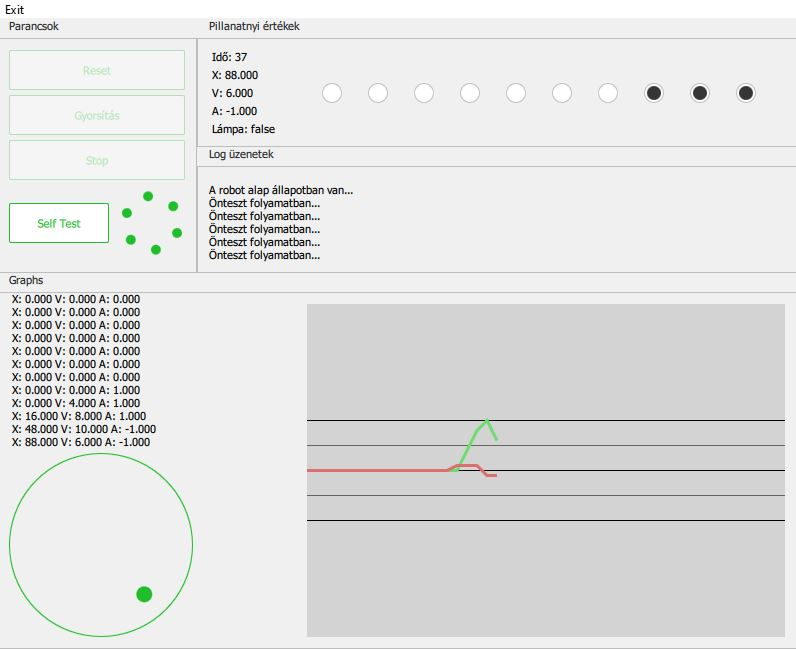

# Alkalmazásfejlesztés házi feladat tapasztalatok

## Fejlesztési Tapasztalatok

### Verziókezelésről

A verziókezelés, és a távoli Git repository használata volt talán a legpozitívabb tapasztalat a feladat megoldása során. Használatával a közös munka gördülékeny tudott lenni, nem kellett kódokat mozgatni és ügyelni arra, hogy kinél van éppen a legfrissebb verzió. A beépített merge tool szintén nagyon hasznosnak bizonyult, amikor egyszerre egy kódrészen többen dolgoztunk. A konfliktusok túlnyomó részét autómatikusan kezelni tudta, és csak néhány kérdéses esetben kellett kézzel döntést hozni. A dokumentáció készítése során is nagy segitség volt a változtatások visszakövethetősége. 
A feladat megoldása során a GitKraken-t használtuk, ami jól átláthatóan, és azonnal jelzi a Qt Creator-ban megtett változtatásokat. Könnyű áttekintést ada a Git-fához, és felhasználóbarát felületet a commit üzenetek megírásához.

### A tervezési megfontolások

Az alkalmazás elkészítése során ügyeltünk arra, hogy minden osztály jól meghatározható feladatot lásson el. Például egy különálló osztály felelős a “modell” -ért, azaz a kezelt változók összefogásáért. Ez az osztály nem foglalkozik kommunikációval, vagy megjelenítéssel, ezekre külön kommunikációs, közvetítő és a QML között kapcsolatot tartó osztályok vannak. Ez a megközelítés könnyű átláthatóságot, és bővítést tesz lehetővé, hiszen ha lecserélnénk például a kommunikációt egy másik protokolra, akkor az üzleti logikát ez teljesen változatlanul hagyná, nem kéne azzal foglalkoznunk, ez mire lehet még hatással a különböző kódokban. Ugyanígy a megjelenítést attól teljesen függetlenül tudjuk kezelni, hogy éppen a megjelenített adat, hogy jön létre és hogy kerül továbbításra.

### Megjelenítés és UI

Mindenkinek tanácsolni tudjuk a QML készítésénél, hogy importálják a legfrissebb QtQuick objektumokat, mert ezek drasztikusan befolyásolják a vezérlő elemek alapértelmezett kinézetét, és esztétikusabb, modernebb külsőt adnak az alkalmazásnak. Szintén fontos tapasztalat volt, hogy bár nem lebecsülve a csapat esztétikai érzékét, az internet számos előre elkészített design-t tartalmaz, melyeket érdemes megfontolni, így az összkép kellemesebb lesz.

### Qt signals and slots

A fenti mechanizmussal a házi feladat keretei között találkoztunk először, és meglepően gördülékenyen és könnyen használható megoldás a program részei közti asszinkron kommunikációra. Egy következő C++ projekt készítésénél, biztosan alkalmazni fogjuk az itt megtanult patterneket, hogy átláthatóbb és hatékonyabb kódot tudjunk írni.

## Tesztek és dokumentáció
### Felhasználói tesztek

Mint ahogy a legtöbb GUI készítésénél, most is hasznosnak bizonyult a végső teszteket egy “laikussal” elvégeztetni. Bár erre a csapat több tagja is alkalmasnak érezte magát, egy nem szakértő családtag bevonása rávilágított, hogy a készítő tudja hova kell kattintatni, így sok hibát nem vesz észre. Tipikusan ilyen volt a gombok engedélyezésének szabályozása.

### Dokumentáció készítés

Számos félrevezető információt találni interneten arról, hogy mi a célszerű módja a dokumentáció elkészítésének. Különösen igaz ez, ha a különböző diagrammok készítését nézzük. Végül ezekhez a Visual Paradigm programot használtuk, és a kommentezett kód felhasználásával tudtunk szintén sok energiát spórolni a Doxygen miatt. Tanulság a jövőre nézve, hogy érdemes azonnal kommentezni, ahogy egy új sor kód megszületik, így a leírt információ részletesebb, és utólag sokkal kellemetlenebb munka a kódot visszafejteni.

## Összefoglalás

Összességében az házi feladat elkészítése sok új és hasznos tudást adott, ami az egyetemi keretekből kilépve is megőrzi értékét és hasznosságát. Ez egyrészt igaz a felhasznált technológiára, valamint azokra a fejlesztési eszközökre, melyek használatát a projekt során elsajátítottuk.

<small>Szerzők: Mihályi Gergely, Nemes Marcell, Nyáry Lőrinc</small>