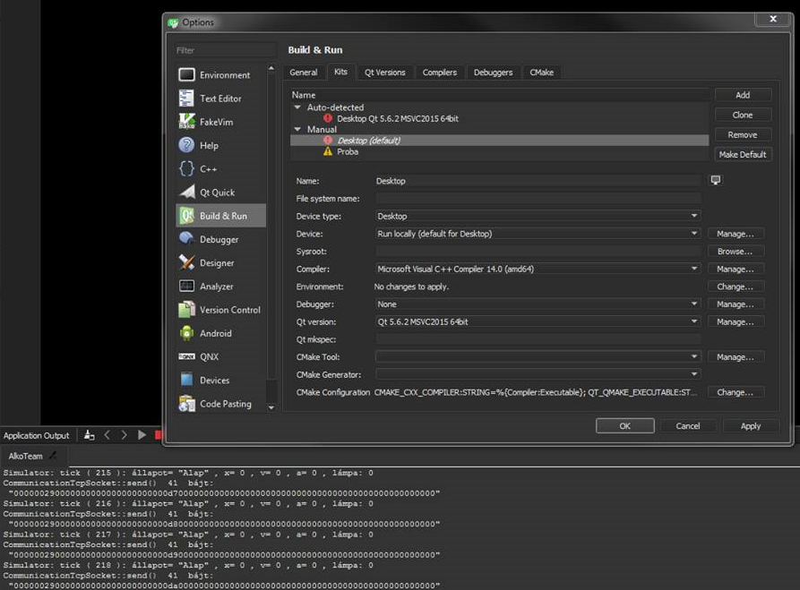
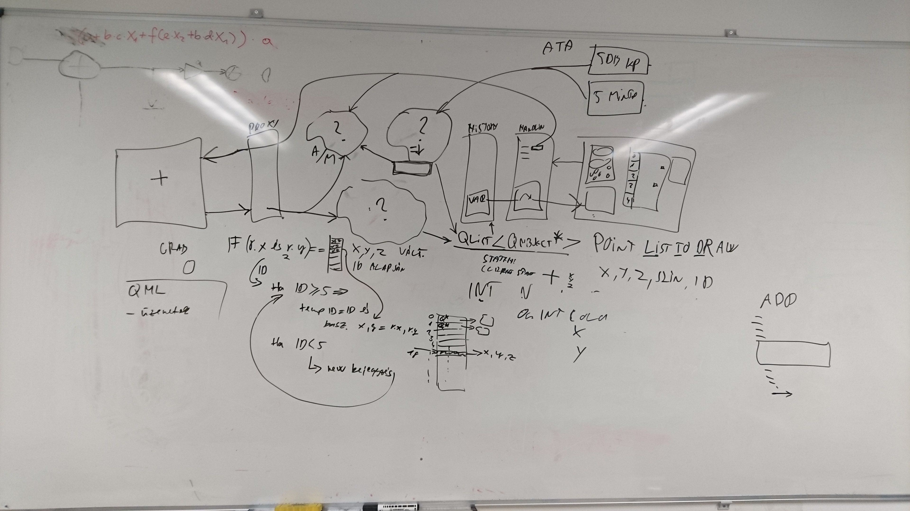

# Alkalmazásfejlesztés Házi Feladat Snippet Oldal (AlkoTeam) #
## Tanulságok a fejlesztés során ##

## 1. Megfelelo Qt verzió és fordító kiválasztása ##

A projektmunka legelején legnagyobb fejtörést az okozta, hogy hogyan szerezzük be a fejlesztokörnyezetet úgy, hogy egységesen muködjön mindanyiunk gépén.
Hamar rájöttünk, hogy a Qt és a QtCreator két külön kezelendo dolgot jelent. A Qt oldalán van egy gyujtemény a régi verziókról, melyeknél még nincs szükség online regisztrációra.
Ez az oldal itt található: [https://download.qt.io/](https://download.qt.io/)

Miután feltelepítettük a fejlesztokörnyezeteket azzal a problémával szembesültünk, hogy mindenkinél valamilyen korábbi okból kifolyólag, az msvc (fordító) már fel volt telepítve.
Sajnos sok idobe telt kiderült, hogy a QtCreator nem feltételenül képes az msvc-vel mindig együtt muködni. Hosszas projektbeállítások után végül egyikunk gépén sem futott rendesen a fejlesztokörnyezet.
Ezt a beállítást használtuk:

Ezt követoen pár fórumon tett javaslat alapján végül minanyiunk gépén újratelepítettük a Qt-t úgy, hogy az MinGW-s verzó legyen.
Ezután mindenki gépén rendben volt a fejlesztokörnyezet (fordult a kód és nem voltak hibák).
A konklúzió, az, hogy ha van is a gépen korábbi fordító, érdemes utánanézni, hogy milyen fordítót ajánlanak egy-egy projektben a fejlesztokörnyezethez.

## 2. A csapatmunka ##

Nem RobonAUT-os csapatról lévén szó, elég hamar nekiláttunk a tervezésnek, amit mindenkinek ajánlunk mert így sem sikerült maradéktalanul végezni a feladattal a 14. hét végére.
A csapatmunkát tekintve a heti egy-két gyűlést preferáltuk, amiről megállapítható, hogy főleg az elején, a tervezési fázisban nagyon hatákonyan működött.
Viszont azt is el kell mondani, hogy a közös éjszakai kódolások sokszor nem voltak sikeresek. Mert habár haladtunk a problémákkal és jó volt segíteni egymásnak mégsem voltunk hatékonyak.
Összesegében elmodható, hogy heti egyszer érdemes összeülni átbeszélni a problémákat, megnézni a heti kódfolyamot és megálmodni a következő heti teendőket, de fontos mellette az is hogy mindenki egyenlő arányban szánjon időt a projektre és hétről hétre haladva írjon meg egy-egy funkciót.

A képen látható, hogy egyes gyűléseken milyen hasznosan le tudtuk írni, hogy a kezdetben felhőnek tűnő nehéz probléma hogyan is valósítható meg gyorsan és egyszerűen:

## 3. A fejlesztés nehézségei avagy saját osztályt tartalmazó QList<> létrehozása ##

A fejlesztői környezet elég sokszor próbára tett minket.
A beállításának nehézségeiről már korábban írtunk, de a fejlesztés alatt is akadtak problémák.
Legtöbbszőr az értelmezhetetlen fordító error-okkal gyűlt meg a bajunk.
Így alakult ki például az a megoldás, hogy a pontok osztálya nem származik le a QObject-ből pedig ajánlatos lenne neki.
De egyszerűen olyan hibákat produkált a rendszer, amelyen több órányi megoldáskeresés sem segített.
Rendszeresen bele kellett nyúlni a makefile-okba és még így sem volt biztos, hogy ami az egyik gépen tökéletesen működik az a másikon is.

A points saját osztályról csak annyit, hogy szeretnénk pontokat megjeleníteni a felületen, azonban ehhez szükségeltetik, az hogy a QObject egy leszármazottja legyen és QList<QObject>-ként küldjük el a grafikus felület felé.
Viszont bárhogyan próbáltunk belőle leszármazottat csinálni egyszerűen a Qt Creator nem engedte. Hosszú órákat vett el a fejlesztésből ez a probléma de nem sikerült megoldani.
Végül, elég csúnyán lett megolva a dolog és 3 int listában (x,y,szín) tároljuk a kirajzolandó pontokat.

MarkDown file szerkesztés :
[https://guides.github.com/features/mastering-markdown/](https://guides.github.com/features/mastering-markdown/)

Készítette: AlkoTeam (Merth Attila, Szabó Bence, Tóth Dániel)
