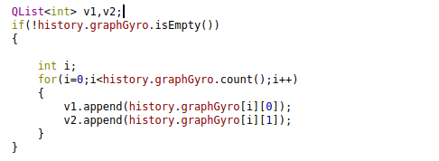
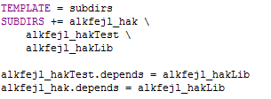
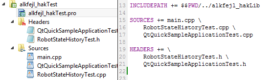

# I. A Qt Creator fejlesztőkörnyezezet telepítése Linux (Ubuntu) operációs rendszerre (részletes leírás)
A teljes telepítési folyamatról több tutorialt is készítettek az interneten. Ez a snippet azért készül, mert semelyik segítségével sem sikerült elsőre a telepítés, így gondoltam hasznos lehet, a hasonló problémákba ütközőknek.
Mielőtt a Qt Creatort szeretnénk feltelepíteni mindenképpen győződjünk meg a telepítendő szoftver verziójáról és arról, hogy ahhoz a számítógépünkön (akár Linux, akár Windows) a megfelelő előkövetelmények rendelkezésre állnak-e. 
A Qt Creatort a C++ 14-es verziójával használjuk a tárgy során, ezért mindenképpen szükségünk lesz a legújabb gcc fordítóra. Nagyon fontos telepíteni, mert a tárgy github oldalán található egyszerű példák közül nagyon sok használja a C++ 14-es verzióját.
## 1. Gcc fordító telepítése, frissítése
A következő paranccsal tudjuk megvizsgálni, hogy milyen gcc fordítóval rendelkezik Linux operációs rendszerünk.
gcc -v
Amennyiben a fordító verzió, 4.8 verziónál régebbi, akkor mindenképpen telepítsünk egy újabb változatot a következőképpen: (Jelen példában a v4.9 gcc fordító telepítése történik) 
sudo add-apt-repository ppa:ubuntu-toolchain-r/test
sudo apt-get update
sudo apt-get install gcc-4.9 g++-4.9
sudo update-alternatives --install /usr/bin/gcc gcc /usr/bin/gcc-4.9 60 --slave /usr/bin/g++ g++ /usr/bin/g++-4.9
Ezek után ellenőrizzük, hogy a fordító sikeresen feltelepült.
gcc -v
Remélhetőleg már az új fordítóverziót fogja kiírni a program.
Végül még egy library telepítése szükséges Linux-on:
sudo apt-get install libgl1-mesa-dev libglu1-mesa-dev

Kiegészítés:
Ajánlott a gcc fordítón kívül más fejlesztési eszközökhöz kapcsolódó csomagok telepítése is. Ezt a következőképpen tehetjük meg:
sudo apt-get update
sudo apt-get install build-essential

## 2. Qt Creator telepítése
Töltsük le a Qt weboldaláról az operációs rendszerünknek megfelelő verziót. Ezután csomagoljuk ki, válasszuk ki a megfelelő mappát (jelen példában /home/admin/Downloads/Qt/), és engedélyezzük a végrehajtást a .run kiterjesztésű fájlon (itt: qt-linux-opensource-5.0.2-x86-offline.run). Végül indítsuk el a telepítést.
cd /home/admin/Downloads/Qt/				// fájl helyének kiválasztása
chmod +x qt-linux-opensource-5.0.2-x86-offline.run		// fájlon végrehajtás engedélyezése
./ qt-linux-opensource-5.0.2-x86-offline.run			// fájl futtatása
A megnyíló grafikus varázsló segítségével könnyen elvégezhetjük a telepítést.

## 3. Telepítés utáni konfiguráció
A telepítés elvégzése után le kell ellenőrizni, hogy a Qt Creator tudja-e használni a megfelelő fordítót. Az esetek többségében automatikusan felismeri, de előfordulhat, hogy mégsem. Minden esetben célszerű leellenőrizni:
Tools > Options ablakban Build & Run opció kiválasztása, azon belül pedig a Kit fülön megnézhető, hogy milyen fordítót használ a Qt Creator.
Amennyiben automatikusan felismerte a gcc fordítót, akkor nincs további teendő. Egyéb esetben add hozzá manuálisan a megfelelő fordítót. Amennyiben követted ezt az útmutatót, akkor a következő helyen megtalálod
/usr/bin/gcc

## 4. Egyéb telepítéshez, első használathoz kapcsolódó problémák
Előfordulhat, hogy egy a tárgy honlapján tökéletesen elkészített projekt első megnyitásra hibát jelez. Ilyen esetben nem kell megijedni, mert előfordulhat, hogy csak a buildelés helye nincs megfelelően beállítva.
Menj a bal oldalt a Build Settings-re és nézd meg, hogy a Build Directory milyen színnel van kiemelve. Amennyiben pirossal, mint az alábbi képen, akkor ez egy probléma, és adj meg egy olyan helyet, ahova a projekt build fájljai kerülhetnek.

 

Remélem hasznos volt ez a rész,  s megkímélt pár fölösleges telepítéssel töltött órától!

# II. QVector típusú változó megjelenítése
A feladat során szükséges volt egy vektoros adat szimulálására, majd megjelenítésére. A valóságot úgy éreztem az tükrözi legjobban, ha ehhez a QList helyett a QVector típusú változót használom, hiszen a való életben esetleg olyan transzformációkat szeretnénk végezni ezen a változón, ami igényli ennek a típusnak a használatát. Felvettem tehát egy QVector<int> _g változót, jelen esetben ez egy kételemű vektor lesz, amiben egy szimulált giroszkóp adatait tároltam.
A probléma akkor jött elő, amikor ezt QML környezetben szerettem volna felhasználni. A QML nem ismeri fel a QVector típusú változót. Ennek kiküszöbölésére a következő transzformációt végeztem el:

 
 
Mivel a felületen természetesen a korábbi állapotok megjelenítésére is szükség van, ezért létrehoztam a vektor egy-egy tagjára külön egy-egy QList<int> változót. Ezeket minden alkalommal feltöltöm, majd ezeket a listákat adom át a QML-nek. Így az adat már felhasználható, és kijelezhető.
 

# III. QTest unit test környezet felépítése
A projektünk unit tesztjeinek megírása nem olyan egyszerű feladat mint elsőre látszik.
Első lépésben meg kell változatni a projekt hierarchiát, hogy a tesztelendő objektumokat elérjék a teszt objektumok. A projektünk eddig úgy nézett ki, hogy van egy főkönyvtár amiben az összes .cpp és .h található. Esetleg ebben a fájlban található még egy kommunikáció vagy egyéb mappa, ahol a specifikus .cpp és .h fájlok helyezkednek el. Ezeket a fájlokat kell kivágni, majd létrehozni a főkönyvtárban 3 új mappát (alkfejl_hak, alkfejl_hakLib, alkfejl_hakTest) és az alkfejl_hak-ba belementeni az összes fájlt.
Az alkfejl_hak mappát egyszerűen létrehozhatjuk total commanderben. Az alkfejl_hakLib mappát a „New Subproject” -> „Libraries” -> „C++ Library” -> Type:”Statically Linked Library” kattintásokkal hozhatjuk létre. Míg az alkfejl_hakTest mappát a „New Subproject” -> „Applications” -> „Qt Console Application” kattintás sorozattal hozhatjuk létre. Ezek után így kell kinéznie a projektünknek:
 
 
 
Jól látható a mappa hierarchia. Van egy főág profile fájl, és minden mappához tartozik egy saját profile fájl (Így összesen 4 db .pro fájlunk lesz.)
Az alkfejl_hakSolution.pro fájlunk például így fog kinézni, tartalmazza az almappákat és a függőségeket:

 
 
Míg az alkönyvtárak profile fájlainak tartalmaznia kell azokat a .cpp és .h fájlokat „SOURCES” és „HEADERS” alatt, amik a megfelelő könyvtárakban találhatók. Például az alkfejl_hakTest.pro megfelelő része és a könyvtár hierarchia így fog kinézni miután létrehoztuk a szükséges fájlokat:

 
 
Ezután át kell másolni a tesztelendő .cpp és .h objektumokat a alkfejl_hak mappából az alkfejl_hakLib mappába, ugyanis a alkfejl_hakTest-ben található unit tesztek innen fogják elérni a szükséges tesztelendő objektumokat.
A további teendőkről, hogy hogyan írjuk meg a unit tesztjeinket, rengeteg dokumentáció / tutorial kering az interneten. Az alábbi linken találhattok egy tutorialt arról, hogyan kell egy kész programhoz unit teszteket készíteni: http://imaginativethinking.ca/qtest-101-writing-unittests-qt-application/
